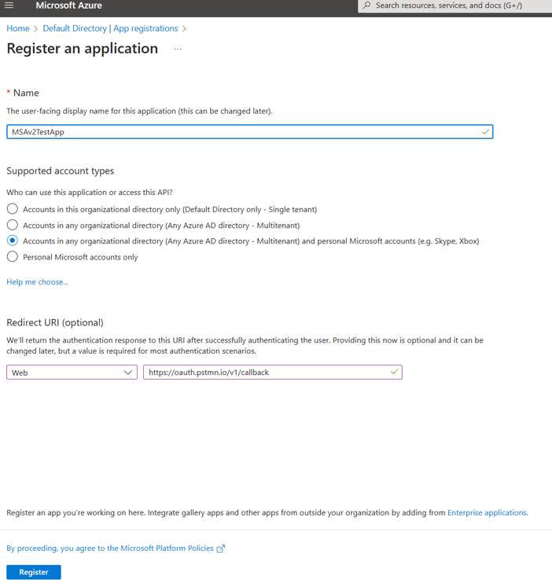
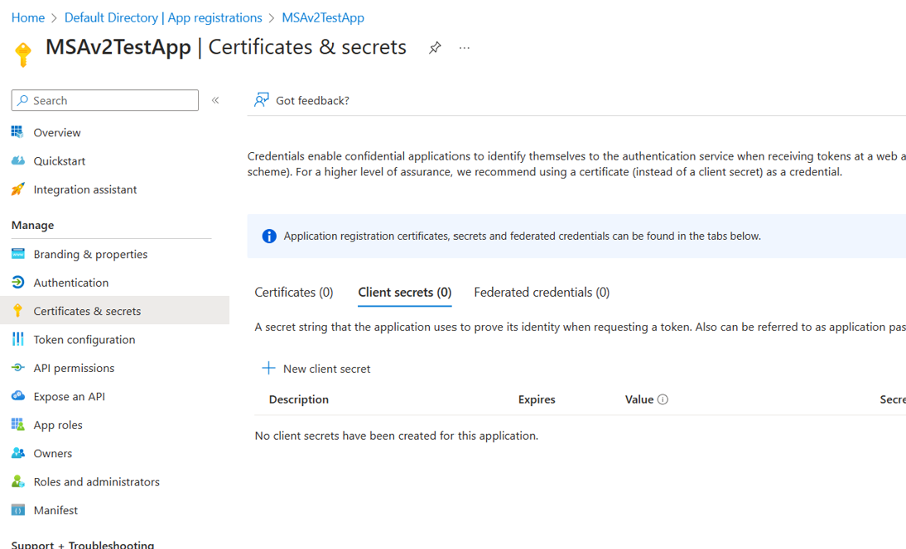
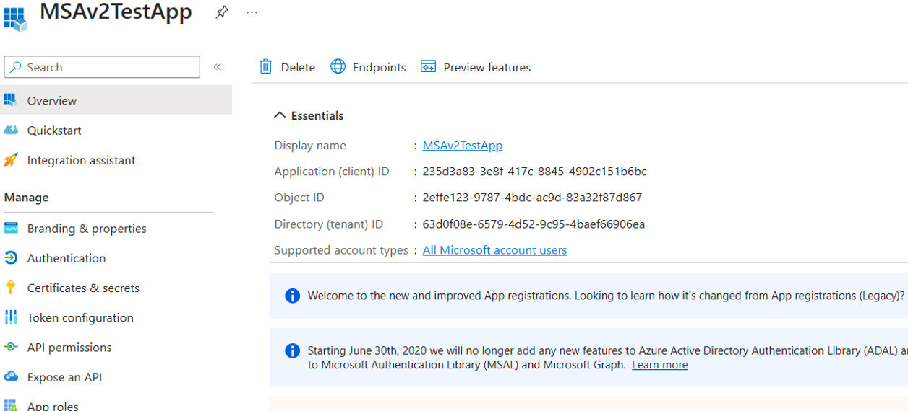
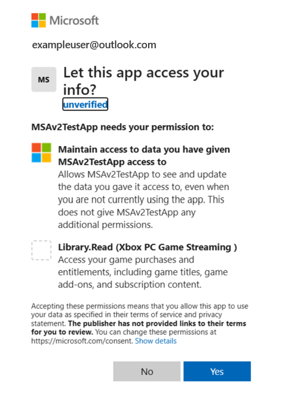

# Entitlement Data for Eligible Games 

Please note that under the EC Commitments, Microsoft committed to provide, with consumer consent, access to Entitlement Data (e.g., whether a consumer has already purchased an Eligible Game or whether a consumer is an active subscriber to a multi-game subscription service that includes an Eligible Game) through a standard interface. This obligation is limited to Streaming Services that are already licensed to provide cloud game streaming by at least one Major Game Publisher at the time the Streaming Service seeks access to a Microsoft Game Store. Should a cloud game streaming provider want avail itself of this provision, it should fill out the Streaming Provider Application [here](https://www.xbox.com). For more information on this, please see the full text of the EC Commitments on the European Commission’s website [here](https://ec.europa.eu/competition/mergers/cases1/202330/M_10646_9311516_7443_3.pdf)). Additional Frequently Asked Questions about the EC Commitments are available [here](https://www.xbox.com/en-US/legal/activision-blizzard-cloud-game-streaming-eu/FAQ)

As Eligible Activision Blizzard games are available on both Battle.net and the Microsoft Store, there are two separate Entitlement endpoints for Streaming Providers to call for comprehensive Entitlement Data. For both APIs, Streaming Providers will need to perform secure Service-to-Service (S2S) with OAuth Credentials. Providers will need to share their Azure Application App ID and Tenant ID with Microsoft and Blizzard to allow list the Provider's application as a secure caller. To learn more about this pattern, learn how to [Configure protected web API apps](https://review.learn.microsoft.com/en-us/entra/identity-platform/scenario-protected-web-api-app-configuration?branch=main&tabs=aspnetcore).

When Streaming Providers complete the Streaming Provider License, they will also attest to following certain Data Protection Agreements as they request customer Entitlement Data. This request requires user consent to share Entitlement Data from each Store with the provider, which the Provider must request as outlined in each API's documentation.

This page will document the Entitlement API for Microsoft Store Entitlement Data of Eligible Activision Blizzard games and subgames. For documentation on the Battle.net Entitlement API, please read more [here](https://www.xbox.com).

## Entitlement Data Application and Onboarding 

To obtain Entitlement Data from Microsoft and Battle.net, here is a high level overview of the process for a Streaming Provider: 
1. Apply for Entitlement Data via Streaming Provider License form on [https://www.xbox.com]
2. Review API documentation on Microsoft Game Dev and Battle.net Developer Portal. 
3. Create a free Azure account if you do not have one already. For step-by-step tutorial, see the learning module - [Create an Azure account](/learn/modules/create-an-azure-account/).
4. Create a free Azure Application. 
5. Send Azure Application ID and Tenant ID to the game streaming provider email alias, abkstreaming@microsoft.com. 
6. Game streaming provider alias will confirm your application has been allow listed to call the Entitlement APIs, and credentials will be provided via email. 
7. Streaming Provider may now call Entitlement APIs from their application. 

## Azure App Configuration with MSA v2 

To create an Azure App that will work for both User and S2S auth, use the following configuration:  

1. Provide a friendly name for your app. Keep in mind this app name will be show to the user as part of the consent form (See Below). 
2. For supported account type select the multi-tenant and personal account option. 
3. Provide your redirect URI. The example below is configured to use postman for testing purposes. 

After registering the Azure Application, configure your secret. For testing with postman we are using a client secret, for production it is recommended to use a certificate. 

After creating the secret, send the Application (Client) Id and Azure Tenant ID to abkstreaming@microsoft.com for secure access to the Microsoft Store and Battle.net endpoints.  

Providers will also need to trigger a consent dialog for a user to consent to sharing their Entitlement Data from each Store by calling the endpoint with a particular Scope, such as the below example: 

## Entitlement Endpoint Technical Documentation 

