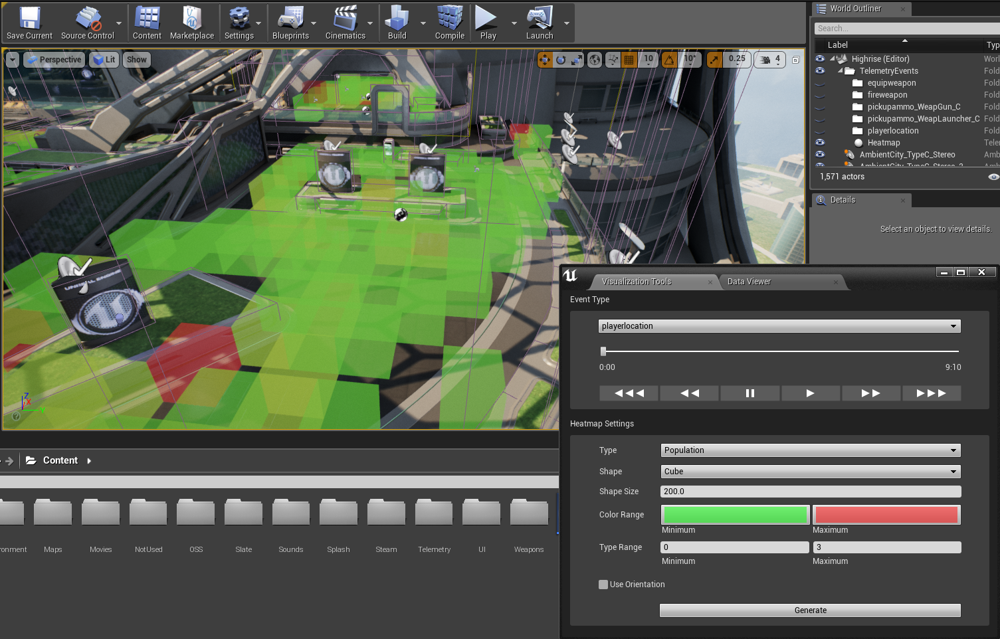
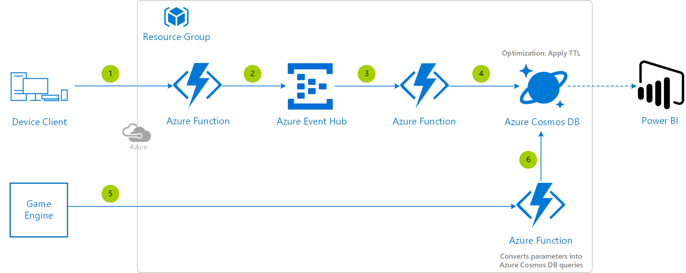

# In-editor Debugging Telemetry Reference Architecture

This reference architecture **focuses on the development phase and a small number of users**, gathering data from gameplay sessions and displaying it directly within the game engine - Unreal Engine in this case. It provides the fastest response time so your development and QA teams don't have to wait to get results from the testing sessions.

## Architecture diagram

## Relevant services

- [Azure Event Hub](https://azure.microsoft.com/services/event-hubs/) - Selected as it's a service tailored for analytics pipelines and is simple to use with little configuration or management overhead. It is capable of receiving and processing the events in real-time.
- [Azure Functions](https://azure.microsoft.com/services/functions/) - Selected as we are not going to need windowing (perform some set-based computation or other operations over subsets of events that fall within some period of time) and we are looking to just copying data over from Azure Event Hubs to the storage/databases.
- [Azure Cosmos DB](https://azure.microsoft.com/services/cosmos-db/) - Selected for being able to store data with a higher rate of ingest.

## Step by step

1. Invoke the **Azure Function** from the device client. Alternatively you could have use virtual machines with a load balancer.
2. Connect the Azure Function to the **Azure Event Hub**.
3. Transfer data from Azure Event Hub to an **Azure Function** that copies the data through the pipeline.
4. From the Azure Function target **Azure Cosmos DB** with JSON output.
5. That concludes the data ingestion part. After that to review the data, within the game engine a set of querying parameters are set, those are submitted to a translator **Azure Function** that converts them into an Azure Cosmos DB query.
6. The data is the pulled from **Azure Cosmos DB** to the game engine for visualization.

> [!TIP]
> If you are looking for slicing and dicing the data in a dashboard, hook up the Azure Cosmos DB database to [Power BI](https://docs.microsoft.com/azure/cosmos-db/powerbi-visualize) too.

## Deployment template

Have a look at the [general guidelines documentation](./general-guidelines.md#naming-conventions) that includes an article summarizing the naming rules and restrictions for Azure services.

>[!NOTE]
> If you're interested in how the ARM template works, review the Azure Resource Manager template documentation from each of the different services leveraged in this reference architecture:
>
> - [Create an Event Hub using Azure Resource Manager template](https://docs.microsoft.com/azure/event-hubs/event-hubs-resource-manager-namespace-event-hub)
> - [Automate resource deployment for your function app in Azure Functions](https://docs.microsoft.com/azure/azure-functions/functions-infrastructure-as-code)
> - [Azure Cosmos DB template](https://docs.microsoft.com/azure/templates/microsoft.documentdb/databaseaccounts)

>[!TIP]
> To run the Azure Functions locally, update the *local.settings.json* file with these same app settings.

## Implementation details

It's worth mentioning that you only need to create a single Azure Function App, that contains the different Functions within.

- [Big data reference architecture and implementation for an online multiplayer game](https://github.com/dgkanatsios/GameAnalyticsEventHubFunctionsCosmosDatalake)
- [Processing 100,000 Events Per Second on Azure Functions](https://blogs.msdn.microsoft.com/appserviceteam/2017/09/19/processing-100000-events-per-second-on-azure-functions/)
- [Reliable Event Processing in Azure Functions (how to avoid losing a message)](https://hackernoon.com/reliable-event-processing-in-azure-functions-37054dc2d0fc)
- [In-order event processing with Azure Functions](https://medium.com/@jeffhollan/in-order-event-processing-with-azure-functions-bb661eb55428)

## Optimization considerations

You can **expire old data automatically stored in Azure Cosmos DB** using [Azure Cosmos DB TTL](https://docs.microsoft.com/azure/cosmos-db/time-to-live) (Time To Live), setting a time horizon where stored documents will be purged.

## Additional resources and samples

If you are looking for windowing support out-of-the-box, meaning you want to perform directly in the cloud some set-based computation (aggregation) or other operations over subsets of events that fall within some period of time, then you should consider replacing the Azure Function that connects the Azure Event Hub to Azure Cosmos DB with [Azure Stream Analytics](https://docs.microsoft.com/stream-analytics-query/windowing-azure-stream-analytics).

## Pricing

If you don't have an Azure subscription, create a [free account](https://aka.ms/azfreegamedev) to get started with 12 months of free services. You're not charged for services included for free with Azure free account, unless you exceed the limits of these services. Learn how to check usage through the [Azure Portal](https://docs.microsoft.com/azure/billing/billing-check-free-service-usage#check-usage-on-the-azure-portal) or through the [usage file](https://docs.microsoft.com/azure/billing/billing-check-free-service-usage#check-usage-through-the-usage-file).

You are responsible for the cost of the Azure services used while running these reference architectures, the total amount depends on the number of events that will run though the analytics pipeline. See the pricing webpages for each of the services that were used in the reference architectures:

- [Event Hubs pricing](https://azure.microsoft.com/pricing/details/event-hubs/)
- [Azure Functions](https://azure.microsoft.com/pricing/details/functions/)
- [Azure Cosmos DB pricing](https://azure.microsoft.com/pricing/details/cosmos-db/)
- [Azure Stream Analytics pricing](https://azure.microsoft.com/pricing/details/stream-analytics/)
- [Azure Virtual Machines pricing](https://azure.microsoft.com/pricing/details/virtual-machines)

You also have available the [Azure pricing calculator](https://azure.microsoft.com/pricing/calculator/), to configure and estimate the costs for the Azure services that you are planning to use. Prices are estimates and are not intended as actual price quotes. Actual prices may vary depending upon the date of purchase, currency of payment, and type of agreement you enter with Microsoft. Contact a Microsoft sales representative for additional information on pricing.