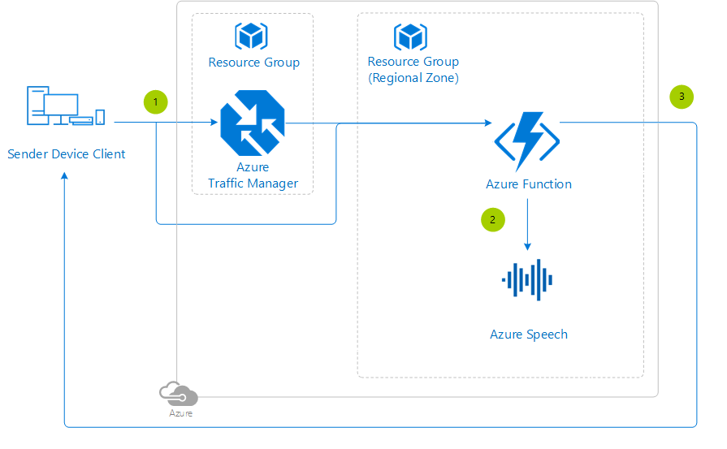

# Speech to Text Reference Architecture

Help bring everyone into the conversation using the **Speech to Text** Cognitive Service provided by Azure.

This article will describe the architecture used in [this sample on GitHub](https://github.com/Azure-Samples/gaming-cognitive-services-speech-to-text). Keep in mind that the code from this reference architecture is only an example for guidance and there may be places to optimize the code before using in a production environment.

## Architecture Diagram

## Architecture Services

- [Azure Functions](https://docs.microsoft.com/azure/azure-functions/functions-overview) - Simplest way to run code on-demand in the cloud.
- [Azure Speech Service](https://docs.microsoft.com/azure/cognitive-services/speech-service/speech-to-text) - The service that provides the speech to text functionality.

## Architecture Considerations

When enabling this functionality in your game, keep in mind the following variables:

- **Languages supported** - For a complete list of languages, see the [language support](https://docs.microsoft.com/azure/cognitive-services/speech-service/language-support#speech-to-text) topic.
- **Regions supported** - For information about regional availability, see the [regions](https://docs.microsoft.com/azure/cognitive-services/speech-service/regions#speech-to-text) topic.
- **Audio inputs** - The Speech Service supports 16-bit, 16-KHz mono PCM audio by default.

## Deployment Template

Click the following button to deploy the project to your Azure subscription:

This operation will trigger a template deployment of the [azuredeploy.json](https://github.com/Azure-Samples/gaming-cognitive-services-speech-to-text/blob/master/azuredeploy.json) ARM template file to your Azure subscription, which will create the necessary Azure resources. This may induce charges in your Azure account.

Have a look at the [general guidelines documentation](./general-guidelines.md#naming-conventions) that includes a section summarizing the naming rules and restrictions for Azure services.

>[!NOTE]
> If you're interested in how the ARM template works, review the Azure Resource Manager template documentation from each of the different services leveraged in this reference architecture:
>
> - [Automate resource deployment for your function app in Azure Functions](https://docs.microsoft.com/azure/azure-functions/functions-infrastructure-as-code)

There are two types of Azure Cognitive Services subscriptions. The first is a subscription to a single service, such as Computer Vision or the Speech Services. A single-service subscription is restricted to just that service. The second type is a multi-service subscription. This allows you to use a single subscription for multiple Azure Cognitive Services. This option also consolidates billing. To make this reference architecture as modular as possible, the cognitive services are each setup as a single service.

Finally, add this Function [application setting](https://docs.microsoft.com/azure/azure-functions/functions-how-to-use-azure-function-app-settings) so the sample project can connect to the Azure services:

- SPEECH_KEY - The [access key](https://docs.microsoft.com/azure/cognitive-services/cognitive-services-apis-create-account#access-your-resource) for the Azure Speech Cognitive Service that was created.

>[!TIP]
> To run the Azure Functions locally, update the *local.settings.json* file with these same app setting.

## Step by Step

1. The player's device sends a request to the **Azure Function** with the language specified in the header and the speech audio in the body.
2. The **Azure Function** then uses that information to submit a request to start the conversion to text. The **Azure Speech** service's response body is the text translated from the audio file.
3. The **Azure Function** then responds to the player's request with the translation.

### Azure Speech to Text Service

If you are looking for **samples** of the Speech to Text Cognitive Service, see [Microsoft Speech Service API: Speech-to-Text Samples](https://github.com/Azure-Samples/Cognitive-Speech-STT-Windows).

## Security Considerations

Do not hard-code any Cognitive Services connection strings into the source of the Function.  Instead, at a minimum, leverage the [Function App Settings](https://docs.microsoft.com/azure/azure-functions/functions-how-to-use-azure-function-app-settings#manage-app-service-settings) or, for even stronger security, use [Key Vault](https://docs.microsoft.com/azure/key-vault/) instead. There is a tutorial explaining how to [create a Key Vault](https://blogs.msdn.microsoft.com/benjaminperkins/2018/06/13/create-an-azure-key-vault-and-secret/), how to [use a managed service identity with a Function](https://blogs.msdn.microsoft.com/benjaminperkins/2018/06/13/using-managed-service-identity-msi-with-and-azure-app-service-or-an-azure-function/) and finally how to [read the secret stored in Key Vault from a Function](https://blogs.msdn.microsoft.com/benjaminperkins/2018/06/13/how-to-connect-to-a-database-from-an-azure-function-using-azure-key-vault/).

## Pricing

If you don't have an Azure subscription, create a [free account](https://aka.ms/azfreegamedev) to get started with 12 months of free services. You're not charged for services included for free with Azure free account, unless you exceed the limits of these services. Learn how to check usage through the [Azure Portal](https://docs.microsoft.com/azure/billing/billing-check-free-service-usage#check-usage-on-the-azure-portal) or through the [usage file](https://docs.microsoft.com/azure/billing/billing-check-free-service-usage#check-usage-through-the-usage-file).

You are responsible for the cost of the Azure services used while running these reference architectures.  The total amount will vary based on usage. See the pricing webpages for each of the services that were used in the reference architecture:

- [Azure Traffic Manager](https://azure.microsoft.com/pricing/details/traffic-manager/)
- [Azure Functions](https://azure.microsoft.com/pricing/details/functions/)
- [Azure Speech Services](https://azure.microsoft.com/pricing/details/cognitive-services/speech-services/)

You can also use the [Azure pricing calculator](https://azure.microsoft.com/pricing/calculator/) to configure and estimate the costs for the Azure services that you are planning to use.