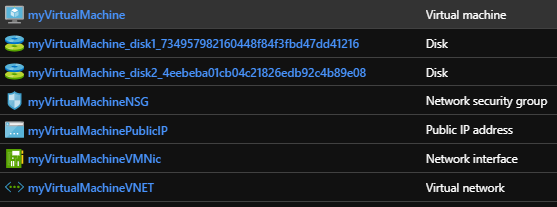
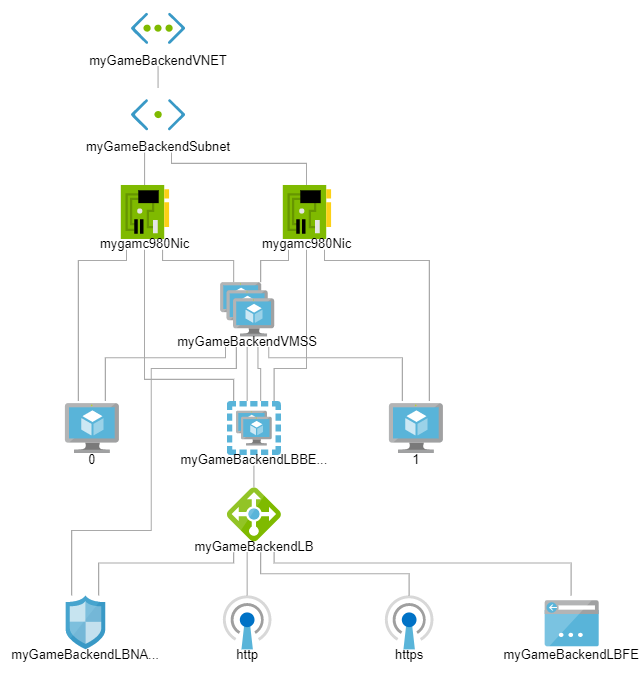
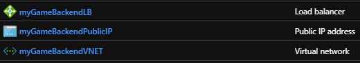
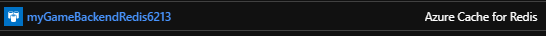
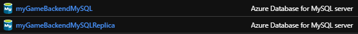

# Deploy a single region LAMP architecture

This document covers different methods to deploy a **single region LAMP architecture**, either using **command line tools** on either Bash, PowerShell or Windows Batch for a more hands on programmatic setup, or an Azure Resource Manager template for a **one-click deployment**. And in most cases there will be pointers to how to setup a certain portion of the architecture using the **Azure Portal**. Alternatively you can use third-party solutions like [Hashicorp Terraform](https://docs.microsoft.com/azure/terraform/terraform-overview) either using their [command line tools](https://docs.microsoft.com/azure/virtual-machines/linux/terraform-install-configure) or [automating your infrastructure deployments with Azure Pipelines](https://www.azuredevopslabs.com/labs/vstsextend/terraform/), for your guidance specific step by step Terraform's Azure Provider templates have been provided in this paper, you can also find more templates in [this link](https://github.com/terraform-providers/terraform-provider-azurerm/tree/master/examples).

In general, when deploying a single region LAMP architecture there are certain steps that are mostly one-offs while others need to be executed in more regular basis as your backend gets updated to match your game requirements. Below is the full list of steps:

**Mostly one-offs operations**

1. Deploy a Virtual Machine on a Managed Disk with your preferred Linux OS distribution.
2. Install Apache, your preferred PHP version and other stuff you consider.
3. Deallocate and generalize the Virtual Machine.
4. Capture the Virtual Machine Disk Image to generate the custom golden image.
5. Deploy the networking resources (load balancer, etc).
6. Deploy the Azure Cache for Redis.
7. Deploy the Azure Database for MySQL.
8. Create the Azure Storage account and container.
9. Create your Virtual Machine Scale Set ensuring it references the captured Disk Image as the OS Disk.
10. Setup the autoscale settings.
11. Enable protection against DDoS attacks.

> [!NOTE]
> In the future you may want to change to another Linux OS version or PHP version, that would require you to recreate the custom golden image (steps 1-4). Or you may want to make changes into the autoscaler (step 10).

**Regular basis operations**

12. Update the Virtual Machine instances from the Virtual Machine Scale Set created in the step number 9 previously mentioned with any PHP file modifications.

## Preparative

You'll need to have at least an Azure subscription. [Learn more](./general-purpose-lamp.md#pricing).

Review the [naming conventions](./general-guidelines.md#naming-conventions) for any of the names that you are choosing for the Azure resources that you are going to be creating.

Do some [research](https://azure.microsoft.com/pricing/details/virtual-machines/linux/) on what Azure Linux Virtual Machine types are supported on what Azure region.

### Command line alternatives

# [Bash](#tab/bash)

Bash is a Unix shell and command language, typically runs in a text window where the user types commands that cause actions. Bash can also read and execute commands from a file, called a shell script. To create and execute a Bash script:

1. Create a file in a directory in your computer running Linux/Unix.
1. Choose a filename and ensure the extension of the file is `.sh`, to identify it as a Bash script.
1. Use your favorite editor to open the file.
1. Ensure that the script includes `#!/bin/bash` at the very top.
1. Copy/paste the Bash snippets provided in this document. Just remember that variables need to be initialized before they are used, so they need to be placed higher within the Bash file than the commands that use them.
1. Save the file.
1. Ensure it has execution permissions using `chmod +x [SCRIPTNAME.sh]` substituting `[SCRIPTNAME.sh]` with your script.
1. To execute, simply use `./[SCRIPTNAME.sh]`.

# [Windows PowerShell or PowerShell Core](#tab/powershell)

Command-line shell designed especially for system administrators. PowerShell includes an interactive prompt and a scripting environment that can be used independently or in combination. Unlike most shells, which accept and return text, PowerShell is built on top of the .NET Framework common language runtime (CLR) and the .NET Framework, and accepts and returns .NET Framework objects. To create an execute a Windows PowerShell or PowerShell Core script:

1. Create a new file in a folder (i.e: the Desktop) in your computer running Windows (Windows PowerShell or PowerShell Core) or Mac/Linux (PowerShell Core only).
2. Choose a filename and ensure the extension of the file is `.ps1`, this is very important or the Operating System won't recognize the file as a script that can be run.
3. Edit the file using right-click on it, and copy/paste the Windows PowerShell or PowerShell Core snippets provided in this document. Just remember that variables need to be initialized before they are used, so they need to be placed higher within the Windows Batch file than the commands that use them.
4. Save the file and execute it.

# [Windows Batch](#tab/bat)

With batch files (also known as bat files) you can simplify routine or repetitive tasks on Windows. A batch file is an unformatted text file that contains one or more commands and has a `.bat` or `.cmd` file name extension. When you type the file name at the command prompt, the `Cmd.exe` (or Command Prompt) from the Windows operating system runs the commands sequentially as they appear in the file. To create and execute a Windows Batch script:

1. Create a new file in a folder (i.e. the Desktop) in your computer running Windows.
2. Choose a filename and ensure the extension of the file is either `.bat` or `.cmd`, this is very important or the Operating System won't recognize the file as a script that can be run.
3. Edit the file using right-click on it, and copy/paste the Windows Batch snippets provided in this document. Just remember that variables need to be initialized before they are used, so they need to be placed higher within the Windows Batch file than the commands that use them.
4. Save the file.
5. To execute, simply right click on the file and select **Open**.

---

Don't feel obliged to stick to Bash, PowerShell or Windows Batch for deploying the whole architecture end-to-end. You could complete a step like deploying the Azure Cache for Redis using Windows Batch and then switch to Bash to deploy Azure Database for MySQL, although it's not the standard.

> [!IMPORTANT]
> Should you choose to setup the architecture programmatically using a command line interface and the samples from this document, you are going to need to install either [Azure CLI](https://docs.microsoft.com/cli/azure/install-az-cli2), a cross-platform command-line tool providing a great experience for managing Azure resources, or [Azure PowerShell](https://docs.microsoft.com/powershell/azure/install-az-ps). They are both designed to make scripting easy, query data, support long-running operations, and more.

### Command line general configuration variables and tools

Regardless of what step you are working on, it's best practice to keep a set of general variables handy as they are foundational:

- **YOURSUBSCRIPTIONID**: Your Azure subscription ID (format: XXXXXXXX-XXXX-XXXX-XXXX-XXXXXXXXXXXX).
- **REGIONNAME**: The Azure region where the architecture will be deployed.
- **RESOURCEGROUPNAME**: The name of the resource group that will contain all the different Azure services from the architecture. Consider appending the region name as a suffix.
- **PREFIX**: The string that will precede all the Azure services for future identification purposes. i.e: the codename of your game.

#### Get the list of Azure region names

# [Bash](#tab/bash)

```azurecli-interactive
az account list-locations
```

# [Windows PowerShell or PowerShell Core](#tab/powershell)

```azurepowershell-interactive
Get-AzLocation | Format-Table
```

# [Windows Batch](#tab/bat)

```bat
CALL az account list-locations
```

---

Here below are some examples of the region names currently available:

| Region | Name |
|--------|------|
| **Japan West** | japanwest |
| **Japan East** | japaneast |
| **Korea Central** | koreacentral |
| **Korea South** | koreasouth |
| **East Asia** | eastasia |
| **Southeast Asia** | southeastasia |
| **Southeast Asia** | southeastasia |
| **Australia Central** | australiacentral |
| **Australia Central 2** | australiacentral2 |

More specifically you can also query what Azure regions support specific Azure Linux Virtual Machine types. Learn more about the [az-vm-list-skus](https://docs.microsoft.com/cli/azure/vm#az-vm-list-skus) Azure CLI and [Get-AzComputeResourceSku](https://docs.microsoft.com/powershell/module/az.compute/get-azcomputeresourcesku) PowerShell commands.

# [Bash](#tab/bash)

```azurecli-interactive
az vm list-skus --size Standard_B1s --query [].locationInfo[].location
az vm list-skus --size Standard_F16s_v2 --query [].locationInfo[].location
az vm list-skus --size Standard_F32s_v2 --query [].locationInfo[].location
```

# [Windows PowerShell or PowerShell Core](#tab/powershell)

```azurepowershell-interactive
Get-AzComputeResourceSku | where {$_.ResourceType.Contains("virtualMachines") -and $_.Name.Contains("Standard_B1s")}
Get-AzComputeResourceSku | where {$_.ResourceType.Contains("virtualMachines") -and $_.Name.Contains("Standard_F16s_v2")}
Get-AzComputeResourceSku | where {$_.ResourceType.Contains("virtualMachines") -and $_.Name.Contains("Standard_F32s_v2")}
```

# [Windows Batch](#tab/bat)

```bat
CALL az vm list-skus --size Standard_B1s --query [].locationInfo[].location
CALL az vm list-skus --size Standard_F16s_v2 --query [].locationInfo[].location
CALL az vm list-skus --size Standard_F32s_v2 --query [].locationInfo[].location
```

---

#### Initialize the variables

Aside from the Azure subscription ID and the region name, that need to be specific, you can be creative with the resource group name and the login username, as long as they comply with the [naming conventions](./general-guidelines.md#naming-conventions). *myResourceGroup* and *azureuser* are just examples.

# [Bash](#tab/bash)

```azurecli-interactive
export YOURSUBSCRIPTIONID=XXXXXXXX-XXXX-XXXX-XXXX-XXXXXXXXXXXX
export RESOURCEGROUPNAME=myResourceGroup
export REGIONNAME=japanwest
export PREFIX=myGameBackend
```

# [Windows PowerShell or PowerShell Core](#tab/powershell)

```azurepowershell-interactive
$YOURSUBSCRIPTIONID='XXXXXXXX-XXXX-XXXX-XXXX-XXXXXXXXXXXX'
$RESOURCEGROUPNAME='myResourceGroup'
$REGIONNAME='japanwest'
$PREFIX='myGameBackend'
```

# [Windows Batch](#tab/bat)

```bat
SET YOURSUBSCRIPTIONID=XXXXXXXX-XXXX-XXXX-XXXX-XXXXXXXXXXXX
SET RESOURCEGROUPNAME=myResourceGroup
SET REGIONNAME=japanwest
SET PREFIX=myGameBackend
```

---

## 1. Deploy a Virtual Machine on a Managed Disk

This Virtual Machine only has one specific use: serve as a foundation for the custom golden image. In most cases, it gets deleted afterwards.

> [!TIP]
> When deploying a Virtual Machine, it's recommended to use SSH keys rather than password to protect the access. [Learn more](https://docs.microsoft.com/azure/virtual-machines/linux/create-ssh-keys-detailed).

Regardless of what method it's used to deploy the Virtual Machine on a Managed Disk, if you look within the resource group in the Azure Portal it should look like it's shown in the image below. The exposed resources created would be the Virtual Machine itself, a couple of disks (the one from the Operating System and another for the data), a public IP address, a Network Security Group, a Network Interface Controller (NIC) and finally a Virtual Network.

<center>

[](media/general-purpose/general-purpose-create-vm.png)

</center>

### Command line approach using Azure CLI

On top of the general configuration variables, the following variables are also being used:

|Variable|Default value|Small configuration|Medium configuration|Large configuration|Description|
|----------|----------|-----------|----------|----------|-----------|
| **LOGINUSERNAME** | azureuser | | | | The admin username to connect to the Virtual Machine after being deployed.
| **VMNAME** | myVirtualMachine | | | | The name of the Virtual Machine.
| **VMNAME** | Canonical:UbuntuServer:16.04-LTS:latest | | | | The Linux OS that will be installed in the Virtual Machine.
| **VMSIZE** | Standard_B1s | Standard_B1s | Standard_F16s_v2 | Standard_F32s_v2 | Virtual Machine option. Be aware that Premium SSD is not supported in every Virtual Machine option. [Learn more](https://azure.microsoft.com/pricing/details/virtual-machines/linux/#Linux).
| **VMDATADISKSIZEINGB** | 5 | 5 | 10 | 30 | How much persistent disk storage you are going to allocate per Virtual Machine. [Benefits of using managed disks](https://docs.microsoft.com/azure/virtual-machines/windows/managed-disks-overview#benefits-of-managed-disks).

> [!TIP]
> In addition to the following documented individual commands and the order of execution, for you to understand each portion of a Virtual Machine deployment, you can download and tweak to your needs the full Bash [1-create-vm.sh](https://github.com/Azure-Samples/gaming-lamp/blob/master/azurecli/bash/1-create-vm.sh) or Windows Batch [1-create-vm.bat](https://github.com/Azure-Samples/gaming-lamp/blob/master/azurecli/windowsbatch/1-create-vm.bat) Azure CLI scripts or the [1-create-vm.ps1](https://github.com/Azure-Samples/gaming-lamp/blob/master/powershell/1-create-vm.ps1) PowerShell script, to save you time.

For more details about the process of deploying a Virtual Machine on a Managed Disk, refer to the [Create and Manage Linux VMs with the Azure CLI](https://docs.microsoft.com/azure/virtual-machines/linux/tutorial-manage-vm) tutorial that covers basic Azure virtual machine deployment items such as selecting a Virtual Machine type, selecting a Virtual Machine image, and deploying a VM.

#### Initialize the variables

Aside from the image to use, Virtual Machine size and the number of GBs of storage, that need to be specific, you can be creative with the Virtual Machine name, as long as it complies with the [naming conventions](./general-guidelines.md#naming-conventions). *myVirtualMachine* is just an example.

# [Bash](#tab/bash)

```azurecli-interactive
export LOGINUSERNAME=azureuser
export VMNAME=myVirtualMachine
export IMAGE=Canonical:UbuntuServer:16.04-LTS:latest
export VMSIZE=Standard_B1s
export VMDATADISKSIZEINGB=5
```

# [Windows PowerShell or PowerShell Core](#tab/powershell)

```azurepowershell-interactive
$LOGINUSERNAME='azureuser'
$VMNAME="myVirtualMachine"
$IMAGE="Canonical:UbuntuServer:16.04-LTS:latest"
$VMSIZE="Standard_B1s"
$VMDATADISKSIZEINGB=5
$LOGINPASSWORD = ConvertTo-SecureString 'CHang3thisP4Ssw0rD' -AsPlainText -Force
```

# [Windows Batch](#tab/bat)

```bat
SET LOGINUSERNAME=azureuser
SET VMNAME=myVirtualMachine
SET IMAGE=Canonical:UbuntuServer:16.04-LTS:latest
SET VMSIZE=Standard_B1s
SET VMDATADISKSIZEINGB=5
```

---

#### Login

Running this command will open a browser for you to log in with your Azure credentials. Learn more about the [az login](https://docs.microsoft.com/cli/azure/authenticate-azure-cli) Azure CLI and [Connect-AzAccount](https://docs.microsoft.com/powershell/module/az.accounts/connect-azaccount) PowerShell commands.

# [Bash](#tab/bash)

```azurecli-interactive
az login
```

# [Windows PowerShell or PowerShell Core](#tab/powershell)

```azurepowershell-interactive
Connect-AzAccount
```

# [Windows Batch](#tab/bat)

```bat
CALL az login
```

---

#### Set the Azure subscription

If you only have subscription, this step is optional. Learn more about the [az account set](https://docs.microsoft.com/cli/azure/account#az-account-set) Azure CLI and [Set-AzContext](https://docs.microsoft.com/powershell/module/az.accounts/set-azcontext) PowerShell commands.

# [Bash](#tab/bash)

```azurecli-interactive
az account set \
 --subscription $YOURSUBSCRIPTIONID
```

# [Windows PowerShell or PowerShell Core](#tab/powershell)

```azurepowershell-interactive
Set-AzContext `
 -SubscriptionId $YOURSUBSCRIPTIONID
```

# [Windows Batch](#tab/bat)

```bat
CALL az account set ^
 --subscription %YOURSUBSCRIPTIONID%
```

---

#### Create a resource group

All resources created in Azure need to be part of a resource group. Learn more about the [az group create](https://docs.microsoft.com/cli/azure/group#az-group-create) Azure CLI and [New-AzResourceGroup](https://docs.microsoft.com/powershell/module/Az.Resources/New-AzResourceGroup) PowerShell commands.

# [Bash](#tab/bash)

```azurecli-interactive
az group create \
 --name $RESOURCEGROUPNAME \
 --location $REGIONNAME
```

# [Windows PowerShell or PowerShell Core](#tab/powershell)

```azurepowershell-interactive
New-AzResourceGroup `
 -Name $RESOURCEGROUPNAME `
 -Location $REGIONNAME
```

# [Windows Batch](#tab/bat)

```bat
CALL az group create ^
 --name %RESOURCEGROUPNAME% ^
 --location %REGIONNAME%
```

---

Have a look at the [general guidelines documentation](./general-guidelines.md#resource-groups) to learn more about resource groups.

#### Create a Virtual Machine

This operation will take several minutes. Learn more about the [az vm create](https://docs.microsoft.com/cli/azure/vm#az-vm-create) Azure CLI and [New-AzVM](https://docs.microsoft.com/powershell/module/az.compute/new-azvm) PowerShell commands.

# [Bash](#tab/bash)

```azurecli-interactive
az vm create \
 --resource-group $RESOURCEGROUPNAME \
 --name $VMNAME \
 --image $IMAGE \
 --size $VMSIZE \
 --admin-username $LOGINUSERNAME \
 --data-disk-sizes-gb $VMDATADISKSIZEINGB \
 --generate-ssh-keys
```

# [Windows PowerShell or PowerShell Core](#tab/powershell)

```azurepowershell-interactive
$VMCREDENTIALS = New-Object System.Management.Automation.PSCredential ($LOGINUSERNAME, $LOGINPASSWORD);

New-AzVM `
 -ResourceGroupName $RESOURCEGROUPNAME `
 -Name $VMNAME `
 -Image $IMAGE `
 -Size $VMSIZE `
 -Credential $VMCREDENTIALS `
 -DataDiskSizeInGb $VMDATADISKSIZEINGB `
 -OpenPorts 80,443,22
```

# [Windows Batch](#tab/bat)

```bat
CALL az vm create ^
 --resource-group %RESOURCEGROUPNAME% ^
 --name %VMNAME% ^
 --image %IMAGE% ^
 --size %VMSIZE% ^
 --admin-username %LOGINUSERNAME% ^
 --data-disk-sizes-gb %VMDATADISKSIZEINGB% ^
 --generate-ssh-keys
```

---

#### Open the ports 80 and 443

Learn more about the [az vm open-port](https://docs.microsoft.com/cli/azure/vm#az-vm-open-port) Azure CLI command.

# [Bash](#tab/bash)

```azurecli-interactive
az vm open-port \
 --port 80 \
 --priority 900 \
 --resource-group $RESOURCEGROUPNAME \
 --name $VMNAME

az vm open-port \
 --port 443 \
 --priority 901 \
 --resource-group $RESOURCEGROUPNAME \
 --name $VMNAME
```

# [Windows PowerShell or PowerShell Core](#tab/powershell)

This operation was previously done using the **-OpenPorts** parameter from the `New-AzVM` command.

# [Windows Batch](#tab/bat)

```bat
CALL az vm open-port ^
 --port 80 ^
 --priority 900 ^
 --resource-group %RESOURCEGROUPNAME% ^
 --name %VMNAME%

CALL az vm open-port ^
 --port 443 ^
 --priority 901 ^
 --resource-group %RESOURCEGROUPNAME% ^
 --name %VMNAME%
```

---

### Azure Resource Manager template

This Azure Resource Manager (ARM) template is an example template that deploys an Azure Virtual Machine to serve as a foundation for the custom golden image. In most cases, it gets deleted afterwards.

[](https://aka.ms/arm-gaming-lamp-create-vm)

### Azure Portal

Refer to [Create a Linux virtual machine in the Azure portal](https://docs.microsoft.com/azure/virtual-machines/linux/quick-create-portal) and [Attach a managed data disk to a VM by using the Azure portal](https://docs.microsoft.com/azure/virtual-machines/windows/attach-managed-disk-portal#add-a-data-disk) if you prefer to create the Virtual Machine manually using the Azure Portal.

### Hashicorp Terraform

This [Hashicorp Terraform's Azure Provider template](https://github.com/Azure-Samples/gaming-lamp/blob/master/terraform/1-create-vm.tf) is an example template that deploys an Azure Virtual Machine to serve as a foundation for the custom golden image. In most cases, it gets deleted afterwards. Refer to the following materials to learn more about the commands used:

- [Create an Azure Resource Group](https://www.terraform.io/docs/providers/azurerm/r/resource_group.html) using **azurerm_resource_group**
- [Create an Azure Virtual Machine](https://www.terraform.io/docs/providers/azurerm/r/virtual_machine.html) using **azurerm_virtual_machine**

## 2. Install Apache and PHP

### Get the public IP of the Virtual Machine that was just created

#### Command line approach using Azure CLI

Learn more about the [az network public-ip list](https://docs.microsoft.com/cli/azure/network/public-ip#az-network-public-ip-list) Azure CLI and [Get-AzVM](https://docs.microsoft.com/powershell/module/az.compute/get-azvm) PowerShell commands.

# [Bash](#tab/bash)

```azurecli-interactive
az network public-ip list \
 --resource-group $RESOURCEGROUPNAME \
 --query [].ipAddress
```

# [Windows PowerShell or PowerShell Core](#tab/powershell)

```azurepowershell-interactive
Get-AzVM `
 -ResourceGroupName $RESOURCEGROUPNAME `
 -Name $VMNAME | Get-AzPublicIpAddress | Select-Object IPAddress
```

# [Windows Batch](#tab/bat)

```bat
CALL az network public-ip list ^
 --resource-group %RESOURCEGROUPNAME% ^
 --query [].ipAddress
```

---

#### Azure Portal

Select the **Connect** button on the overview page for your Virtual Machine.

<center>

[](media/general-purpose/general-purpose-connect-to-vm-portal.png)

</center>

On the right side of the screen a new blade will be open, in **Login using VM local account** a connection command is shown.

### Connect to the Virtual Machine

Using your preferred local bash shell, paste the SSH connection command into the shell to create an SSH session. The following example shows what the SSH connection command looks like:

```bash
ssh azureuser@[PUBLICIP]
```

### Run the installation commands one by one

The following commands will install Apache and the PHP 7.3 version. You can change to any other PHP version, like 5.6, replacing all the 7.3 references below.

```bash
sudo add-apt-repository -y ppa:ondrej/php

sudo apt-get -y update

export DEBIAN_FRONTEND=noninteractive

sudo apt-get -y install apache2 php7.3 libapache2-mod-php7.3 php7.3-mysql

sudo apt-get -y install php7.3-cli php7.3-fpm php7.3-json php7.3-pdo php7.3-zip php7.3-gd php7.3-mbstring php7.3-curl php7.3-xml php7.3-bcmath php7.3-json

sudo apt-get -y install sysv-rc-conf

sudo service apache2 start

sudo sysv-rc-conf apache2 on

echo "<?php phpinfo(); ?>" | sudo tee /var/www/html/phpinfo.php > /dev/null

exit
```

> [!TIP]
> You can create a shell script and execute all the commands in a more automated fashion, check [2-install-apache-and-php.sh](https://github.com/Azure-Samples/gaming-lamp/blob/master/scripts/2-install-apache-and-php.sh) out as an example.

#### Azure Resource Manager template

You could consider using the [Azure Custom Script Extension](https://docs.microsoft.com/azure/virtual-machines/extensions/custom-script-linux) that downloads and runs scripts on Azure Virtual Machines. Click the following button that installs Apache and the PHP 7.3 version using Virtual Machine Custom Script Extension.

[](https://aka.ms/arm-gaming-lamp-install-apache-and-php)

#### Hashicorp Terraform

This [Hashicorp Terraform's Azure Provider template](https://github.com/Azure-Samples/gaming-lamp/blob/master/terraform/2-install-apache-and-php.tf) is an example template that downloads and run scripts on Azure Virtual Machines. Refer to the following material to learn more about the commands used:

- [Create an Azure Virtual Machine with post deployment configuration and run automated tasks](https://www.terraform.io/docs/providers/azurerm/r/virtual_machine.html) using **azurerm_virtual_machine_extension**

### Validate that the web server and PHP are running properly

Replace the PUBLICIP below with the real IP address of your Virtual Machine. Then open your preferred web browser and try to access the default page going to `[http://[PUBLICIP]` or any of your specific PHPs for example, and check that everything is working as intended.

## 3. Deallocate and generalize the Virtual Machine

### Clean up the virtual machine

To create an image for deployment, you'll need to clean the system and make it ready for re-provisioning.

Use your preferred local bash shell, the account name, and the public IP address of the Virtual Machine to connect to it remotely and deprovision it.

```bash	
ssh azureuser@[PUBLICIP]
sudo waagent -deprovision+user -force
exit 
```

The command above performs the following tasks:

- Removes SSH host keys
- Clears nameserver configuration in /etc/resolvconf
- Removes the root user's password from /etc/shadow
- Removes cached DHCP client leases
- Resets host name to localhost.localdomain
- Deletes the last provisioned user account and it’s data

### Stopping, deallocating and generalizing the virtual machine

Before creating an image it's needed to stop and prepare the Linux guest OS on the Virtual Machine. If you create an image from a Virtual Machine that **hasn't been generalized**, any Virtual Machines created from that image **won't start**. These operations should be really quick to complete.

> [!TIP]
> In addition to the following documented individual commands and the order of execution, for you to understand each portion of the Virtual Machine preparative, you can download and tweak to your needs the full Bash [3-prepare-vm.sh](https://github.com/Azure-Samples/gaming-lamp/blob/master/azurecli/bash/3-prepare-vm.sh) or Windows Batch [3-prepare-vm.bat](https://github.com/Azure-Samples/gaming-lamp/blob/master/azurecli/windowsbatch/3-prepare-vm.bat) Azure CLI scripts or the [3-prepare-vm.ps1](https://github.com/Azure-Samples/gaming-lamp/blob/master/powershell/3-prepare-vm.ps1) PowerShell script, to save you time.

#### Command line approach using Azure CLI

Learn more about the [az vm deallocate](https://docs.microsoft.com/cli/azure/vm#az-vm-deallocate), [az vm generalize](https://docs.microsoft.com/cli/azure/vm#az-vm-generalize) Azure CLI, and [Stop-AzVM](https://docs.microsoft.com/powershell/module/az.compute/stop-azvm) and [Set-AzVM](https://docs.microsoft.com/powershell/module/az.compute/set-azvm) PowerShell commands.

# [Bash](#tab/bash)

```azurecli-interactive
az vm deallocate \
 --resource-group $RESOURCEGROUPNAME \
 --name $VMNAME

az vm generalize \
 --resource-group $RESOURCEGROUPNAME \
 --name $VMNAME
```

# [Windows PowerShell or PowerShell Core](#tab/powershell)

```azurepowershell-interactive
Stop-AzVM `
 -ResourceGroupName $RESOURCEGROUPNAME `
 -Name $VMNAME `
 -Force

Set-AzVM `
 -ResourceGroupName $RESOURCEGROUPNAME `
 -Name $VMNAME `
 -Generalized
```

# [Windows Batch](#tab/bat)

```bat
CALL az vm deallocate ^
 --resource-group %RESOURCEGROUPNAME% ^
 --name %VMNAME%

CALL az vm generalize ^
 --resource-group %RESOURCEGROUPNAME% ^
 --name %VMNAME%
```

---

## 4. Capture the Virtual Machine Disk Image to generate the custom golden image

Regardless of what method it's used to create the golden image, if you look within the resource group in the Azure Portal it should look like it's shown below. The only additional resource created would be the Image itself.

<center>

[](media/general-purpose/general-purpose-create-golden-image.png)

</center>

### Command line approach using Azure CLI

On top of the previously defined variables, the following variables are also being used:

|Variable|Default value|Description|
|----------|----------|-----------|
| **GOLDENIMAGENAME** | myGoldenImage | The name of the custom golden image.

> [!TIP]
> In addition to the following documented individual commands and the order of execution, for you to understand each portion of the creation of the custom golden image, you can download and tweak to your needs the full Bash [4-create-golden-image.sh](https://github.com/Azure-Samples/gaming-lamp/blob/master/azurecli/bash/4-create-golden-image.sh) or Windows Batch [4-create-golden-image.bat](https://github.com/Azure-Samples/gaming-lamp/blob/master/azurecli/windowsbatch/4-create-golden-image.bat) Azure CLI scripts or the [4-create-golden-image.ps1](https://github.com/Azure-Samples/gaming-lamp/blob/master/powershell/4-create-golden-image.ps1) PowerShell script, to save you time.

#### Initialize the variables

You can be creative with the custom golden image name, as long as it complies with the [naming conventions](./general-guidelines.md#naming-conventions). *myGoldenImage* is just an example.

# [Bash](#tab/bash)

```azurecli-interactive
export GOLDENIMAGENAME=myGoldenImage
```

# [Windows PowerShell or PowerShell Core](#tab/powershell)

```azurepowershell-interactive
$GOLDENIMAGENAME=myGoldenImage
```

# [Windows Batch](#tab/bat)

```bat
SET GOLDENIMAGENAME=myGoldenImage
```

---

#### Create the custom golden image

Learn more about the [az image create](https://docs.microsoft.com/cli/azure/image#az-image-create) Azure CLI and [New-AzImage](https://docs.microsoft.com/powershell/module/az.compute/new-azimage) PowerShell commands.

# [Bash](#tab/bash)

```azurecli-interactive
az image create \
 --resource-group $RESOURCEGROUPNAME \
 --source $VMNAME \
 --name $GOLDENIMAGENAME \
 --os-type Linux
```

# [Windows PowerShell or PowerShell Core](#tab/powershell)

```azurepowershell-interactive
$vm = Get-AzVM `
 -ResourceGroupName $RESOURCEGROUPNAME `
 -Name $VMNAME

$image = New-AzImageConfig `
 -Location $REGIONNAME `
 -SourceVirtualMachineId $vm.ID

New-AzImage `
 -ResourceGroupName $RESOURCEGROUPNAME `
 -Image $image `
 -ImageName $GOLDENIMAGENAME
```

# [Windows Batch](#tab/bat)

```bat
CALL az image create ^
 --resource-group %RESOURCEGROUPNAME% ^
 --source %VMNAME% ^
 --name %GOLDENIMAGENAME% ^
 --os-type Linux
```

---

### Azure Resource Manager template

Creating images is not fully supported by the Azure Resource Manager. The Azure Virtual Machine that is used as a source must be generalized previously. If you can reference a generalized Azure Virtual Machine, then the ARM template that would create the custom golden image is:

```json
{
  "type": "Microsoft.Compute/images",
  "apiVersion": "2019-03-01",
  "name": "[variables('imageName')]",
  "location": "[parameters('location')]",
  "dependsOn": [
    "[concat('Microsoft.Compute/virtualMachines/', variables('VMNAME'), '/extensions/', variables('extensionName'))]"
  ],
  "properties": {
    "sourceVirtualMachine": {
      "id": "[variables('vmResourceId')]"
    }
  }
}
```

### Azure Portal

Creating images with a managed disk is currently not supported via the Azure Portal.

### Hashicorp Terraform

Creating images is not fully supported by the provider. The Azure Virtual Machine that is used as a source must be generalized previously. Refer to this material for additional guidance:

- [Create an image from an Azure Virtual Machine (must be generalized beforehand)](https://www.terraform.io/docs/providers/azurerm/r/image.html) using **azurerm_image**

## 5. Deploy the networking resources

> [!CAUTION]
> This is the portion of the configuration that requires a more careful look as there are multiple networking elements involved, some interconnected.

Here below is an example of how the topology should look like if you have deployed all the networking resources, including the HTTPs traffic health probe that it's only supported in the Standard Load Balancer SKU, and a Virtual Machine Scale Set with a couple of instances.

<center>

[](media/general-purpose/general-purpose-lamp-single-region-networking-topology.png)

</center>

Specifically to the networking resources, if you look within the resource group in the Azure Portal it should look like it's shown below. The exposed resources created would be a load balancer, a public IP for the load balancer and a Virtual Network.

<center>

[](media/general-purpose/general-purpose-create-networking.png)

</center>

### Command line approach using Azure CLI

On top of the previously defined variables, the following variables are also being used:

|Variable|Default value|Small configuration|Medium configuration|Large configuration|Description|
|----------|----------|-----------|----------|----------|-----------|
| **LBSKU** | Basic | Basic | Standard | Standard | The Azure Load Balancer SKU. [Learn more](https://azure.microsoft.com/pricing/details/virtual-machines/linux/#Linux).
| **PUBLICIPNAME** | PREFIX + PublicIP | | | | The name to identify the public IP address of the Azure Load Balancer.
| **PUBLICIPALLOCATION** | Static | | | | Dynamic or Static.
| **PUBLICIPVERSION** | Ipv4 | | | | Ipv4 or Ipv6.
| **LBNAME** | PREFIX + LB | | | | The name to identify the Azure Load Balancer.
| **VNETNAME** | PREFIX + VNET | | | | The name to identify the Azure Virtual Network.
| **VNETADDRESSPREFIX** | 10.0.0.0/16 | | | | The Azure Virtual Network address space.
| **SUBNETNAME** | PREFIX + Subnet | | | | The name to identify the subnet.
| **SUBNETADDRESSPREFIX** | 10.0.0.0/24 | | | | The subnet's address range in CIDR notation (e.g. 192.168.1.0/24). It must be contained by the address space of the Azure Virtual Network.
| **LBBEPOOLNAME** | LBNAME + BEPool | | | | The name of the Azure Load Balancer backend pool.
| **LBFENAME** | LBNAME + FE | | | | The name of the Azure Load Balancer frontend IP configuration.
| **LBFEPORTRANGESTART** | 50000 | | | | Frontend IP configuration range start port.
| **LBFEPORTRANGEEND** | 50119 | | | | Frontend IP configuration range end port.
| **LBNATPOOLNAME** | LBNAME + NATPool | | | | The Azure Load Balancer NAT pool name.
| **LBRULEHTTPNAME** | LBNAME + HTTPRule | | | | The Azure Load Balancer inbound NAT rule name for the HTTP connections.
| **LBRULEHTTPSNAME** | | Note: Only Standard SKU | LBNAME + HTTPSRule | LBNAME + HTTPSRule | The Azure Load Balancer inbound NAT rule name for the HTTPs connections.

> [!TIP]
> In addition to the following documented individual commands and the order of execution, for you to understand each portion of the deployment of the networking resources, you can download and tweak to your needs the full Bash [5-create-networking.sh](https://github.com/Azure-Samples/gaming-lamp/blob/master/azurecli/bash/5-create-networking.sh) or Windows Batch [5-create-networking.bat](https://github.com/Azure-Samples/gaming-lamp/blob/master/azurecli/windowsbatch/5-create-networking.bat) Azure CLI scripts or the [5-create-networking.ps1](https://github.com/Azure-Samples/gaming-lamp/blob/master/powershell/5-create-networking.ps1) PowerShell script, to save you time.

#### Initialize the variables

You can be creative with the public IP name, load balancer name, virtual network name, subnet name, backend pool name, frontend IP configuration name, NAT pool name and the load balacing rule names, as long as they comply with the [naming conventions](./general-guidelines.md#naming-conventions). *myGameBackendLB* is just an example of how the load balancer could be named.

# [Bash](#tab/bash)

```azurecli-interactive
export LBSKU=Basic
export PUBLICIPNAME=${PREFIX}PublicIP
export PUBLICIPALLOCATION=Static
export PUBLICIPVERSION=IPv4
export LBNAME=${PREFIX}LB
export VNETNAME=${PREFIX}VNET
export VNETADDRESSPREFIX=10.0.0.0/16
export SUBNETNAME=${PREFIX}Subnet
export SUBNETADDRESSPREFIX=10.0.0.0/24
export LBBEPOOLNAME=${LBNAME}BEPool
export LBFENAME=${LBNAME}FE
export LBFEPORTRANGESTART=50000
export LBFEPORTRANGEEND=50119
export LBNATPOOLNAME=${LBNAME}NATPool
export LBRULEHTTPNAME=${LBNAME}HTTPRule
export LBRULEHTTPSNAME=${LBNAME}HTTPSRule
```

# [Windows PowerShell or PowerShell Core](#tab/powershell)

```azurepowershell-interactive
$LBSKU='Basic'
$PUBLICIPNAME=$PREFIX+'PublicIP'
$PUBLICIPALLOCATION='Static'
$PUBLICIPVERSION='IPv4'
$LBNAME=$PREFIX+'LB'
$VNETNAME=$PREFIX+'VNET'
$VNETADDRESSPREFIX='10.0.0.0/16'
$SUBNETNAME=$PREFIX+'Subnet'
$SUBNETADDRESSPREFIX='10.0.0.0/24'
$LBBEPOOLNAME=$LBNAME+'BEPool'
$LBFENAME=$LBNAME+'FE'
$LBFEPORTRANGESTART=50000
$LBFEPORTRANGEEND=50119
$LBNATPOOLNAME=$LBNAME+'NATPool'
$LBRULEHTTPNAME=$LBNAME+'HTTPRule'
$LBRULEHTTPSNAME=$LBNAME+'HTTPSRule'
```

# [Windows Batch](#tab/bat)

```bat
SET LBSKU=Basic
SET PUBLICIPNAME=%PREFIX%PublicIP
SET PUBLICIPALLOCATION=Static
SET PUBLICIPVERSION=IPv4
SET LBNAME=%PREFIX%LB
SET VNETNAME=%PREFIX%VNET
SET VNETADDRESSPREFIX=10.0.0.0/16
SET SUBNETNAME=%PREFIX%Subnet
SET SUBNETADDRESSPREFIX=10.0.0.0/24
SET LBBEPOOLNAME=%LBNAME%BEPool
SET LBFENAME=%LBNAME%FE
SET LBFEPORTRANGESTART=50000
SET LBFEPORTRANGEEND=50119
SET LBNATPOOLNAME=%LBNAME%NATPool
SET LBRULEHTTPNAME=%LBNAME%HTTPRule
SET LBRULEHTTPSNAME=%LBNAME%HTTPSRule
```

---

#### Create the Azure Virtual Network

Learn more about the [az network vnet create](https://docs.microsoft.com/cli/azure/network/vnet#az-network-vnet-create) Azure CLI and [New-AzVirtualNetwork](https://docs.microsoft.com/powershell/module/az.network/new-azvirtualnetwork) PowerShell commands.

# [Bash](#tab/bash)

```azurecli-interactive
az network vnet create \
 --resource-group $RESOURCEGROUPNAME \
 --name $VNETNAME \
 --address-prefix $VNETADDRESSPREFIX \
 --subnet-name $SUBNETNAME \
 --subnet-prefix $SUBNETADDRESSPREFIX
```

# [Windows PowerShell or PowerShell Core](#tab/powershell)

```azurepowershell-interactive
$vnet = New-AzVirtualNetwork `
 -ResourceGroupName $RESOURCEGROUPNAME `
 -Name $VNETNAME `
 -Location $REGIONNAME `
 -AddressPrefix $VNETADDRESSPREFIX

$subnetConfig = Add-AzVirtualNetworkSubnetConfig `
 -Name $SUBNETNAME `
 -AddressPrefix $SUBNETADDRESSPREFIX `
 -VirtualNetwork $vnet

$vnet | Set-AzVirtualNetwork
```

# [Windows Batch](#tab/bat)

```bat
CALL az network vnet create ^
 --resource-group %RESOURCEGROUPNAME% ^
 --name %VNETNAME% ^
 --address-prefix %VNETADDRESSPREFIX% ^
 --subnet-name %SUBNETNAME% ^
 --subnet-prefix %SUBNETADDRESSPREFIX%
```

---

#### Create an inbound public IP address for the load balancer

Learn more about the [az network public-ip create](https://docs.microsoft.com/cli/azure/network/public-ip#az-network-public-ip-create) Azure CLI and [New-AzPublicIpAddress](https://docs.microsoft.com/powershell/module/az.network/new-azpublicipaddress) PowerShell commands.

# [Bash](#tab/bash)

```azurecli-interactive
az network public-ip create \
 --resource-group $RESOURCEGROUPNAME \
 --name $PUBLICIPNAME \
 --allocation-method $PUBLICIPALLOCATION \
 --sku $LBSKU \
 --version $PUBLICIPVERSION
```

# [Windows PowerShell or PowerShell Core](#tab/powershell)

```azurepowershell-interactive
$publicIp = New-AzPublicIpAddress `
 -ResourceGroupName $RESOURCEGROUPNAME `
 -Name $PUBLICIPNAME `
 -Location $REGIONNAME `
 -AllocationMethod $PUBLICIPALLOCATION `
 -IpAddressVersion $PUBLICIPVERSION `
 -Sku $LBSKU
```

# [Windows Batch](#tab/bat)

```bat
CALL az network public-ip create ^
 --resource-group %RESOURCEGROUPNAME% ^
 --name %PUBLICIPNAME% ^
 --allocation-method %PUBLICIPALLOCATION% ^
 --sku %LBSKU% ^
 --version %PUBLICIPVERSION%
```

---

#### Create an Azure Load Balancer

Learn more about the [az network lb create](https://docs.microsoft.com/cli/azure/network/lb#az-network-lb-create) Azure CLI and [New-AzLoadBalancer](https://docs.microsoft.com/powershell/module/az.network/new-azloadbalancer) PowerShell commands.

# [Bash](#tab/bash)

```azurecli-interactive
az network lb create \
 --resource-group $RESOURCEGROUPNAME \
 --name $LBNAME \
 --sku $LBSKU \
 --backend-pool-name $LBBEPOOLNAME \
 --frontend-ip-name $LBFENAME \
 --public-ip-address $PUBLICIPNAME
```

# [Windows PowerShell or PowerShell Core](#tab/powershell)

```azurepowershell-interactive
New-AzLoadBalancer `
 -ResourceGroupName $RESOURCEGROUPNAME `
 -Name $LBNAME `
 -Location $REGIONNAME `
 -Sku $LBSKU

$lb = Get-AzLoadBalancer -ResourceGroupName $RESOURCEGROUPNAME -Name $LBNAME

$lb | Add-AzLoadBalancerFrontendIpConfig -Name $LBFENAME -PublicIpAddress $publicIp | Set-AzLoadBalancer

$lb | Add-AzLoadBalancerBackendAddressPoolConfig -Name $LBBEPOOLNAME | Set-AzLoadBalancer
```

# [Windows Batch](#tab/bat)

```bat
CALL az network lb create ^
 --resource-group %RESOURCEGROUPNAME% ^
 --name %LBNAME% ^
 --sku %LBSKU% ^
 --backend-pool-name %LBBEPOOLNAME% ^
 --frontend-ip-name %LBFENAME% ^
 --public-ip-address %PUBLICIPNAME%
```

---

#### Create an Azure Load Balancer health probe for HTTP

Learn more about the [az network lb probe create](https://docs.microsoft.com/cli/azure/network/lb/probe#az-network-lb-probe-create) Azure CLI and [Add-AzLoadBalancerProbeConfig](https://docs.microsoft.com/powershell/module/az.network/add-azloadbalancerprobeconfig) PowerShell commands.

# [Bash](#tab/bash)

```azurecli-interactive
az network lb probe create \
 --resource-group $RESOURCEGROUPNAME \
 --lb-name $LBNAME \
 --name http \
 --protocol http \
 --port 80 \
 --path /
```

# [Windows PowerShell or PowerShell Core](#tab/powershell)

```azurepowershell-interactive
$lb | Add-AzLoadBalancerProbeConfig -Name 'http' -RequestPath '/' -Protocol http -Port 80 -IntervalInSeconds 15 -ProbeCount 2 | Set-AzLoadBalancer
```

# [Windows Batch](#tab/bat)

```bat
CALL az network lb probe create ^
 --resource-group %RESOURCEGROUPNAME% ^
 --lb-name %LBNAME% ^
 --name http ^
 --protocol http ^
 --port 80 ^
 --path /
```

---

#### Create an Azure Load Balancer health probe for HTTPs

> [!NOTE]
> This is only supported in the Standard Load Balancer SKU.

# [Bash](#tab/bash)

```azurecli-interactive
if [ "$LBSKU" = "Standard" ]; then
az network lb probe create \
 --resource-group $RESOURCEGROUPNAME \
 --lb-name $LBNAME \
 --name https \
 --protocol https \
 --port 443 \
 --path /
fi
```

# [Windows PowerShell or PowerShell Core](#tab/powershell)

```azurepowershell-interactive
if($LBSKU -eq "Standard") {
 $lb | Add-AzLoadBalancerProbeConfig -Name 'https' -RequestPath '/' -Protocol https -Port 443 -IntervalInSeconds 15 -ProbeCount 2 | Set-AzLoadBalancer
}
```

# [Windows Batch](#tab/bat)

```bat
if %LBSKU%==Standard CALL az network lb probe create ^
 --resource-group %RESOURCEGROUPNAME% ^
 --lb-name %LBNAME% ^
 --name https ^
 --protocol https ^
 --port 443 ^
 --path /
```

---

#### Create an inbound NAT pool with backend port 22

Learn more about the [az network lb inbound-nat-pool create](https://docs.microsoft.com/cli/azure/network/lb/inbound-nat-pool#az-network-lb-inbound-nat-pool-create) Azure CLI and [Add-AzLoadBalancerInboundNatPoolConfig](https://docs.microsoft.com/powershell/module/az.network/add-azloadbalancerinboundnatpoolconfig) PowerShell commands.

# [Bash](#tab/bash)

```azurecli-interactive
az network lb inbound-nat-pool create \
 --resource-group $RESOURCEGROUPNAME \
 --name $LBNATPOOLNAME \
 --backend-port 22 \
 --frontend-port-range-start $LBFEPORTRANGESTART \
 --frontend-port-range-end $LBFEPORTRANGEEND \
 --lb-name $LBNAME \
 --frontend-ip-name $LBFENAME \
 --protocol Tcp
```

# [Windows PowerShell or PowerShell Core](#tab/powershell)

```azurepowershell-interactive
$feIpConfig = Get-AzLoadBalancerFrontendIpConfig -Loadbalancer $lb -Name $LBFENAME
$lb | Add-AzLoadBalancerInboundNatPoolConfig `
 -Name $LBNATPOOLNAME `
 -Protocol TCP `
 -FrontendIPConfigurationId $feIpConfig.Id `
 -FrontendPortRangeStart $LBFEPORTRANGESTART `
 -FrontendPortRangeEnd $LBFEPORTRANGEEND `
 -BackendPort 22 | Set-AzLoadBalancer
```

# [Windows Batch](#tab/bat)

```bat
CALL az network lb inbound-nat-pool create ^
 --resource-group %RESOURCEGROUPNAME% ^
 --name %LBNATPOOLNAME% ^
 --backend-port 22 ^
 --frontend-port-range-start %LBFEPORTRANGESTART% ^
 --frontend-port-range-end %LBFEPORTRANGEEND% ^
 --lb-name %LBNAME% ^
 --frontend-ip-name %LBFENAME% ^
 --protocol Tcp
```

---

#### Create a load balancing inbound rule for the port 80

Learn more about the [az network lb rule create](https://docs.microsoft.com/cli/azure/network/lb/rule#az-network-lb-rule-create) Azure CLI and [Add-AzLoadBalancerRuleConfig](https://docs.microsoft.com/powershell/module/az.network/add-azloadbalancerruleconfig) PowerShell commands.

# [Bash](#tab/bash)

```azurecli-interactive
az network lb rule create \
 --resource-group $RESOURCEGROUPNAME \
 --name $LBRULEHTTPNAME \
 --lb-name $LBNAME \
 --protocol tcp \
 --frontend-port 80 \
 --backend-port 80 \
 --probe http \
 --frontend-ip-name $LBFENAME \
 --backend-pool-name $LBBEPOOLNAME
```

# [Windows PowerShell or PowerShell Core](#tab/powershell)

```azurepowershell-interactive
$beAddressPool = Get-AzLoadBalancerBackendAddressPoolConfig -Loadbalancer $lb -Name $LBBEPOOLNAME
$probe = Get-AzLoadBalancerProbeConfig -Name "http" -LoadBalancer $lb
$lb | Add-AzLoadBalancerRuleConfig `
 -Name $LBRULEHTTPNAME `
 -FrontendIPConfigurationId $feIpConfig.Id `
 -BackendAddressPoolId $beAddressPool.Id `
 -Protocol "Tcp" `
 -FrontendPort 80 `
 -BackendPort 80 `
 -ProbeId $probe.Id | Set-AzLoadBalancer
```

# [Windows Batch](#tab/bat)

```bat
CALL az network lb rule create ^
 --resource-group %RESOURCEGROUPNAME% ^
 --name %LBRULEHTTPNAME% ^
 --lb-name %LBNAME% ^
 --protocol tcp ^
 --frontend-port 80 ^
 --backend-port 80 ^
 --probe http ^
 --frontend-ip-name %LBFENAME% ^
 --backend-pool-name %LBBEPOOLNAME%
```

---

#### Create a load balancing inbound rule for the port 443

> [!NOTE]
> This is only supported in the Standard Load Balancer SKU.

# [Bash](#tab/bash)

```azurecli-interactive
if [ "$LBSKU" = "Standard" ]; then
az network lb rule create \
 --resource-group $RESOURCEGROUPNAME \
 --name $LBRULEHTTPSNAME \
 --lb-name $LBNAME \
 --protocol tcp \
 --frontend-port 443 \
 --backend-port 443 \
 --probe https \
 --frontend-ip-name $LBFENAME \
 --backend-pool-name $LBBEPOOLNAME
fi
```

# [Windows PowerShell or PowerShell Core](#tab/powershell)

```azurepowershell-interactive
if($LBSKU -eq "Standard") {
 $probe = Get-AzLoadBalancerProbeConfig -Name "https" -LoadBalancer $lb
 $lb | Add-AzLoadBalancerRuleConfig `
 -Name $LBRULEHTTPSNAME `
 -FrontendIPConfigurationId $feIpConfig.Id `
 -BackendAddressPoolId $beAddressPool.Id `
 -Protocol "Tcp" `
 -FrontendPort 443 `
 -BackendPort 443 `
 -ProbeId $probe.Id | Set-AzLoadBalancer
}
```

# [Windows Batch](#tab/bat)

```bat
if %LBSKU%==Standard CALL az network lb rule create ^
 --resource-group %RESOURCEGROUPNAME% ^
 --name %LBRULEHTTPSNAME% ^
 --lb-name %LBNAME% ^
 --protocol tcp ^
 --frontend-port 443 ^
 --backend-port 443 ^
 --probe https ^
 --frontend-ip-name %LBFENAME% ^
 --backend-pool-name %LBBEPOOLNAME%
```

---

### Azure Resource Manager template

This Azure Resource Manager (ARM) template is an example template that deploys an Azure Virtual Network and an Azure Load Balancer. It also creates an inbound public IP address for the load balancer, Azure Load Balancer health probes for HTTP and HTTPS, an inbound NAT pool with backend port 22 and load balancing inbound rules for the port 80.

Click the following button to deploy the networking resources with an Azure Load Balancer **Basic**:

[](https://aka.ms/arm-gaming-lamp-create-networking)
  
Click the following button to deploy the networking resources with an Azure Load Balancer **Standard**:

[](https://aka.ms/arm-gaming-lamp-create-networking-standard)

### Azure Portal

Refer to [Create a Basic Load Balancer by using the Azure portal](https://docs.microsoft.com/azure/load-balancer/quickstart-create-basic-load-balancer-portal) and [Create a Standard Load Balancer to load balance VMs using the Azure portal](https://docs.microsoft.com/azure/load-balancer/quickstart-load-balancer-standard-public-portal) to learn how to create either Azure Load Balancer SKU using the Azure Portal.

### Hashicorp Terraform

Two example templates are available that deploys an Azure Virtual Network and an Azure Load Balancer, they also creates an inbound public IP address for the load balancer, Azure Load Balancer health probes for HTTP and HTTPS, an inbound NAT pool with backend port 22 and load balancing inbound rules for the port 80. The main difference between both, is that this [Hashicorp Terraform's Azure Provider template](https://github.com/Azure-Samples/gaming-lamp/blob/master/terraform/5-create-networking.tf) deploys a **Basic** Azure Load Balancer, while this other [Hashicorp Terraform's Azure Provider template](https://github.com/Azure-Samples/gaming-lamp/blob/master/terraform/5-create-networking-standard.tf) deploys an **Standard** Azure Load Balancer. Refer to the following material to learn more about the commands used:

- [Create an Azure Virtual Network](https://www.terraform.io/docs/providers/azurerm/r/virtual_network.html) using **azurerm_virtual_network**
- [Create an inbound public IP address for the load balancer](https://www.terraform.io/docs/providers/azurerm/r/public_ip.html) using **azurerm_public_ip**
- [Create an Azure Load Balancer](https://www.terraform.io/docs/providers/azurerm/r/loadbalancer_rule.html) using **azurerm_lb_rule**
- [Create an Azure Load Balancer health probe for HTTP](https://www.terraform.io/docs/providers/azurerm/r/loadbalancer_probe.html) using **azurerm_lb_probe**
- [Create an inbound NAT pool](https://www.terraform.io/docs/providers/azurerm/r/loadbalancer_nat_pool.html) using **azurerm_lb_nat_pool**
- [Create an inbound rule](https://www.terraform.io/docs/providers/azurerm/r/loadbalancer_rule.html) using **azurerm_lb_rule**

## 6. Deploy the Azure Cache for Redis

Azure Cache for Redis is based on the popular software Redis. It is typically used as a cache to improve the performance and scalability of systems that rely heavily on backend data-stores.

Regardless of what method it's used to create the Azure Cache for Redis, if you look within the resource group in the Azure Portal it should look like it's shown below. The only additional resource created would be the cache itself.

<center>

[](media/general-purpose/general-purpose-create-redis.png)

</center>

Deploying the Azure Cache for Redis should take less than 30 minutes in total.

### Command line approach using Azure CLI 

On top of the previously defined variables, the following variables are also being used:

|Variable|Default value|Small configuration|Medium configuration|Large configuration|Description|
|----------|----------|-----------|----------|----------|-----------|
| **REDISNAME** | PREFIX + Redis | |  | | The Azure Cache for Redis name.
| **REDISNAMEUNIQUE** | REDISNAME + [Random number] | | | | **Important**: The name of the Azure Cache for Redis has to be entirely unique across all Azure customers. Hence the scripts use a random generator.
| **REDISVMSIZE** | C1 | C3 | C4 | P4 | Basic/Standard(C0, C1, C2, C3, C4, C5, C6), Premium (P1, P2, P3, P4, P5)
| **REDISSKU** | Standard | Standard | Standard | Premium | Basic – Single node, multiple sizes, ideal for development/test and non-critical workloads. The basic tier has no SLA.<br>Standard – A replicated cache in a two node Primary/Secondary configuration managed by Microsoft, with a high availability SLA.<br>Premium – The new Premium tier includes all the Standard-tier features and more, such as better performance compared to Basic or Standard-tier caches, bigger workloads, data persistence, and enhanced network security.
| **REDISSHARDSTOCREATE** | | Note: Only Premium SKU | Note: Only Premium SKU | 10 | Number of shards per cluster.
| **REDISSUBNETNAME** | | Note: Only Premium SKU | Note: Only Premium SKU | REDISNAME + Subnet | When an Azure Cache for Redis instance is configured with an Azure Virtual Network, it is not publicly addressable and can only be accessed from virtual machines and applications within the Azure Virtual Network. [Learn More](https://docs.microsoft.com/azure/azure-cache-for-redis/cache-how-to-premium-vnet).
| **REDISSUBNETADDRESSPREFIX** | | Note: Only Premium SKU | Note: Only Premium SKU | 10.0.1.0/24 | **Important**: When deploying an Azure Cache for Redis to an Azure Virtual Network, the cache must be in a dedicated subnet that contains no other resources except for Azure Cache for Redis instances.
| **SUBNETID** | | Note: Only Premium SKU | Note: Only Premium SKU | SUBNETID | Note: The full string is required.

> [!TIP]
> In addition to the following documented individual commands and the order of execution, for you to understand each portion of the Azure Cache for Redis deployment, you can download and tweak to your needs the full Bash [6-create-redis.sh](https://github.com/Azure-Samples/gaming-lamp/blob/master/azurecli/bash/6-create-redis.sh) or Windows Batch [6-create-redis.bat](https://github.com/Azure-Samples/gaming-lamp/blob/master/azurecli/windowsbatch/6-create-redis.bat) Azure CLI scripts or the [6-create-redis.ps1](https://github.com/Azure-Samples/gaming-lamp/blob/master/powershell/6-create-redis.ps1) PowerShell script, to save you time.

#### Initialize the variables

You can only be creative with the Azure Cache for Redis name and the subnet name, as long as they comply with the [naming conventions](./general-guidelines.md#naming-conventions). *myGameBackendRedis1234* is just an example of how the Azure Cache for Redis could be named. The remaining variables need to be filled in with a specific set of expected values.

# [Bash](#tab/bash)

```azurecli-interactive
export RANDOMNUMBER=`head -200 /dev/urandom | cksum | cut -f2 -d " "`
export REDISNAME=${PREFIX}Redis
export REDISNAMEUNIQUE=${REDISNAME}${RANDOMNUMBER}
export REDISVMSIZE=C1
export REDISSKU=Standard
export REDISSHARDSTOCREATE=2
export VNETNAME=${PREFIX}VNET
export REDISSUBNETNAME=${REDISNAME}Subnet
export REDISSUBNETADDRESSPREFIX=10.0.1.0/24
export SUBNETID=/subscriptions/${YOURSUBSCRIPTIONID}/resourceGroups/${RESOURCEGROUPNAME}/providers/Microsoft.Network/virtualNetworks/${VNETNAME}/subnets/${REDISSUBNETNAME}
```

# [Windows PowerShell or PowerShell Core](#tab/powershell)

```azurepowershell-interactive
$RANDOMNUMBER=Get-Random
$REDISNAME=$PREFIX+'Redis'
$REDISNAMEUNIQUE=$REDISNAME+$RANDOMNUMBER
$REDISVMSIZE='C1'
$REDISSKU='Standard'
$REDISSHARDSTOCREATE=2
$VNETNAME=$PREFIX+'VNET'
$REDISSUBNETNAME=$REDISNAME+'Subnet'
$REDISSUBNETADDRESSPREFIX=10.0.1.0/24
$SUBNETID='/subscriptions/'+$YOURSUBSCRIPTIONID+'/resourceGroups/'+$RESOURCEGROUPNAME+'/providers/Microsoft.Network/virtualNetworks/'+$VNETNAME+'/subnets/'+$REDISSUBNETNAME
```

# [Windows Batch](#tab/bat)

```bat
SET REDISNAME=%PREFIX%Redis
SET REDISNAMEUNIQUE=%REDISNAME%%RANDOM%
SET REDISVMSIZE=C1
SET REDISSKU=Standard
SET REDISSHARDSTOCREATE=2
SET VNETNAME=%PREFIX%VNET
SET REDISSUBNETNAME=%REDISNAME%Subnet
SET REDISSUBNETADDRESSPREFIX=10.0.1.0/24
SET SUBNETID=/subscriptions/%YOURSUBSCRIPTIONID%/resourceGroups/%RESOURCEGROUPNAME%/providers/Microsoft.Network/virtualNetworks/%VNETNAME%/subnets/%REDISSUBNETNAME%
```

---

#### Create a specific subnet named cache

> [!NOTE]
> This is only supported in the Premium Azure Cache for Redis SKU.

# [Bash](#tab/bash)

```azurecli-interactive
az network vnet subnet create \
 --resource-group $RESOURCEGROUPNAME \
 --vnet-name $VNETNAME \
 --name $REDISSUBNETNAME \
 --address-prefixes $REDISSUBNETADDRESSPREFIX
```

# [Windows PowerShell or PowerShell Core](#tab/powershell)

```azurepowershell-interactive
$vnet = Get-AzVirtualNetwork `
 -ResourceGroupName $RESOURCEGROUPNAME `
 -Name $VNETNAME

$subnetConfig = Add-AzVirtualNetworkSubnetConfig `
 -Name $REDISSUBNETNAME `
 -AddressPrefix $REDISSUBNETADDRESSPREFIX `
 -VirtualNetwork $vnet

$vnet | Set-AzVirtualNetwork
```

# [Windows Batch](#tab/bat)

```bat
CALL az network vnet subnet create ^
 --resource-group %RESOURCEGROUPNAME% ^
 --vnet-name %VNETNAME% ^
 --name %REDISSUBNETNAME% ^
 --address-prefixes %REDISSUBNETADDRESSPREFIX%
```

---

#### Create an Azure Cache for Redis

Learn more about the [az redis create](https://docs.microsoft.com/cli/azure/redis#az-redis-create) Azure CLI and [New-AzRedisCache](https://docs.microsoft.com/powershell/module/az.rediscache/new-azrediscache) PowerShell commands.

# [Bash](#tab/bash)

```azurecli-interactive
if [ "$REDISSKU" = "Standard" ]; then
az redis create \
--resource-group $RESOURCEGROUPNAME \
--name $REDISNAMEUNIQUE \
--location $REGIONNAME \
--sku $REDISSKU \
--vm-size $REDISVMSIZE /
fi

if [ "$REDISSKU" = "Premium" ]; then
az redis create \
--resource-group $RESOURCEGROUPNAME \
--name $REDISNAMEUNIQUE \
--location $REGIONNAME \
--sku $REDISSKU \
--vm-size $REDISVMSIZE \
--shard-count $REDISSHARDSTOCREATE \
--subnet-id $SUBNETID /
fi
```

# [Windows PowerShell or PowerShell Core](#tab/powershell)

```azurepowershell-interactive
if($REDISSKU -eq "Standard") {
 New-AzRedisCache `
 -ResourceGroupName $RESOURCEGROUPNAME `
 -Name $REDISNAMEUNIQUE `
 -Location $REGIONNAME `
 -Size $REDISVMSIZE `
 -Sku $REDISSKU `
 -RedisConfiguration @{"maxmemory-policy" = "allkeys-random"}
}

if($REDISSKU -eq "Premium") {
 New-AzRedisCache `
 -ResourceGroupName $RESOURCEGROUPNAME `
 -Name $REDISNAMEUNIQUE `
 -Location $REGIONNAME `
 -Size $REDISVMSIZE `
 -Sku $REDISSKU `
 -RedisConfiguration @{"maxmemory-policy" = "allkeys-random"} `
 -ShardCount $REDISSHARDSTOCREATE `
 -SubnetId $SUBNETID
}
```

# [Windows Batch](#tab/bat)

```bat
if %REDISSKU%==Standard CALL az redis create ^
 --resource-group %RESOURCEGROUPNAME% ^
 --name %REDISNAMEUNIQUE% ^
 --location %REGIONNAME% ^
 --sku %REDISSKU% ^
 --vm-size %REDISVMSIZE%

if %REDISSKU%==Premium CALL az redis create ^
 --resource-group %RESOURCEGROUPNAME% ^
 --name %REDISNAMEUNIQUE% ^
 --location %REGIONNAME% ^
 --sku %REDISSKU% ^
 --vm-size %REDISVMSIZE% ^
 --shard-count %REDISSHARDSTOCREATE% ^
 --subnet-id %SUBNETID%
```

---

> [!NOTE]
> Just note that the main difference between the Standard and Premium plans are the `--shard-count` and `--subnet-id`, which enable to setup a cluster and secure the cache behind an Azure Virtual Network. Remove them if you are not interested on that.

#### Get details of the cache (hostName, enableNonSslPort, port, sslPort, primaryKey and secondaryKey)

# [Bash](#tab/bash)

```azurecli-interactive
az redis show \
 --resource-group $RESOURCEGROUPNAME \
 --name $REDISNAMEUNIQUE \
 --query [hostName,enableNonSslPort,port,sslPort] \
 --output tsv

az redis list-keys \
 --resource-group $RESOURCEGROUPNAME \
 --name $REDISNAMEUNIQUE \
 --query [primaryKey,secondaryKey] \
 --output tsv
```

# [Windows PowerShell or PowerShell Core](#tab/powershell)

```azurepowershell-interactive
Get-AzRedisCache `
 -ResourceGroupName $RESOURCEGROUPNAME `
 -Name $REDISNAMEUNIQUE | Select-Object HostName, EnableNonSslPort, Port, SslPort

Get-AzRedisCacheKey `
 -ResourceGroupName $RESOURCEGROUPNAME `
 -Name $REDISNAMEUNIQUE
```

# [Windows Batch](#tab/bat)

```bat
CALL az redis show ^
 --resource-group %RESOURCEGROUPNAME% ^
 --name %REDISNAMEUNIQUE% ^
 --query [hostName,enableNonSslPort,port,sslPort] ^
 --output tsv

CALL az redis list-keys ^
 --resource-group %RESOURCEGROUPNAME% ^
 --name %REDISNAMEUNIQUE% ^
 --query [primaryKey,secondaryKey] ^
 --output tsv
```

---

### Azure Resource Manager template

This Azure Resource Manager (ARM) template is an example template that deploys an Azure Cache for Redis.

[](https://aka.ms/arm-gaming-lamp-create-redis)

### Azure Portal

Refer to [Create a cache](https://docs.microsoft.com/azure/azure-cache-for-redis/cache-dotnet-how-to-use-azure-redis-cache#create-a-cache) to create an Azure Cache for Redis using the Azure Portal. Then refer to [How to configure Azure Cache for Redis](https://docs.microsoft.com/azure/azure-cache-for-redis/cache-configure) that describes the configurations available for the Azure Cache for Redis instances.

Refer to [How to configure Redis clustering for a Premium Azure Cache for Redis](https://docs.microsoft.com/azure/azure-cache-for-redis/cache-how-to-premium-clustering) that describes how to configure clustering in a premium Azure Cache for Redis instance using the Azure Portal.

Refer to [How to configure Virtual Network Support for a Premium Azure Cache for Redis](https://docs.microsoft.com/azure/azure-cache-for-redis/cache-how-to-premium-vnet) that describes how to configure virtual network support for a premium Azure Cache for Redis instance using the Azure Portal.

### Hashicorp Terraform

This [Hashicorp Terraform's Azure Provider template](https://github.com/Azure-Samples/gaming-lamp/blob/master/terraform/6-create-redis.tf) is an example template that deploys an Azure Cache for Redis. Refer to the following materials to learn more about the commands used:

- [Create an Azure Cache for Redis](https://www.terraform.io/docs/providers/azurerm/r/redis_cache.html) using **azurerm_redis_cache**

## 7. Deploy the Azure Database for MySQL

Azure Database for MySQL is a relational database service based on the open-source MySQL Server engine. It's a fully managed database as a service offering that can handle mission-critical workloads with predictable performance and dynamic scalability. It supports source/replica configuration out of the box via read replicas.

Regardless of what method it's used to create the Azure Cache for Redis, if you look within the resource group in the Azure Portal it should look like it's shown below. The only additional exposed resources created would be the master database itself and, if you created them, the replica or replicas.

<center>

[](media/general-purpose/general-purpose-create-mysql.png)

</center>

Deploying the Azure Database for MySQL master and replicas should take less than 30 minutes in total.

### Command line approach using Azure CLI

On top of the previously defined variables, the following variables are also being used:

|Variable|Default value|Small configuration|Medium configuration|Large configuration|Description|
|----------|----------|-----------|----------|----------|-----------|
| **MYSQLNAME** | PREFIX + MySQL | | | | The name of the Azure Database for MySQL server. |
| **MYSQLNAMELOWER** | lowercase(MYSQLNAME) | | | | **Important**: The server name of the Azure Database for MySQL has to be entirely lowercase. |
| **MYSQLNAMEUNIQUE** | MYSQLNAMELOWER + [Random number] | | | | **Important**: The name of the Azure Cache for Redis has to be entirely unique across all Azure customers. Hence the scripts use a random generator.
| **MYSQLUSERNAME** | azuremysqluser | | | | The admin username to connect to the MySQL server.
| **MYSQLPASSWORD** | CHang3thisP4Ssw0rD | | | | The admin password to connect to the MySQL server. Change it for whichever you consider, as robust as possible.
| **MYSQLDBNAME** | gamedb | | | | The name of the game database.
| **MYSQLBACKUPRETAINEDDAYS** | 7 | 7 | 15 | 30 | The backup retention period. [Learn more](https://docs.microsoft.com/azure/mysql/concepts-backup).
| **MYSQLGEOREDUNDANTBACKUP** | Disabled | Disabled | Disabled | Enabled | [Learn more](https://docs.microsoft.com/azure/mysql/concepts-backup#backup-redundancy-options). Important: Configuring locally redundant or geo-redundant storage for backup is only allowed during server create. Once the server is provisioned, you cannot change the backup storage redundancy option.
| **MYSQLSKU** | GP_Gen5_2 | GP_Gen5_2 | GP_Gen5_8 | MO_Gen5_16 | **Important**: There is a connection limit depending on the SKU type and number of cores. [Learn more](https://docs.microsoft.com/azure/mysql/concepts-pricing-tiers#storage).
| **MYSQLSTORAGEMBSIZE** | 51200 | 8192 | 4096000 | 8192000 | Space and IOPS vary depending on the SKU and allocated storage size. [Learn more](https://docs.microsoft.com/azure/mysql/concepts-pricing-tiers#storage).
| **MYSQLVERSION** | 5.7 | 5.7 | 5.7 | 5.7 | MySQL version.
| **MYSQLREADREPLICANAME** | | | MYSQLNAMEUNIQUE + Replica | MYSQLNAMEUNIQUE + Replica1 ... | Read replica MySQL name.
| **MYSQLREADREPLICAREGION** | | | REGIONNAME | REGIONNAME | Azure region where the read replica will be deployed.
| **MYSQLSUBNETNAME** | MYSQLNAME + Subnet | | | | Name of the subnet containing the database.  
| **MYSQLSUBNETADDRESSPREFIX** | 10.0.2.0/24 | | | | Note: only supported in General Purpose or Memory Optimized tiers.
| **MYSQLRULENAME** | MYSQLNAME + Rule | | | | Name of the rule enabled within the subnet.

> [!TIP]
> In addition to the following documented individual commands and the order of execution, for you to understand each portion of the Azure Database for MySQL deployment, you can download and tweak to your needs the full Bash [7-create-mysql.sh](https://github.com/Azure-Samples/gaming-lamp/blob/master/azurecli/bash/7-create-mysql.sh) or Windows Batch [7-create-mysql.bat](https://github.com/Azure-Samples/gaming-lamp/blob/master/azurecli/windowsbatch/7-create-mysql.bat) Azure CLI scripts or the [7-create-mysql.ps1](https://github.com/Azure-Samples/gaming-lamp/blob/master/powershell/7-create-mysql.ps1) PowerShell script, to save you time.

#### Initialize the variables

You can only be creative with the Azure Database for MySQL master and read replica(s) server names, the database name, the subnet name and the admin username and password, as long as they comply with the [naming conventions](./general-guidelines.md#naming-conventions). *myGameBackendMySQL* is just an example of how the Azure Database for MysQL server could be named. The remaining variables need to be filled in with a specific set of expected values.

# [Bash](#tab/bash)

```azurecli-interactive
export RANDOMNUMBER=`head -200 /dev/urandom | cksum | cut -f2 -d " "`
export MYSQLNAME=${PREFIX}MySQL
export MYSQLNAMELOWER=${MYSQLNAME,,}
export MYSQLNAMEUNIQUE=${MYSQLNAMELOWER}${RANDOMNUMBER}
export MYSQLUSERNAME=azuremysqluser
export MYSQLPASSWORD=CHang3thisP4Ssw0rD
export MYSQLDBNAME=gamedb
export MYSQLBACKUPRETAINEDDAYS=7
export MYSQLGEOREDUNDANTBACKUP=Disabled
export MYSQLSKU=GP_Gen5_2
export MYSQLSTORAGEMBSIZE=51200
export MYSQLVERSION=5.7
export MYSQLREADREPLICANAME=${MYSQLNAMEUNIQUE}Replica
export MYSQLREADREPLICAREGION=westus
export MYSQLSUBNETNAME=${MYSQLNAME}Subnet
export MYSQLSUBNETADDRESSPREFIX=10.0.2.0/24
export MYSQLRULENAME=${MYSQLNAME}Rule
```

# [Windows PowerShell or PowerShell Core](#tab/powershell)

```azurepowershell-interactive
$RANDOMNUMBER=Get-Random
$MYSQLNAME=$PREFIX+'MySQL'
$MYSQLNAMELOWER=$MYSQLNAME.tolower()
$MYSQLNAMEUNIQUE=$MYSQLNAMELOWER+$RANDOMNUMBER
$MYSQLUSERNAME='azuremysqluser'
$MYSQLPASSWORD='CHang3thisP4Ssw0rD'
$MYSQLDBNAME='gamedb'
$MYSQLBACKUPRETAINEDDAYS=7
$MYSQLGEOREDUNDANTBACKUP='Disabled'
$MYSQLSKU='GP_Gen5_2'
$MYSQLSTORAGEMBSIZE=51200
$MYSQLVERSION='5.7'
$MYSQLREADREPLICANAME=$MYSQLNAMEUNIQUE+'Replica'
$MYSQLREADREPLICAREGION='westus'
$MYSQLSUBNETNAME=$MYSQLNAME+'Subnet'
$MYSQLSUBNETADDRESSPREFIX='10.0.2.0/24'
$MYSQLRULENAME=$MYSQLNAME+'Rule'
```

# [Windows Batch](#tab/bat)

```bat
SET PREFIXLOWER=mygamebackend
SET MYSQLNAME=%PREFIX%MySQL
SET MYSQLNAMELOWER=%PREFIXLOWER%mysql
SET MYSQLNAMEUNIQUE=%MYSQLNAMELOWER%RANDOM%
SET MYSQLUSERNAME=azuremysqluser
SET MYSQLPASSWORD=CHang3thisP4Ssw0rD
SET MYSQLDBNAME=gamedb
SET MYSQLBACKUPRETAINEDDAYS=7
SET MYSQLGEOREDUNDANTBACKUP=Disabled
SET MYSQLSKU=GP_Gen5_2
SET MYSQLSTORAGEMBSIZE=51200
SET MYSQLVERSION=5.7
SET MYSQLREADREPLICANAME=%MYSQLNAMEUNIQUE%Replica
SET MYSQLREADREPLICAREGION=westus
SET MYSQLSUBNETNAME=%MYSQLNAME%Subnet
SET MYSQLSUBNETADDRESSPREFIX=10.0.2.0/24
SET MYSQLRULENAME=%MYSQLNAME%Rule
```

---

#### Enable Azure CLI db-up extension (in preview)

# [Bash](#tab/bash)

```azurecli-interactive
az extension add --name db-up
```

# [Windows PowerShell or PowerShell Core](#tab/powershell)

Not applicable.

# [Windows Batch](#tab/bat)

```bat
CALL az extension add --name db-up
```

---

#### Create the server, database and other routinely tasks

> [!NOTE]
> In addition to creating the server, the Azure CLI `az mysql up` command creates a sample database, a root user in the database, opens the firewall for Azure services, and creates default firewall rules for the client computer. Also, Azure Database for MySQL doesn't have PowerShell commands yet.

Learn more about the [az mysql up](https://docs.microsoft.com/cli/azure/ext/db-up/mysql#ext-db-up-az-mysql-up) Azure CLI and [New-AzResource](https://docs.microsoft.com/powershell/module/az.resources/new-azresource) PowerShell commands.

# [Bash](#tab/bash)

```azurecli-interactive
az mysql up \
 --resource-group $RESOURCEGROUPNAME \
 --server-name $MYSQLNAMEUNIQUE \
 --admin-user $MYSQLUSERNAME \
 --admin-password $MYSQLPASSWORD \
 --backup-retention $MYSQLBACKUPRETAINEDDAYS \
 --database-name $MYSQLDBNAME \
 --geo-redundant-backup $MYSQLGEOREDUNDANTBACKUP \
 --location $REGIONNAME \
 --sku-name $MYSQLSKU \
 --storage-size $MYSQLSTORAGEMBSIZE \
 --version=$MYSQLVERSION
```

# [Windows PowerShell or PowerShell Core](#tab/powershell)

```azurepowershell-interactive
$storageProfileVariable = @{
    "storageMB"=$MYSQLSTORAGEMBSIZE;
    "backupRetentionDays"=$MYSQLBACKUPRETAINEDDAYS;
    "geoRedundantBackup"=$MYSQLGEOREDUNDANTBACKUP
}

New-AzResource `
 -ResourceGroupName $RESOURCEGROUPNAME `
 -ResourceType "Microsoft.DBforMySQL/servers" `
 -ResourceName $MYSQLNAMEUNIQUE `
 -ApiVersion 2017-12-01 `
 -Location $REGIONNAME `
 -SkuObject @{name=$MYSQLSKU} `
 -PropertyObject @{version = $MYSQLVERSION; administratorLogin = $MYSQLUSERNAME; administratorLoginPassword = $MYSQLPASSWORD; storageProfile=$storageProfileVariable} `

New-AzResource `
 -ResourceGroupName $RESOURCEGROUPNAME `
 -ResourceType "Microsoft.DBforMySQL/servers/firewallRules" `
 -ResourceName $MYSQLNAMEUNIQUE/rule1 `
 -ApiVersion 2017-12-01 `
 -PropertyObject @{startIpAddress="0.0.0.0"; endIpAddress="255.255.255.255"}

New-AzResource `
 -ResourceGroupName $RESOURCEGROUPNAME `
 -ResourceType "Microsoft.DBforMySQL/servers/databases" `
 -ResourceName $MYSQLNAMEUNIQUE/$MYSQLDBNAME `
 -ApiVersion 2017-12-01 `
 -PropertyObject @{collation='utf8_general_ci'; charset='utf8'}
```

# [Windows Batch](#tab/bat)

```bat
CALL az mysql up ^
 --resource-group %RESOURCEGROUPNAME% ^
 --server-name %MYSQLNAMEUNIQUE% ^
 --admin-user %MYSQLUSERNAME% ^
 --admin-password %MYSQLPASSWORD% ^
 --backup-retention %MYSQLBACKUPRETAINEDDAYS% ^
 --database-name %MYSQLDBNAME% ^
 --geo-redundant-backup %MYSQLGEOREDUNDANTBACKUP% ^
 --location %REGIONNAME% ^
 --sku-name %MYSQLSKU% ^
 --storage-size %MYSQLSTORAGEMBSIZE% ^
 --version=%MYSQLVERSION%
```

---

#### Create and enable Azure Database for MySQL Virtual Network service endpoints

# [Bash](#tab/bash)

```azurecli-interactive
az network vnet subnet create \
 --resource-group $RESOURCEGROUPNAME \
 --vnet-name $VNETNAME \
 --name $MYSQLSUBNETNAME \
 --service-endpoints Microsoft.SQL \
 --address-prefix $MYSQLSUBNETADDRESSPREFIX
```

# [Windows PowerShell or PowerShell Core](#tab/powershell)

Not supported, use either Azure CLI or ARM templates.

# [Windows Batch](#tab/bat)

```bat
CALL az network vnet subnet create ^
 --resource-group %RESOURCEGROUPNAME% ^
 --vnet-name %VNETNAME% ^
 --name %MYSQLSUBNETNAME% ^
 --service-endpoints Microsoft.SQL ^
 --address-prefix %MYSQLSUBNETADDRESSPREFIX%
```

---

> [!IMPORTANT]
> When using Azure CLI, **Microsoft.Sql** refers to the Azure service named SQL Database but this service tag also applies to the Azure SQL Database, Azure Database for PostgreSQL and MySQL services. It is important to note when applying the Microsoft.Sql service tag to a VNet service endpoint it configures service endpoint traffic for all Azure Database services, including Azure SQL Database, Azure Database for PostgreSQL and Azure Database for MySQL servers on the subnet.
>
> When using PowerShell, refer to [allow Azure services](https://docs.microsoft.com/azure/mysql/howto-connect-webapp#solution-1---allow-azure-services) to read how to allow Azure services to connect to the Azure Database for MySQL that you just deployed.

#### Create a Virtual Network rule on the MySQL server to secure it to the subnet

Learn more about the [az mysql server vnet-rule create](https://docs.microsoft.com/cli/azure/mysql/server/vnet-rule#az-mysql-server-vnet-rule-create) Azure CLI command.

# [Bash](#tab/bash)

```azurecli-interactive
az mysql server vnet-rule create \
 --resource-group $RESOURCEGROUPNAME \
 --server-name $MYSQLNAMEUNIQUE \
 --vnet-name $VNETNAME \
 --subnet $MYSQLSUBNETNAME \
 --name $MYSQLRULENAME
```

# [Windows PowerShell or PowerShell Core](#tab/powershell)

Not supported, use either Azure CLI or ARM templates.

# [Windows Batch](#tab/bat)

```bat
CALL az mysql server vnet-rule create ^
 --resource-group %RESOURCEGROUPNAME% ^
 --server-name %MYSQLNAME% ^
 --vnet-name %VNETNAME% ^
 --subnet %MYSQLSUBNETNAME% ^
 --name %MYSQLRULENAME%
```

---

#### Create a read replica using the MySQL server as a source (master)

Learn more about the [az mysql server replica create](https://docs.microsoft.com/cli/azure/mysql/server/replica#az-mysql-server-replica-create) Azure CLI command.

# [Bash](#tab/bash)

```azurecli-interactive
az mysql server replica create \
 --resource-group $RESOURCEGROUPNAME \
 --name $MYSQLREADREPLICANAME \
 --source-server $MYSQLNAMEUNIQUE \
 --location $MYSQLREADREPLICAREGION
```

# [Windows PowerShell or PowerShell Core](#tab/powershell)

Not supported, use either Azure CLI or ARM templates.

# [Windows Batch](#tab/bat)

```bat
CALL az mysql server replica create ^
 --resource-group %RESOURCEGROUPNAME% ^
 --name %MYSQLREADREPLICANAME% ^
 --source-server %MYSQLNAMEUNIQUE% ^
 --location %MYSQLREADREPLICAREGION%
```

---

### Azure Resource Manager template

This Azure Resource Manager (ARM) template is an example template that deploys an Azure Database for MySQL server, a number of replicas based on the 'Number Of Replica' parameter, and a sample database. It also creates and enables Azure Database for MySQL Virtual Network service endpoints, and creates a Virtual Network rule on the MySQL server to secure it to the subnet.

[](https://aka.ms/arm-gaming-lamp-create-mysql)

### Azure Portal

Refer to [Design an Azure Database for MySQL database using the Azure portal](https://docs.microsoft.com/azure/mysql/tutorial-design-database-using-portal), to learn how to create and manage your server, configure the firewall and setup the database.

Refer to [How to create and manage read replicas in Azure Database for MySQL using the Azure portal](https://docs.microsoft.com/azure/mysql/howto-read-replicas-portal), to learn how to create and manage read replicas in the Azure Database for MySQL service using the Azure Portal.

Refer to [Create and manage Azure Database for MySQL VNet service endpoints and VNet rules by using the Azure portal](https://docs.microsoft.com/azure/mysql/howto-manage-vnet-using-portal?toc=%2fazure%2fvirtual-network%2ftoc.json), to learn how to enable security measures for your database.

### Hashicorp Terraform

This [Hashicorp Terraform's Azure Provider template](https://github.com/Azure-Samples/gaming-lamp/blob/master/terraform/7-create-mysql.tf) is an example template that deploys an Azure Database for MySQL server and a sample database. It also creates and enables Azure Database for MySQL Virtual Network service endpoints, and creates a Virtual Network rule on the MySQL server to secure it to the subnet. At the moment, the provider doesn't support the creation of replicas, so use any other deployment mechanism to take care of that. Refer to the following materials to learn more about the commands used:

- [Create an Azure Database for MySQL server](https://www.terraform.io/docs/providers/azurerm/r/mysql_server.html) using **azurerm_mysql_server**
- [Create an Azure Database for MySQL database](https://www.terraform.io/docs/providers/azurerm/r/mysql_database.html) using **azurerm_mysql_database**

## 8. Create the Azure Storage account and container

Azure Storage is Microsoft's cloud storage solution for modern data storage scenarios, like storing flat files. Azure Storage offers a massively scalable object store for data objects, a file system service for the cloud, a messaging store for reliable messaging, and a NoSQL store.

Regardless of what method it's used to create the Azure Storage account and container, if you look within the resource group in the Azure Portal it should look like it's shown below. The only additional exposed resource created would be the Azure Storage itself.

<center>

[](media/general-purpose/general-purpose-create-storage.png)

</center>

### Command line approach using Azure CLI

On top of the previously defined variables, the following variables are also being used:

|Variable|Default value|Small configuration|Medium configuration|Large configuration|Description|
|----------|----------|-----------|----------|----------|-----------|
| **STORAGENAME** | PREFIX + STRG | | | | The name of the storage account. |
| **STORAGENAMELOWER** | lowercase(STORAGENAME) | | | | **Important**: The name of the storage account has to be entirely lowercase. |
| **STORAGENAMEUNIQUE** | STORAGENAMELOWER + [Random number] | | | | **Important**: The name of the storage account has to be entirely unique across all Azure customers. Hence the scripts use a random generator.
| **STORAGESKU** | Standard_LRS | Standard_LRS | Premium_LRS | Premium_LRS | The storage SKU to setup, either standard, premium or ultra.
| **STORAGECONTAINERNAME** | %STORAGENAMELOWER%cntnr | | | | The blobs need to be stored within a container.
| **STORAGESUBNETNAME** | STORAGENAME + Subnet | | | | Name of the subnet containing the storage account.
| **STORAGESUBNETADDRESSPREFIX** | 10.0.3.0/24 | | | | Subnet address.
| **STORAGERULENAME** | STORAGENAME + Rule | | | | Name of the rule enabled within the subnet.

> [!TIP]
> In addition to the following documented individual commands and the order of execution, for you to understand each portion of the Azure Storage and container deployment, you can download and tweak to your needs the full Bash [8-create-storage.sh](https://github.com/Azure-Samples/gaming-lamp/blob/master/azurecli/bash/8-create-storage.sh) or Windows Batch [8-create-storage.bat](https://github.com/Azure-Samples/gaming-lamp/blob/master/azurecli/windowsbatch/8-create-storage.bat) Azure CLI scripts or the [8-create-storage.ps1](https://github.com/Azure-Samples/gaming-lamp/blob/master/powershell/8-create-storage.ps1) PowerShell script, to save you time.

#### Initialize variables

You can only be creative with the Azure Storage account name and the container name, as long as they comply with the [naming conventions](./general-guidelines.md#naming-conventions). *mygamebackendstrg1234* is just an example of how the Azure Storage account could be named. The remaining variables need to be filled in with a specific set of expected values.

# [Bash](#tab/bash)

```azurecli-interactive
export RANDOMNUMBER=`head -200 /dev/urandom | cksum | cut -f2 -d " "`
export STORAGENAME=${PREFIX}STRG
export STORAGENAMELOWER=${STORAGENAME,,}
export STORAGENAMEUNIQUE=${STORAGENAMELOWER}${RANDOMNUMBER}
export STORAGESKU=Standard_LRS
export STORAGECONTAINERNAME=${STORAGENAMELOWER}cntnr
export STORAGESUBNETNAME=${STORAGENAME}+'Subnet'
export STORAGESUBNETADDRESSPREFIX='10.0.3.0/24'
export STORAGERULENAME=${STORAGENAME}+'Rule'
```

# [Windows PowerShell or PowerShell Core](#tab/powershell)

```azurepowershell-interactive
$RANDOMNUMBER=Get-Random -Max 10000
$STORAGENAME=$PREFIX+'STRG'
$STORAGENAMELOWER=$STORAGENAME.tolower()
$STORAGENAMEUNIQUE=$STORAGENAMELOWER+$RANDOMNUMBER
$STORAGESKU='Standard_LRS'
$STORAGECONTAINERNAME=$STORAGENAMELOWER+'cntnr'
$STORAGESUBNETNAME=$STORAGENAME+'Subnet'
$STORAGESUBNETADDRESSPREFIX='10.0.3.0/24'
$STORAGERULENAME=$STORAGENAME+'Rule'
```

# [Windows Batch](#tab/bat)

```bat
SET STORAGENAME=%PREFIX%STRG
SET STORAGENAMELOWER=%PREFIXLOWER%strg%RANDOM%
SET STORAGENAMEUNIQUE=%STORAGENAMELOWER%%RANDOM%
SET STORAGESKU=Standard_LRS
SET STORAGECONTAINERNAME=%STORAGENAMELOWER%cntnr
SET STORAGESUBNETNAME=%STORAGENAME%Subnet
SET STORAGESUBNETADDRESSPREFIX=10.0.3.0/24
SET STORAGERULENAME=%STORAGENAME%Rule
```

---

#### Create a storage account

Learn more about the [az storage account create](https://docs.microsoft.com/cli/azure/storage/account#az-storage-account-create) Azure CLI and [New-AzStorageAccount](https://docs.microsoft.com/powershell/module/az.storage/new-azstorageaccount) PowerShell commands.

# [Bash](#tab/bash)

```azurecli-interactive
az storage account create \
 --resource-group $RESOURCEGROUPNAME% \
 --name $STORAGENAMEUNIQUE \
 --sku $STORAGESKU \
 --location $REGIONNAME
```

# [Windows PowerShell or PowerShell Core](#tab/powershell)

```azurepowershell-interactive
New-AzStorageAccount `
 -ResourceGroupName $RESOURCEGROUPNAME `
 -Name $STORAGENAMEUNIQUE `
 -SkuName $STORAGESKU `
 -Location $REGIONNAME
```

# [Windows Batch](#tab/bat)

```bat
CALL az storage account create ^
 --resource-group %RESOURCEGROUPNAME% ^
 --name %STORAGENAMEUNIQUE% ^
 --sku %STORAGESKU% ^
 --location %REGIONNAME%
```

---

#### Get the connection string from the storage account

# [Bash](#tab/bash)

```azurecli-interactive
export STORAGECONNECTIONSTRING=`az storage account show-connection-string -n $STORAGENAMEUNIQUE -g $RESOURCEGROUPNAME --query connectionString -o tsv`
```

# [Windows PowerShell or PowerShell Core](#tab/powershell)

Not required.

# [Windows Batch](#tab/bat)

```bat
CALL az storage account show-connection-string -n %STORAGENAMEUNIQUE% -g %RESOURCEGROUPNAME% --query connectionString -o tsv > connectionstring.tmp
SET /p STORAGECONNECTIONSTRING=<connectionstring.tmp
CALL DEL connectionstring.tmp
```

---

#### Create a storage container into the storage account

Learn more about the [az storage container create](https://docs.microsoft.com/cli/azure/storage/container#az-storage-container-create) Azure CLI and [New-AzRmStorageContainer](https://docs.microsoft.com/powershell/module/az.storage/new-azrmstoragecontainer) PowerShell commands.

# [Bash](#tab/bash)

```azurecli-interactive
az storage container create \
 --name $STORAGECONTAINERNAME \
 --connection-string $STORAGECONNECTIONSTRING
```

# [Windows PowerShell or PowerShell Core](#tab/powershell)

```azurepowershell-interactive
$accountObject = Get-AzStorageAccount `
 -ResourceGroupName $RESOURCEGROUPNAME `
 -AccountName $STORAGENAMEUNIQUE

New-AzRmStorageContainer `
 -StorageAccount $accountObject `
 -ContainerName $STORAGECONTAINERNAME
```

# [Windows Batch](#tab/bat)

```bat
CALL az storage container create ^
 --name %STORAGECONTAINERNAME% ^
 --connection-string %STORAGECONNECTIONSTRING%
```

---

#### Enable service endpoint for Azure Storage on the Virtual Network and subnet

# [Bash](#tab/bash)

```azurecli-interactive
az network vnet subnet create \
 --resource-group $RESOURCEGROUPNAME% \
 --vnet-name $VNETNAME \
 --name $STORAGESUBNETNAME \
 --service-endpoints Microsoft.Storage \
 --address-prefix $STORAGESUBNETADDRESSPREFIX
```

# [Windows PowerShell or PowerShell Core](#tab/powershell)

```azurepowershell-interactive
$vnet = Get-AzVirtualNetwork `
 -ResourceGroupName $RESOURCEGROUPNAME `
 -Name $VNETNAME

$subnetConfig = Add-AzVirtualNetworkSubnetConfig `
 -Name $STORAGESUBNETNAME `
 -AddressPrefix $STORAGESUBNETADDRESSPREFIX `
 -VirtualNetwork $vnet `
 -ServiceEndpoint Microsoft.Storage

$vnet | Set-AzVirtualNetwork
```

# [Windows Batch](#tab/bat)

```bat
CALL az network vnet subnet create ^
 --resource-group %RESOURCEGROUPNAME% ^
 --vnet-name %VNETNAME% ^
 --name %STORAGESUBNETNAME% ^
 --service-endpoints Microsoft.Storage ^
 --address-prefix %STORAGESUBNETADDRESSPREFIX%
```

---

#### Add a network rule for a virtual network and subnet

Learn more about the [az storage account network-rule add](https://docs.microsoft.com/cli/azure/storage/account/network-rule#az-storage-account-network-rule-add) Azure CLI and [Add-AzStorageAccountNetworkRule](https://docs.microsoft.com/powershell/module/az.storage/add-azstorageaccountnetworkrule) PowerShell commands.

# [Bash](#tab/bash)

```azurecli-interactive
$STORAGESUBNETID=`az network vnet subnet show --resource-group $RESOURCEGROUPNAME --vnet-name $VNETNAME --name $STORAGESUBNETNAME --query id --output tsv`
az storage account network-rule add --resource-group $RESOURCEGROUPNAME --account-name $STORAGENAMEUNIQUE --subnet $STORAGESUBNETID
```

# [Windows PowerShell or PowerShell Core](#tab/powershell)

```azurepowershell-interactive
$subnetId = $vnet.Id + '/subnets/' + $STORAGESUBNETNAME

Add-AzStorageAccountNetworkRule `
 -ResourceGroupName $RESOURCEGROUPNAME `
 -Name $STORAGENAMEUNIQUE `
 -VirtualNetworkResourceId $subnetId
```

# [Windows Batch](#tab/bat)

```bat
CALL az network vnet subnet show --resource-group %RESOURCEGROUPNAME% --vnet-name %VNETNAME% --name %STORAGESUBNETNAME% --query id --output tsv > storagesubnetid.tmp
SET /p STORAGESUBNETID=<storagesubnetid.tmp
CALL DEL storagesubnetid.tmp

CALL az storage account network-rule add ^
 --resource-group %RESOURCEGROUPNAME% ^
 --account-name %STORAGENAMEUNIQUE% ^
 --subnet %STORAGESUBNETID% ^
```

---

### Azure Resource Manager template

This ARM template is an example template that deploys an Azure storage account, creates a storage container into the storage account, enables service endpoint for Azure Storage on the Virtual Network and subnet and adds a network rule for a virtual network and subnet. It gets the connection string from the storage account and provides it in the 'Output' field.

[](https://aka.ms/arm-gaming-lamp-create-storage)

### Azure Portal

Refer to [Create a storage account](https://docs.microsoft.com/azure/storage/common/storage-quickstart-create-account?tabs=azure-portal#create-a-storage-account-1), showing you how to create an Azure Storage account using the Azure Portal.

Refer to [Create a container](https://docs.microsoft.com/azure/storage/blobs/storage-quickstart-blobs-portal#create-a-container), showing you how to create an storage containe in the Azure portal.

### Hashicorp Terraform

This [Hashicorp Terraform's Azure Provider template](https://github.com/Azure-Samples/gaming-lamp/blob/master/terraform/8-create-storage.tf) is an example template that deploys an deploys an Azure storage account, enables service endpoint for Azure Storage on the Virtual Network and subnet and adds a network rule for a virtual network and subnet At the moment, the provider is having a bug creating an storage container into the storage account, so use any other deployment mechanism to take care of that. Refer to the following materials to learn more about the commands used:

- [Create an Azure Storage account](https://www.terraform.io/docs/providers/azurerm/r/storage_account.html) using **azurerm_storage_account**
- [Create a container within an Azure Storage account](https://www.terraform.io/docs/providers/azurerm/r/storage_container.html) using **azurerm_storage_container**

## 9. Create a Virtual Machine Scale Set

A virtual machine scale set allows you to deploy and manage a set of identical, auto-scaling virtual machines.

Scale sets have an "upgrade policy" that determine how VMs are brought up-to-date with the latest scale set model. The three modes for the upgrade policy are:

- **Automatic** - In this mode, the scale set makes no guarantees about the order of VMs being brought down. The scale set may take down all VMs at the same time, which may cause down time.
- **Manual** - In this mode, when you update the scale set model, nothing happens to existing VMs. It isn't the most suitable to use when the number of instances is high and you don't have any automation to handle the updates.
- **Rolling** - In this mode, the scale set rolls out the update in batches with an optional pause time between batches. Rolling upgrade updates only a portion of the instances from the scale set at a time, meaning your game should be prepared to handle that, at the same time, a subset of the backend servers may be running the older version while the rest is up to date; eventually all the servers will be up to date. Rolling upgrade requires that a health probe is associated to the Virtual Machine Scale Set and also all the Virtual Machine instances.

> [!TIP]
> It's recommended to switch to the **Rolling** policy upgrade once you are moving to production.

Regardless of what method it's used to create the Azure Virtual Machine Scale Set, if you look within the resource group in the Azure Portal it should look like it's shown below. The only additional exposed resource created would be the scale set itself.

<center>

[](media/general-purpose/general-purpose-create-vmss.png)

</center>

### Command line approach using Azure CLI

On top of the previously defined variables, the following variables are also being used:

|Variable|Default value|Small configuration|Medium configuration|Large configuration|Description|
|----------|----------|-----------|----------|----------|-----------|
| **VMSSNAME** | PREFIX + VMSS | | | | The name of the scale set.
| **VMSSSKUSIZE** | Standard_B1s | Standard_B1s | Standard_F16s_v2 | Standard_F32s_v2 | The SKU to setup, either standard, premium or ultra.
| **VMSSVMTOCREATE** | 2 | 2 | 20 | 50 | The number of Virtual Machine instances that will be deployed upon creation of the scale set.
| **VMSSSTORAGESKU** | Standard_LRS | Standard_LRS | Premium_LRS | Premium_LRS | The storage SKU to setup, either standard, premium or ultra.
| **VMSSACELERATEDNETWORKING** | false | false | true | true | [Learn more](https://docs.microsoft.com/azure/virtual-network/create-vm-accelerated-networking-cli#benefits) about the benefits of accelerated networking.
| **VMSSUPGRADEPOLICY** | Manual | Manual | Rolling | Rolling | Manual, Automatic or Rolling. Explained above.
| **HEALTHPROBEID** |  |  | Use the health probe ID | Use the health probe ID | Required if Rolling upgrade mode.

> [!TIP]
> In addition to the following documented individual commands and the order of execution, for you to understand each portion of the Azure Storage and container deployment, you can download and tweak to your needs the full Bash [9-create-vmss.sh](https://github.com/Azure-Samples/gaming-lamp/blob/master/azurecli/bash/9-create-vmss.sh) or Windows Batch [9-create-vmss.bat](https://github.com/Azure-Samples/gaming-lamp/blob/master/azurecli/windowsbatch/9-create-vmss.bat) Azure CLI scripts or the [9-create-vmss.ps1](https://github.com/Azure-Samples/gaming-lamp/blob/master/powershell/9-create-vmss.ps1) PowerShell script, to save you time.

#### Initialize variables

You can only be creative with the Azure Virtual MAchine Scale Set name, as long as it complies with the [naming conventions](./general-guidelines.md#naming-conventions). *myGameBackendVMSS* is just an example. The remaining variables need to be filled in with a specific set of expected values.

# [Bash](#tab/bash)

```azurecli-interactive
export VMSSNAME=${PREFIX}VMSS
export GOLDENIMAGENAME=myGoldenImage
export VMSSSKUSIZE=Standard_B1s
export VMSSVMTOCREATE=2
export VMSSSTORAGESKU=Premium_LRS
export VMSSACELERATEDNETWORKING=false
export VMSSUPGRADEPOLICY=Manual
export HEALTHPROBEID=/subscriptions/${YOURSUBSCRIPTIONID}/resourceGroups/${RESOURCEGROUPNAME}/providers/Microsoft.Network/loadBalancers/${LBNAME}/probes/http
export VMSSOVERPROVISIONING=--disable-overprovision
```

# [Windows PowerShell or PowerShell Core](#tab/powershell)

```azurepowershell-interactive
$VMSSNAME=$PREFIX+'VMSS'
$GOLDENIMAGENAME='myGoldenImage'
$VMSSSKUSIZE='Standard_B1s'
$VMSSVMTOCREATE=2
$VMSSSTORAGESKU='Premium_LRS'
$VMSSACELERATEDNETWORKING='false'
$VMSSUPGRADEPOLICY='Manual'
$HEALTHPROBEID='/subscriptions/'+$YOURSUBSCRIPTIONID+'/resourceGroups/'+$RESOURCEGROUPNAME+'/providers/Microsoft.Network/loadBalancers/'+$LBNAME+'/probes/http'
$VMSSOVERPROVISIONING='false'

if ($VMSSACELERATEDNETWORKING -eq 'true') {
    $VMSSACELERATEDNETWORKING='-EnableAcceleratedNetworking'
} else {
    $VMSSACELERATEDNETWORKING=''
}

if ($VMSSOVERPROVISIONING -eq 'true') {
    $VMSSOVERPROVISIONING='-Overprovision $True'
} else {
    $VMSSOVERPROVISIONING='-Overprovision $False'
}
```

# [Windows Batch](#tab/bat)

```bat
SET VMSSNAME=%PREFIX%VMSS
SET GOLDENIMAGENAME=myGoldenImage
SET VMSSSKUSIZE=Standard_B1s
SET VMSSVMTOCREATE=2
SET VMSSSTORAGESKU=Premium_LRS
SET VMSSACELERATEDNETWORKING=false
SET VMSSUPGRADEPOLICY=Manual
SET HEALTHPROBEID=/subscriptions/%YOURSUBSCRIPTIONID%/resourceGroups/%RESOURCEGROUPNAME%/providers/Microsoft.Network/loadBalancers/%LBNAME%/probes/http
SET VMSSOVERPROVISIONING=--disable-overprovision
```

---

#### Create a scale set

Learn more about the [az-vmss-create](https://docs.microsoft.com/cli/azure/vmss#az-vmss-create) Azure CLI and [New-AzVmss](https://docs.microsoft.com/powershell/module/az.compute/new-azvmss) PowerShell commands.

# [Bash](#tab/bash)

```azurecli-interactive
az vmss create \
 --resource-group $RESOURCEGROUPNAME \
 --name $VMSSNAME \
 --image $GOLDENIMAGENAME \
 --upgrade-policy-mode $VMSSUPGRADEPOLICY \
 --load-balancer $LBNAME \
 --lb-sku $LBSKU \
 --vnet-name $VNETNAME \
 --subnet $SUBNETNAME \
 --admin-username $LOGINUSERNAME \
 --instance-count $VMSSVMTOCREATE \
 --backend-pool-name $LBBEPOOLNAME \
 --storage-sku $VMSSSTORAGESKU \
 --vm-sku $VMSSSKUSIZE \
 --lb-nat-pool-name $LBNATPOOLNAME \
 --accelerated-networking $VMSSACELERATEDNETWORKING \
 --generate-ssh-keys $VMSSOVERPROVISIONING
```

# [Windows PowerShell or PowerShell Core](#tab/powershell)

```azurepowershell-interactive
$vnet = Get-AzVirtualNetwork -ResourceGroupName $RESOURCEGROUPNAME -Name $VNETNAME
$subnetId = $vnet.Id + '/subnets/' + $SUBNETNAME
$lb = Get-AzLoadBalancer -ResourceGroupName $RESOURCEGROUPNAME -Name $LBNAME

$ipConfig = New-AzVmssIpConfig `
  -Name "myIPConfig" `
  -LoadBalancerBackendAddressPoolsId $lb.BackendAddressPools[0].Id `
  -LoadBalancerInboundNatPoolsId $lb.InboundNatPools[0].Id `
  -SubnetId $subnetId

$vmssConfig = New-AzVmssConfig `
  -Location $REGIONNAME `
  -SkuCapacity $VMSSVMTOCREATE `
  -SkuName $VMSSSKUSIZE `
  -UpgradePolicyMode $VMSSUPGRADEPOLICY `
  -HealthProbeId $HEALTHPROBEID `
  -Overprovision $True

$customImage = Get-AzImage -ResourceGroupName $RESOURCEGROUPNAME -ImageName $GOLDENIMAGENAME
Set-AzVmssStorageProfile `
  -VirtualMachineScaleSet $vmssConfig `
  -OsDiskCreateOption 'FromImage' `
  -ManagedDisk $VMSSSTORAGESKU `
  -OsDiskOsType Linux `
  -ImageReferenceId $customImage.Id

Set-AzVmssOsProfile `
 -VirtualMachineScaleSet $vmssConfig `
 -ComputerNamePrefix $PREFIX `
 -AdminUsername $LOGINUSERNAME `
 -AdminPassword $LOGINPASSWORD

Add-AzVmssNetworkInterfaceConfiguration `
  -VirtualMachineScaleSet $vmssConfig `
  -Name "network-config" `
  -Primary $True `
  -IPConfiguration $ipConfig `

New-AzVmss `
 -ResourceGroupName $RESOURCEGROUPNAME `
 -VMScaleSetName $VMSSNAME `
 -VirtualMachineScaleSet $vmssConfig
```

# [Windows Batch](#tab/bat)

```bat
CALL az vmss create ^
 --resource-group %RESOURCEGROUPNAME% ^
 --name %VMSSNAME% ^
 --image %GOLDENIMAGENAME% ^
 --upgrade-policy-mode %VMSSUPGRADEPOLICY% ^
 --load-balancer %LBNAME% ^
 --lb-sku %LBSKU% ^
 --vnet-name %VNETNAME% ^
 --subnet %SUBNETNAME% ^
 --admin-username %LOGINUSERNAME% ^
 --instance-count %VMSSVMTOCREATE% ^
 --backend-pool-name %LBBEPOOLNAME% ^
 --storage-sku %VMSSSTORAGESKU% ^
 --vm-sku %VMSSSKUSIZE% ^
 --lb-nat-pool-name %LBNATPOOLNAME% ^
 --accelerated-networking %VMSSACELERATEDNETWORKING% ^
 --generate-ssh-keys %VMSSOVERPROVISIONING%
```

---

#### Confirm scale set upgrade policy

# [Bash](#tab/bash)

```azurecli-interactive
az vmss show \
 --resource-group $RESOURCEGROUPNAME \
 --name $VMSSNAME \
 --query upgradePolicy
```

# [Windows PowerShell or PowerShell Core](#tab/powershell)

```azurepowershell-interactive
Get-AzVmss `
 -ResourceGroupName $RESOURCEGROUPNAME `
 -VMScaleSetName $VMSSNAME | select -expandproperty UpgradePolicy
```

# [Windows Batch](#tab/bat)

```bat
CALL az vmss show ^
 --resource-group %RESOURCEGROUPNAME% ^
 --name %VMSSNAME% ^
 --query upgradePolicy
```

---

#### Associate the load balancer health probe to the scale set

Learn more about the [az vmss update](https://docs.microsoft.com/cli/azure/vmss#az-vmss-update) Azure CLI command.

# [Bash](#tab/bash)

```azurecli-interactive
az vmss update \
 --resource-group $RESOURCEGROUPNAME \
 --name $VMSSNAME \
 --query virtualMachineProfile.networkProfile.healthProbe \
 --set virtualMachineProfile.networkProfile.healthProbe.id='${HEALTHPROBEID}'
```

# [Windows PowerShell or PowerShell Core](#tab/powershell)

Previously setup during the creation of the Azure Virtual Machine Scale Set.

# [Windows Batch](#tab/bat)

```bat
CALL az vmss update ^
 --resource-group %RESOURCEGROUPNAME% ^
 --name %VMSSNAME% ^
 --query virtualMachineProfile.networkProfile.healthProbe ^
 --set virtualMachineProfile.networkProfile.healthProbe.id='%HEALTHPROBEID%'
```

---

#### Update all the instances from the scale set

Learn more about the [az vmss update-instances](https://docs.microsoft.com/cli/azure/vmss#az-vmss-update-instances) Azure CLI command.

# [Bash](#tab/bash)

```azurecli-interactive
az vmss update-instances \
 --resource-group $RESOURCEGROUPNAME \
 --name $VMSSNAME \
 --instance-ids *
```

# [Windows PowerShell or PowerShell Core](#tab/powershell)

Not required in this case using PowerShell as there were no changes because the health probe was added from the beginning tp the Azure Virtual Machine Scale Set.

# [Windows Batch](#tab/bat)

```bat
CALL az vmss update-instances ^
 --resource-group %RESOURCEGROUPNAME% ^
 --name %VMSSNAME% ^
 --instance-ids *
```

---

#### Switch to Rolling upgrade mode

# [Bash](#tab/bash)

```azurecli-interactive
az vmss update \
 --resource-group $RESOURCEGROUPNAME \
 --name $VMSSNAME \
 --query upgradePolicy \
 --set upgradePolicy.mode=Rolling
```

# [Windows PowerShell or PowerShell Core](#tab/powershell)

```azurepowershell-interactive
$vmss = Get-AzVmss `
 -ResourceGroupName $RESOURCEGROUPNAME `
 -VMScaleSetName $VMSSNAME

Set-AzVmssRollingUpgradePolicy `
 -VirtualMachineScaleSet $vmss `
 -MaxBatchInstancePercent 35 `
 -MaxUnhealthyInstancePercent 40 `
 -MaxUnhealthyUpgradedInstancePercent 30 `
 -PauseTimeBetweenBatches 'PT30S'

Update-AzVmss `
 -ResourceGroupName $RESOURCEGROUPNAME `
 -VMScaleSetName $VMSSNAME `
 -VirtualMachineScaleSet $vmss `
 -UpgradePolicyMode Rolling
```

# [Windows Batch](#tab/bat)

```bat
CALL az vmss update ^
 --resource-group %RESOURCEGROUPNAME% ^
 --name %VMSSNAME% ^
 --query upgradePolicy ^
 --set upgradePolicy.mode=Rolling
```

---

### Azure Resource Manager template

This ARM template is an example template that deploys an Azure virtual machine scale set and associates the load balancer health probe to the scale set.

[](https://aka.ms/arm-gaming-lamp-create-vmss)

### Azure Portal

Refer to [Create a virtual machine scale set in the Azure portal](https://docs.microsoft.com/azure/virtual-machine-scale-sets/quick-create-portal) to learn how to deploy a VM scale set using the Azure Portal.

### Hashicorp Terraform

This [Hashicorp Terraform's Azure Provider template](https://github.com/Azure-Samples/gaming-lamp/blob/master/terraform/9-create-vmss.tf) is an example template that deploys an Azure virtual machine scale set and associates the load balancer health probe to the scale set. It lacks the mapping of the Azure Virtual MAchine Scale Set instances to the load balancer NAT pool. Refer to the following materials to learn more about the commands used:

- [Create an Azure Virtual Machine Scale Set](https://www.terraform.io/docs/providers/azurerm/r/virtual_machine_scale_set.html) using **azurerm_virtual_machine_scale_set**

## 10. Create the autoscaler

It monitors the performance of the Virtual Machine instances in your scale set. These autoscale rules increase or decrease the number of Virtual Machine instances in response to these performance metrics.

Regardless of what method it's used to create the autoscaler, it won't show up  directly exposed resource within the resource group unless you enable the **Show hidden types** checkbox. Once that's enable, the autoscaler should look like it's shown below.

<center>

[](media/general-purpose/general-purpose-create-autoscaler.png)

</center>

### Command line approach using Azure CLI

On top of the previously defined variables, the following variables are also being used:

|Variable|Default value|Small configuration|Medium configuration|Large configuration|Description|
|----------|----------|-----------|----------|----------|-----------|
| **VMSSAUTOSCALERNAME** | PREFIX + Autoscaler | | | | The name of the autoscaler.
| **VMSSAUTOSCALERCRITERIA** | Percentage CPU | Percentage CPU | Percentage CPU | Percentage CPU | The general criteria that will be used to trigger the autoscaler. [Learn more](https://docs.microsoft.com/azure/azure-monitor/platform/metrics-supported#microsoftcomputevirtualmachinescalesets).
| **VMSSAUTOSCALERMAXCOUNT** | 10 | 10 | 15 | 40 | The maximum number of Virtual Machines that will be part of the scale set. After that number is reached, the autoscaler won't create more.
| **VMSSAUTOSCALERMINCOUNT** | 2 | 2 | 10 | 20 | The minimum number of Virtual Machines that will be part of the scale set. After that number is reached, the autoscaler won't switch off any more. Usually matches VMSSVMTOCREATE
| **VMSSAUTOSCALERUPTRIGGER** | 50 avg 5m | 50 avg 5m | 50 avg 5m | 50 avg 5m | Condition to trigger the scaling out operation. [Learn more](https://docs.microsoft.com/Azure/azure-monitor/platform/autoscale-best-practices) about best practices.
| **VMSSAUTOSCALERDOWNTRIGGER** | 30 avg 5m | 30 avg 5m | 30 avg 5m | 30 avg 5m | Condition to trigger the scaling in operation. [Learn more](https://docs.microsoft.com/Azure/azure-monitor/platform/autoscale-best-practices) about best practices.
| **VMSSAUTOSCALEROUTINCREASE** | 1 | 1 | 2 | 3 | How many new instances will be added to the scale set upon being triggered the scale out request.
| **VMSSAUTOSCALERINDECREASE** | 1 | 1 | 2 | 3 | How many instances will be removed from  the scale set upon being triggered the scale in request.

> [!TIP]
> In addition to the following documented individual commands and the order of execution, for you to understand each portion of the Azure Storage and container deployment, you can download and tweak to your needs the full Bash [10-create-autoscaler.sh](https://github.com/Azure-Samples/gaming-lamp/blob/master/azurecli/bash/10-create-autoscaler.sh) or Windows Batch [10-create-autoscaler.bat](https://github.com/Azure-Samples/gaming-lamp/blob/master/azurecli/windowsbatch/10-create-autoscaler.bat) Azure CLI scripts or the [10-create-autoscaler.ps1](https://github.com/Azure-Samples/gaming-lamp/blob/master/powershell/10-create-autoscaler.ps1) PowerShell script, to save you time.

#### Initialize variables

You can only be creative with the autoscaler name, as long as it complies with the [naming conventions](./general-guidelines.md#naming-conventions). *myGameBackendAutoscaler* is just an example. The remaining variables need to be filled in with a specific set of expected values.

# [Bash](#tab/bash)

```azurecli-interactive
export VMSSAUTOSCALERNAME=${PREFIX}Autoscaler
export VMSSAUTOSCALERCRITERIA=Percentage CPU
export VMSSAUTOSCALERMAXCOUNT=10
export VMSSAUTOSCALERMINCOUNT=$VMSSVMTOCREATE
export VMSSAUTOSCALERUPTRIGGER=50 avg 5m
export VMSSAUTOSCALERDOWNTRIGGER=30 avg 5m
export VMSSAUTOSCALEROUTINCREASE=1
export VMSSAUTOSCALERINDECREASE=1
```

# [Windows PowerShell or PowerShell Core](#tab/powershell)

```azurepowershell-interactive
$VMSSAUTOSCALERNAME=$PREFIX+'Autoscaler'
$VMSSAUTOSCALERCRITERIA='Percentage CPU'
$VMSSAUTOSCALERMAXCOUNT=10
$VMSSAUTOSCALERMINCOUNT=$VMSSVMTOCREATE
$VMSSAUTOSCALERUPTRIGGER=50
$VMSSAUTOSCALERDOWNTRIGGER=30
$VMSSAUTOSCALEROUTINCREASE=1
$VMSSAUTOSCALERINDECREASE=1
```

# [Windows Batch](#tab/bat)

```bat
SET VMSSAUTOSCALERNAME=%PREFIX%Autoscaler
SET VMSSAUTOSCALERCRITERIA=Percentage CPU
SET VMSSAUTOSCALERMAXCOUNT=10
SET VMSSAUTOSCALERMINCOUNT=%VMSSVMTOCREATE%
SET VMSSAUTOSCALERUPTRIGGER=50 avg 5m
SET VMSSAUTOSCALERDOWNTRIGGER=30 avg 5m
SET VMSSAUTOSCALEROUTINCREASE=1
SET VMSSAUTOSCALERINDECREASE=1
```

---

#### Define the autoscaling profile

Learn more about the [az monitor autoscale create](https://docs.microsoft.com/cli/azure/monitor/autoscale#az-monitor-autoscale-create) Azure CLI command.

# [Bash](#tab/bash)

```azurecli-interactive
az monitor autoscale create \
 --resource-group $RESOURCEGROUPNAME \
 --resource $VMSSNAME \
 --resource-type Microsoft.Compute/virtualMachineScaleSets \
 --name $VMSSAUTOSCALERNAME \
 --min-count $VMSSAUTOSCALERMINCOUNT \
 --max-count $VMSSAUTOSCALERMAXCOUNT \
 --count $VMSSVMTOCREATE
```

# [Windows PowerShell or PowerShell Core](#tab/powershell)

In PowerShell, first you create the rules and then you enable the autoscaler, rather than creating it without rules like in Azure CLI.

# [Windows Batch](#tab/bat)

```bat
CALL az monitor autoscale create ^
 --resource-group %RESOURCEGROUPNAME% ^
 --resource %VMSSNAME% ^
 --resource-type Microsoft.Compute/virtualMachineScaleSets ^
 --name %VMSSAUTOSCALERNAME% ^
 --min-count %VMSSAUTOSCALERMINCOUNT% ^
 --max-count %VMSSAUTOSCALERMAXCOUNT% ^
 --count %VMSSVMTOCREATE%
```

---

#### Enable virtual machine autoscaler for scaling out

Learn more about the [az monitor autoscale rule create](https://docs.microsoft.com/cli/azure/monitor/autoscale/rule#az-monitor-autoscale-rule-create) Azure CLI and [New-AzAutoscaleRule](https://docs.microsoft.com/powershell/module/az.monitor/new-azautoscalerule) PowerShell commands.

# [Bash](#tab/bash)

```azurecli-interactive
az monitor autoscale rule create \
 --resource-group $RESOURCEGROUPNAME \
 --autoscale-name $VMSSAUTOSCALERNAME \
 --condition "${VMSSAUTOSCALERCRITERIA} > ${VMSSAUTOSCALERUPTRIGGER}" \
 --scale out $VMSSAUTOSCALEROUTINCREASE
```

# [Windows PowerShell or PowerShell Core](#tab/powershell)

```azurepowershell-interactive
$scaleOutRule = New-AzAutoscaleRule `
 -MetricName $VMSSAUTOSCALERCRITERIA `
 -MetricResourceId /subscriptions/$YOURSUBSCRIPTIONID/resourceGroups/$RESOURCEGROUPNAME/providers/Microsoft.Compute/virtualMachineScaleSets/$VMSSNAME `
 -Operator GreaterThan `
 -MetricStatistic Average `
 -Threshold $VMSSAUTOSCALERUPTRIGGER `
 -TimeGrain 00:01:00 `
 -TimeWindow 00:05:00 `
 -ScaleActionCooldown 00:05:00 `
 -ScaleActionDirection Increase `
 -ScaleActionValue $VMSSAUTOSCALEROUTINCREASE
```

# [Windows Batch](#tab/bat)

```bat
CALL az monitor autoscale rule create ^
 --resource-group %RESOURCEGROUPNAME% ^
 --autoscale-name %VMSSAUTOSCALERNAME% ^
 --condition "%VMSSAUTOSCALERCRITERIA% > %VMSSAUTOSCALERUPTRIGGER%" ^
 --scale out %VMSSAUTOSCALEROUTINCREASE%
```

---

#### Enable virtual machine autoscaler for scaling in

# [Bash](#tab/bash)

```azurecli-interactive
az monitor autoscale rule create \
 --resource-group $RESOURCEGROUPNAME \
 --autoscale-name $VMSSAUTOSCALERNAME \
 --condition "${VMSSAUTOSCALERCRITERIA} < ${VMSSAUTOSCALERDOWNTRIGGER}" \
 --scale in $VMSSAUTOSCALERINDECREASE
```

# [Windows PowerShell or PowerShell Core](#tab/powershell)

```azurepowershell-interactive
$scaleInRule = New-AzAutoscaleRule `
 -MetricName $VMSSAUTOSCALERCRITERIA `
 -MetricResourceId /subscriptions/$YOURSUBSCRIPTIONID/resourceGroups/$RESOURCEGROUPNAME/providers/Microsoft.Compute/virtualMachineScaleSets/$VMSSNAME `
 -Operator LessThan `
 -MetricStatistic Average `
 -Threshold $VMSSAUTOSCALERDOWNTRIGGER `
 -TimeGrain 00:01:00 `
 -TimeWindow 00:05:00 `
 -ScaleActionCooldown 00:05:00 `
 -ScaleActionDirection Decrease `
 -ScaleActionValue $VMSSAUTOSCALERINDECREASE

# In the case of Powershell, after the rules are created then the autoscaler is enabled

$autoscalerProfile = New-AzAutoscaleProfile `
 -DefaultCapacity $VMSSVMTOCREATE `
 -MaximumCapacity $VMSSAUTOSCALERMAXCOUNT `
 -MinimumCapacity $VMSSAUTOSCALERMINCOUNT `
 -Rule $scaleOutRule,$scaleInRule `
 -Name $VMSSAUTOSCALERNAME

Add-AzAutoscaleSetting `
 -ResourceGroup $RESOURCEGROUPNAME `
 -Location $REGIONNAME `
 -Name $VMSSAUTOSCALERNAME `
 -TargetResourceId /subscriptions/$YOURSUBSCRIPTIONID/resourceGroups/$RESOURCEGROUPNAME/providers/Microsoft.Compute/virtualMachineScaleSets/$VMSSNAME `
 -AutoscaleProfile $autoscalerProfile
```

# [Windows Batch](#tab/bat)

```bat
CALL az monitor autoscale rule create ^
 --resource-group %RESOURCEGROUPNAME% ^
 --autoscale-name %VMSSAUTOSCALERNAME% ^
 --condition "%VMSSAUTOSCALERCRITERIA% < %VMSSAUTOSCALERDOWNTRIGGER%" ^
 --scale in %VMSSAUTOSCALERINDECREASE%
```

---

### Azure Resource Manager template

This ARM template is an example template that defines the autoscaling profile, enables Azure Virtual Machines autoscale on virtual machine scale set for scaling out, and enables autoscale on virtual machine scale set for scaling in.

[](https://aka.ms/arm-gaming-lamp-create-autoscaler)

### Azure Portal

Refer to [Automatically scale a virtual machine scale set in the Azure portal](https://docs.microsoft.com/azure/virtual-machine-scale-sets/virtual-machine-scale-sets-autoscale-portal), showing you how to create autoscale rules in the Azure Portal.

### Hashicorp Terraform

This [Hashicorp Terraform's Azure Provider template](https://github.com/Azure-Samples/gaming-lamp/blob/master/terraform/10-create-autoscaler.tf) is an example template that defines the autoscaling profile, enables Azure Virtual Machines autoscale on virtual machine scale set for scaling out, and enables autoscale on virtual machine scale set for scaling in. Refer to the following materials to learn more about the commands used:

- [Define an autoscaling profile](https://www.terraform.io/docs/providers/azurerm/r/autoscale_setting.html) using **azurerm_autoscale_setting**

## 11. Enable protection against DDoS attacks

Distributed denial of service (DDoS) attacks are some of the largest availability and security concerns facing game studios that are moving their backends to the cloud. DDoS Protection Standard protects resources in a virtual network including public IP addresses associated with virtual machines and load balancers. [Learn more](https://docs.microsoft.com/azure/virtual-network/ddos-protection-overview).

### Command line approach using Azure CLI

On top of the previously defined variables, the following variables are also being used:

|Variable|Default value|Description|
|----------|----------|-----------|
| **DDOSPROTECTIONNAME** | PREFIX + DdosPlan | The name of the DDoS Standard Protection plan.

#### Initialize variables

# [Bash](#tab/bash)

```azurecli-interactive
export DDOSPROTECTIONNAME=${PREFIX}DdosPlan
```

# [Windows PowerShell or PowerShell Core](#tab/powershell)

```azurepowershell-interactive
$DDOSPROTECTIONNAME=$PREFIX+'DdosPlan'
```

# [Windows Batch](#tab/bat)

```bat
SET DDOSPROTECTIONNAME=%PREFIX%DdosPlan
```

---

#### Create the DDoS protection plan

Learn more about the [az network ddos-protection create](https://docs.microsoft.com/cli/azure/network/ddos-protection#az-network-ddos-protection-create) Azure CLI and [New-AzDdosProtectionPlan](https://docs.microsoft.com/powershell/module/az.network/new-azddosprotectionplan) PowerShell commands.

# [Bash](#tab/bash)

```azurecli-interactive
az network ddos-protection create \
 --resource-group $RESOURCEGROUPNAME \
 --name $DDOSPROTECTIONNAME \
 --vnets $VNETNAME
```

# [Windows PowerShell or PowerShell Core](#tab/powershell)

```azurepowershell-interactive
$ddosProtectionPlan = New-AzDdosProtectionPlan `
 -ResourceGroupName $RESOURCEGROUPNAME `
 -Name $DDOSPROTECTIONNAME `
 -Location $REGIONNAME
```

# [Windows Batch](#tab/bat)

```bat
CALL az network ddos-protection create ^
 --resource-group %RESOURCEGROUPNAME% ^
 --name %DDOSPROTECTIONNAME% ^
 --vnets %VNETNAME%
```

---

#### Enable the DDoS Standard plan on the Virtual Network

# [Bash](#tab/bash)

```azurecli-interactive
az network vnet update \
 --resource-group $RESOURCEGROUPNAME \
 --name $VNETNAME \
 --ddos-protection true \
 --ddos-protection-plan $DDOSPROTECTIONNAME
```

# [Windows PowerShell or PowerShell Core](#tab/powershell)

```azurepowershell-interactive
$vnet = Get-AzVirtualNetwork -Name $VNETNAME -ResourceGroupName $RESOURCEGROUPNAME
$vnet.DdosProtectionPlan = New-Object Microsoft.Azure.Commands.Network.Models.PSResourceId
$vnet.DdosProtectionPlan.Id = $ddosProtectionPlan.Id
$vnet.EnableDdosProtection = $True
$vnet | Set-AzVirtualNetwork
```

# [Windows Batch](#tab/bat)

```bat
CALL az network vnet update ^
 --resource-group %RESOURCEGROUPNAME% ^
 --name %VNETNAME% ^
 --ddos-protection true ^
 --ddos-protection-plan %DDOSPROTECTIONNAME%
```

---

### Azure Resource Manager template

This ARM template is an example template that creates a DDoS protection plan and enables the DDoS Standard plan on the Virtual Network.

[](https://aka.ms/arm-gaming-lamp-enable-ddos-protection)

### Azure Portal

Refer to [Manage Azure DDoS Protection Standard using the Azure portal](https://docs.microsoft.com/azure/virtual-network/manage-ddos-protection) to learn how to enable AzureDDoS Standard Protection via Azure Portal.

### Hashicorp Terraform

This [Hashicorp Terraform's Azure Provider template](https://github.com/Azure-Samples/gaming-lamp/blob/master/terraform/11-enable-ddos-protection.tf) is an example template that creates a DDoS protection plan and enables the DDoS Standard plan on the Virtual Network. Refer to the following materials to learn more about the commands used:

- [Enable an Azure DDoS Protection plan](https://www.terraform.io/docs/providers/azurerm/r/network_ddos_protection_plan.html) using **azurerm_network_ddos_protection_plan**

## 12. Update the Virtual Machine instances from the Virtual Machine Scale Set

This document covers a simple way to upload a bunch of PHP files to the remote Virtual Machine instances. You may want to use a more sophisticated system like Azure DevOps, in that case you could start with a couple of good documents: [Deploying Applications to Azure Virtual Machine Scale Sets](https://devblogs.microsoft.com/devops/deploying-applications-to-azure-vm-scale-sets/) or [Using Azure DevOps to Deploy Web Applications to Virtual Machines](https://devblogs.microsoft.com/premier-developer/using-azure-devops-to-deploy-web-applications-to-virtual-machines/).

### Command line approach using Azure CLI

On top of the previously defined variables, the following variables are also being used:

|Variable|Default value|Description|
|----------|----------|-----------|
| **BLOBSOURCEURI** | app\\package.tar.gz | The path to the compressed file (TAR GZIP) containing the PHP files.
| **BLOBFILEDESTINATIONNAME** | package.tar.gz | The filename of the compressed file in the destination.
| **SCRIPTUPDATESOURCEURI** | scripts\\update-app.sh | The path to the bash script that will decompress the PHP file remotely.
| **SCRIPTUPDATEFILEDESTINATIONAME** | update-app.sh | The filename of the update script file in the destination.
| **DESTINATIONFOLDER** | /var/www/html | Directory where the PHP files will be decompressed into.
| **SERVICETORESTART** | apache2.service | Service to restart after the PHP files are decompressed.

> [!TIP]
> In addition to the following documented individual commands and the order of execution, for you to understand each portion of the Azure Storage and container deployment, you can download and tweak to your needs the full Bash [12-update-app.sh](https://github.com/Azure-Samples/gaming-lamp/blob/master/azurecli/bash/12-update-app.sh) or Windows Batch [12-update-app.bat](https://github.com/Azure-Samples/gaming-lamp/blob/master/azurecli/windowsbatch/12-update-app.bat) Azure CLI scripts or the [12-update-app.ps1](https://github.com/Azure-Samples/gaming-lamp/blob/master/powershell/12-update-app.ps1) PowerShell script, to save you time.

#### Initialize variables

You can be creative with all these variables, just ensure they are matching the expected source and destination files/directory names.

# [Bash](#tab/bash)

```azurecli-interactive
export BLOBSOURCEURI=./app/package.tar.gz
export BLOBFILEDESTINATIONNAME=package.tar.gz
export SCRIPTUPDATESOURCEURI=./scripts/update-app.sh
export SCRIPTUPDATEFILEDESTINATIONAME=update-app.sh
export DESTINATIONFOLDER=/var/www/html
export SERVICETORESTART=apache2.service
```

# [Windows PowerShell or PowerShell Core](#tab/powershell)

```azurepowershell-interactive
$BLOBSOURCEURI='./app/package.tar.gz'
$BLOBFILEDESTINATIONNAME='package.tar.gz'
$SCRIPTUPDATESOURCEURI='./scripts/update-app.sh'
$SCRIPTUPDATEFILEDESTINATIONAME='update-app.sh'
$DESTINATIONFOLDER='/var/www/html'
$SERVICETORESTART='apache2.service'
```

# [Windows Batch](#tab/bat)

```bat
SET BLOBSOURCEURI=app\\package.tar.gz
SET BLOBFILEDESTINATIONNAME=package.tar.gz
SET SCRIPTUPDATESOURCEURI=scripts\\update-app.sh
SET SCRIPTUPDATEFILEDESTINATIONAME=update-app.sh
SET DESTINATIONFOLDER=/var/www/html
SET SERVICETORESTART=apache2.service
```

---

#### Get the connection string from the storage account

Learn more about the [az storage account show-connection-string](https://docs.microsoft.com/cli/azure/storage/account#az-storage-account-show-connection-string) Azure CLI command.

# [Bash](#tab/bash)

```azurecli-interactive
export STORAGECONNECTIONSTRING=`az storage account show-connection-string -n $STORAGENAME -g $RESOURCEGROUPNAME --query connectionString -o tsv`
```

# [Windows PowerShell or PowerShell Core](#tab/powershell)

Only a reference to the storage account is required instead of the connection string.

```azurepowershell-interactive
Set-AzCurrentStorageAccount `
 -ResourceGroupName $RESOURCEGROUPNAME `
 -AccountName $STORAGENAMEUNIQUE
```

# [Windows Batch](#tab/bat)

```bat
CALL az storage account show-connection-string -n %STORAGENAME% -g %RESOURCEGROUPNAME% --query connectionString -o tsv > connectionstring.tmp
SET /p STORAGECONNECTIONSTRING=<connectionstring.tmp
CALL DEL connectionstring.tmp
```

---

#### Upload both the application files and update application script to the blob storage

Learn more about the [az storage blob upload](https://docs.microsoft.com/cli/azure/storage/blob#az-storage-blob-upload) Azure CLI command.

# [Bash](#tab/bash)

```azurecli-interactive
az storage blob upload \
 -c $STORAGECONTAINERNAME \
 -f $BLOBSOURCEURI \
 -n $BLOBFILEDESTINATIONNAME \
 --connection-string $STORAGECONNECTIONSTRING

az storage blob upload \
 -c $STORAGECONTAINERNAME \
 -f $SCRIPTUPDATESOURCEURI \
 -n $SCRIPTUPDATEFILEDESTINATIONAME \
 --connection-string $STORAGECONNECTIONSTRING
```

# [Windows PowerShell or PowerShell Core](#tab/powershell)

```azurepowershell-interactive
Set-AzStorageBlobContent `
  -File $BLOBSOURCEURI `
  -Container $STORAGECONTAINERNAME `
  -Blob $BLOBFILEDESTINATIONNAME

Set-AzStorageBlobContent `
  -File $SCRIPTUPDATESOURCEURI `
  -Container $STORAGECONTAINERNAME `
  -Blob $SCRIPTUPDATEFILEDESTINATIONAME
```

# [Windows Batch](#tab/bat)

```bat
CALL az storage blob upload ^
 -c %STORAGECONTAINERNAME% ^
 -f %BLOBSOURCEURI% ^
 -n %BLOBFILEDESTINATIONNAME% ^
 --connection-string %STORAGECONNECTIONSTRING%

CALL az storage blob upload ^
 -c %STORAGECONTAINERNAME% ^
 -f %SCRIPTUPDATESOURCEURI% ^
 -n %SCRIPTUPDATEFILEDESTINATIONAME% ^
 --connection-string %STORAGECONNECTIONSTRING%
```

---

#### Get the URLs from the uploaded files

Learn more about the [az storage blob url](https://docs.microsoft.com/cli/azure/storage/blob#az-storage-blob-url) Azure CLI command.

# [Bash](#tab/bash)

```azurecli-interactive
export BLOBURL=`az storage blob url -c $STORAGECONTAINERNAME -n $BLOBFILEDESTINATIONNAME -o tsv --connection-string $STORAGECONNECTIONSTRING`
export SCRIPTURL=`az storage blob url -c $STORAGECONTAINERNAME -n $SCRIPTUPDATEFILEDESTINATIONAME -o tsv --connection-string $STORAGECONNECTIONSTRING`
```

# [Windows PowerShell or PowerShell Core](#tab/powershell)

```azurepowershell-interactive
$BLOBURL=(Get-AzStorageBlob -blob $BLOBFILEDESTINATIONNAME -Container $STORAGECONTAINERNAME).ICloudBlob.uri.AbsoluteUri
$SCRIPTURL=(Get-AzStorageBlob -blob $SCRIPTUPDATEFILEDESTINATIONAME -Container $STORAGECONTAINERNAME).ICloudBlob.uri.AbsoluteUri
```

# [Windows Batch](#tab/bat)

```bat
CALL az storage blob url -c %STORAGECONTAINERNAME% -n %BLOBFILEDESTINATIONNAME% -o tsv --connection-string %STORAGECONNECTIONSTRING% > bloburl.tmp
SET /p BLOBURL=<bloburl.tmp
CALL DEL bloburl.tmp

CALL az storage blob url -c %STORAGECONTAINERNAME% -n %SCRIPTUPDATEFILEDESTINATIONAME% -o tsv --connection-string %STORAGECONNECTIONSTRING% > scripturl.tmp
SET /p SCRIPTURL=<scripturl.tmp
CALL DEL scripturl.tmp
```

---

#### Build the Protected Settings JSON string

This will be  used by the Custom Script Extension to download the file or files from the storage account. [Learn more about this command](https://docs.microsoft.com/cli/azure/storage/account/keys#az-storage-account-keys-list)

# [Bash](#tab/bash)

```azurecli-interactive
export STORAGEKEY=`az storage account keys list --account-name $STORAGENAME --resource-group $RESOURCEGROUPNAME --query [0].value --output tsv`
export PROTECTEDSETTINGS="{\"storageAccountName\":\"${STORAGENAME}\",\"storageAccountKey\":\"${STORAGEKEY}\"}"
export SETTINGS="{\"fileUris\":[\"${BLOBURL}\",\"${SCRIPTURL}\"],\"commandToExecute\":\"bash ${SCRIPTUPDATEFILEDESTINATIONAME} ${BLOBFILEDESTINATIONNAME} ${DESTINATIONFOLDER} ${SERVICETORESTART}\"}"
```

# [Windows PowerShell or PowerShell Core](#tab/powershell)

```azurepowershell-interactive
$STORAGEKEY = Get-AzStorageAccountKey -ResourceGroupName $RESOURCEGROUPNAME -Name $STORAGENAMEUNIQUE
$SETTINGS = @{"fileUris" = "[$BLOBURL,$SCRIPTURL]"; "commandToExecute" = "bash $SCRIPTUPDATEFILEDESTINATIONAME $BLOBFILEDESTINATIONNAME $DESTINATIONFOLDER $SERVICETORESTART"};
$PROTECTEDSETTINGS = @{"storageAccountName" = $STORAGENAME; "storageAccountKey" = $STORAGEKEY};
```

# [Windows Batch](#tab/bat)

```bat
CALL az storage account keys list --account-name %STORAGENAME% --resource-group %RESOURCEGROUPNAME% --query [0].value --output tsv > storagekey.tmp
SET /p STORAGEKEY=<storagekey.tmp
CALL DEL storagekey.tmp

SET PROTECTEDSETTINGS="{\"storageAccountName\":\"%STORAGENAME%\",\"storageAccountKey\":\"%STORAGEKEY%\"}"
SET SETTINGS="{\"fileUris\":[\"%BLOBURL%\",\"%SCRIPTURL%\"],\"commandToExecute\":\"bash %SCRIPTUPDATEFILEDESTINATIONAME% %BLOBFILEDESTINATIONNAME% %DESTINATIONFOLDER% %SERVICETORESTART%\"}"
```

---

#### Update the configuration file from the scale set

Learn more about the [az vmss extension set](https://docs.microsoft.com/cli/azure/vmss/extension#az-vmss-extension-set) Azure CLI command.

# [Bash](#tab/bash)

```azurecli-interactive
az vmss extension set \
 --resource-group $RESOURCEGROUPNAME \
 --vmss-name $VMSSNAME \
 --publisher Microsoft.Azure.Extensions \
 --name CustomScript \
 --version 2.0 \
 --settings $SETTINGS \
 --force-update \
 --protected-settings $PROTECTEDSETTINGS
```

# [Windows PowerShell or PowerShell Core](#tab/powershell)

```azurepowershell-interactive
$vmss = Get-AzVmss -ResourceGroupName $RESOURCEGROUPNAME -VMScaleSetName $VMSSNAME
Add-AzVmssExtension `
 -VirtualMachineScaleSet $vmss `
 -Name CustomScript `
 -Publisher Microsoft.Azure.Extensions `
 -ForceUpdateTag 'true' `
 -TypeHandlerVersion 2.0 `
 -Setting $SETTINGS `
 -ProtectedSetting $PROTECTEDSETTINGS
```

# [Windows Batch](#tab/bat)

```bat
CALL az vmss extension set ^
 --resource-group %RESOURCEGROUPNAME% ^
 --vmss-name %VMSSNAME% ^
 --publisher Microsoft.Azure.Extensions ^
 --name CustomScript ^
 --version 2.0 ^
 --settings %SETTINGS% ^
 --force-update ^
 --protected-settings %PROTECTEDSETTINGS%
```

---

#### Update all the instances from the scale set

This will ensure that in the next update round they download and install the files uploaded to the storage account. [Learn more about this command](https://docs.microsoft.com/cli/azure/vmss#az-vmss-update-instances).

# [Bash](#tab/bash)

```azurecli-interactive
az vmss update-instances \
 --instance-ids * \
 --name $VMSSNAME \
 --resource-group $RESOURCEGROUPNAME
```

# [Windows PowerShell or PowerShell Core](#tab/powershell)

```azurepowershell-interactive
Get-AzVmssvm -ResourceGroupName $RESOURCEGROUPNAME -VMScaleSetName $VMSSNAME | ForEach-Object {
    Update-AzVmssInstance -ResourceGroupName $RESOURCEGROUPNAME -VMScaleSetName $VMSSNAME -InstanceId $_.InstanceId
}
```

# [Windows Batch](#tab/bat)

```bat
CALL az vmss update-instances ^
 --instance-ids * ^
 --name %VMSSNAME% ^
 --resource-group %RESOURCEGROUPNAME%
```

---

### Azure Resource Manager template

This ARM template is an example template that uploads a bunch of PHP files to the remote Virtual Machine instances and run a bash script that will decompress the PHP file remotely.

> [!NOTE]
> Unlike the full bash [12-update-app.sh](https://github.com/Azure-Samples/gaming-lamp/blob/master/azurecli/bash/12-update-app.sh) or Windows batch [12-update-app.bat](https://github.com/Azure-Samples/gaming-lamp/blob/master/azurecli/windowsbatch/12-update-app.bat) Azure CLI scripts or the the [12-update-app.ps1](https://github.com/Azure-Samples/gaming-lamp/blob/master/powershell/12-update-app.ps1) PowerShell script, the template doesn't include file upload to blob storage. You can run [Initialize variables](#initialize-variables-4), [Get the connection string from the storage account](#get-the-connection-string-from-the-storage-account-1), [Upload both the application files and update application script to the blob storage](#upload-both-the-application-files-and-update-application-script-to-the-blob-storage) and [Get the URLs from the uploaded files](#get-the-urls-from-the-uploaded-files) or upload files to the blob storage manually.

The file path should be `<Blob Url>/app/package.tar.gz` and `<Script Url>/scripts/update-app.sh`.

[](https://aka.ms/arm-gaming-lamp-update-app)

### Hashicorp Terraform

This [Hashicorp Terraform's Azure Provider template](https://github.com/Azure-Samples/gaming-lamp/blob/master/terraform/12-update-app.tf) is an example template that uploads a bunch of PHP files to the remote Virtual Machine instances and run a bash script that will decompress the PHP file remotely.

## Application layer

- This [quickstart](https://docs.microsoft.com/azure/mysql/connect-php) demonstrates how to connect to an Azure Database for MySQL using a PHP application. It shows how to use SQL statements to query, insert, update, and delete data in the database. This topic assumes that you are familiar with development using PHP and that you are new to working with Azure Database for MySQL.
- The [Retwis](https://github.com/SyntaxC4-MSFT/retwis) sample is the Redis Hello World. It is a minimal Twitter-style social network clone written using Redis and PHP using the Predis client. The source code is designed to be very simple and at the same time to show different Redis data structures.
- View, download, and install the [PHP client library source code](https://github.com/Azure/azure-storage-php) for Azure Storage on GitHub.
- Explore [Blob storage samples](https://azure.microsoft.com/resources/samples/?sort=0&service=storage&platform=php&term=blob) written using the PHP client library.

## Summary

Deploying a single region LAMP architecture on Azure should take less than 90 minutes end-to-end using scripts (either Bash or Windows Batch) or ARM deployment templates. Using the Azure Portal will take longer. The deployed architecture should look like the image below:

<center>

[](media/general-purpose/general-purpose-lamp-single-region-deployed-architecture.png)

</center>

This table summarizes the scripts and templates available for steps covered in this document.

| Action | Azure CLI | Azure PowerShell | ARM Template | Hashicorp Terraform| Portal |
|--------|--------|--------|--------|--------|--------|
| **Deploy a Virtual Machine on a Managed Disk** | [1-create-vm.sh](https://github.com/Azure-Samples/gaming-lamp/blob/master/azurecli/bash/1-create-vm.sh)<br>[1-create-vm.bat](https://github.com/Azure-Samples/gaming-lamp/blob/master/azurecli/windowsbatch/1-create-vm.bat) | [1-create-vm.ps1](https://github.com/Azure-Samples/gaming-lamp/blob/master/powershell/1-create-vm.ps1) | <a href="https://aka.ms/arm-gaming-lamp-create-vm" target="_blank">Deploy</a> | [1-create-vm.tf](https://github.com/Azure-Samples/gaming-lamp/blob/master/terraform/1-create-vm.tf) | [Create VM](https://docs.microsoft.com/azure/virtual-machines/linux/quick-create-portal), [Attach Managed data disk](https://docs.microsoft.com/azure/virtual-machines/windows/attach-managed-disk-portal#add-a-data-disk)
| **Install Apache, PHP and other stuff you consider** | [2-install-apache-and-php.sh](https://github.com/Azure-Samples/gaming-lamp/blob/master/scripts/2-install-apache-and-php.sh) | N/A | <a href="https://aka.ms/arm-gaming-lamp-install-apache-and-php" target="_blank">Deploy</a> | [2-install-apache-and-php.tf](https://github.com/Azure-Samples/gaming-lamp/blob/master/terraform/2-install-apache-and-php.tf) | N/A
| **Deallocate and generalize the Virtual Machine** | [3-prepare-vm.sh](https://github.com/Azure-Samples/gaming-lamp/blob/master/azurecli/bash/3-prepare-vm.sh)<br>[3-prepare-vm.bat](https://github.com/Azure-Samples/gaming-lamp/blob/master/azurecli/windowsbatch/3-prepare-vm.bat) | [3-prepare-vm.ps1](https://github.com/Azure-Samples/gaming-lamp/blob/master/powershell/3-prepare-vm.ps1) | N/A | N/A | N/A
| **Generate the custom golden image** | [4-create-golden-image.sh](https://github.com/Azure-Samples/gaming-lamp/blob/master/azurecli/bash/4-create-golden-image.sh)<br>[4-create-golden-image.bat](https://github.com/Azure-Samples/gaming-lamp/blob/master/azurecli/windowsbatch/4-create-golden-image.bat) | [4-create-golden-image.ps1](https://github.com/Azure-Samples/gaming-lamp/blob/master/powershell/4-create-golden-image.ps1) | N/A | [4-create-golden-image.tf](https://github.com/Azure-Samples/gaming-lamp/blob/master/terraform/4-create-golden-image.tf) | N/A
| **Deploy the networking resources** | [5-create-networking.sh](https://github.com/Azure-Samples/gaming-lamp/blob/master/azurecli/bash/5-create-networking.sh)<br>[5-create-networking.bat](https://github.com/Azure-Samples/gaming-lamp/blob/master/azurecli/windowsbatch/5-create-networking.bat) | [5-create-networking.ps1](https://github.com/Azure-Samples/gaming-lamp/blob/master/powershell/5-create-networking.ps1) | <a href="https://aka.ms/arm-gaming-lamp-create-networking" target="_blank">Deploy Basic LB</a><br><a href="https://aka.ms/arm-gaming-lamp-create-networking-standard" target="_blank">Deploy Standard LB</a> | [5-create-networking.tf](https://github.com/Azure-Samples/gaming-lamp/blob/master/terraform/5-create-networking.tf)<br>[5-create-networking-standard.tf](https://github.com/Azure-Samples/gaming-lamp/blob/master/terraform/5-create-networking-standard.tf) | [Basic](https://docs.microsoft.com/azure/load-balancer/quickstart-create-basic-load-balancer-portal), [Standard](https://docs.microsoft.com/azure/load-balancer/quickstart-load-balancer-standard-public-portal)
| **Deploy the Azure Cache for Redis** | [6-create-redis.sh](https://github.com/Azure-Samples/gaming-lamp/blob/master/azurecli/bash/6-create-redis.sh)<br>[6-create-redis.bat](https://github.com/Azure-Samples/gaming-lamp/blob/master/azurecli/windowsbatch/6-create-redis.bat) | [6-create-redis.ps1](https://github.com/Azure-Samples/gaming-lamp/blob/master/powershell/6-create-redis.ps1) | <a href="https://aka.ms/arm-gaming-lamp-create-redis" target="_blank">Deploy</a> | [6-create-redis.tf](https://github.com/Azure-Samples/gaming-lamp/blob/master/terraform/6-create-redis.tf) | [Create a cache](https://docs.microsoft.com/azure/azure-cache-for-redis/cache-dotnet-how-to-use-azure-redis-cache#create-a-cache), [Configure cache](https://docs.microsoft.com/azure/azure-cache-for-redis/cache-configure), [Clustering setup](https://docs.microsoft.com/azure/azure-cache-for-redis/cache-how-to-premium-clustering), [VNET support](https://docs.microsoft.com/azure/azure-cache-for-redis/cache-how-to-premium-vnet)
| **Deploy the Azure Database for MySQL** | [7-create-mysql.sh](https://github.com/Azure-Samples/gaming-lamp/blob/master/azurecli/bash/7-create-mysql.sh)<br>[7-create-mysql.bat](https://github.com/Azure-Samples/gaming-lamp/blob/master/azurecli/windowsbatch/7-create-mysql.bat) | [7-create-mysql.ps1](https://github.com/Azure-Samples/gaming-lamp/blob/master/powershell/7-create-mysql.ps1) | <a href="https://aka.ms/arm-gaming-lamp-create-mysql" target="_blank">Deploy</a> | [7-create-mysql.tf](https://github.com/Azure-Samples/gaming-lamp/blob/master/terraform/7-create-mysql.tf) | [Create server](https://docs.microsoft.com/azure/mysql/tutorial-design-database-using-portal), [Create read replicas](https://docs.microsoft.com/azure/mysql/howto-read-replicas-portal), [Create service endpoint](https://docs.microsoft.com/azure/mysql/howto-manage-vnet-using-portal?toc=%2fazure%2fvirtual-network%2ftoc.json)
| **Create the Azure Storage account and container** | [8-create-storage.sh](https://github.com/Azure-Samples/gaming-lamp/blob/master/azurecli/bash/8-create-storage.sh)<br>[8-create-storage.bat](https://github.com/Azure-Samples/gaming-lamp/blob/master/azurecli/windowsbatch/8-create-storage.bat) | [8-create-storage.ps1](https://github.com/Azure-Samples/gaming-lamp/blob/master/powershell/8-create-storage.ps1) | <a href="https://aka.ms/arm-gaming-lamp-create-storage" target="_blank">Deploy</a> | [8-create-storage.tf](https://github.com/Azure-Samples/gaming-lamp/blob/master/terraform/8-create-storage.tf) | [Create storage account](https://docs.microsoft.com/azure/storage/common/storage-quickstart-create-account?tabs=azure-portal#create-a-storage-account-1), [Create container](https://docs.microsoft.com/azure/storage/blobs/storage-quickstart-blobs-portal#create-a-container)
| **Create the Virtual Machine Scale Set** | [9-create-vmss.sh](https://github.com/Azure-Samples/gaming-lamp/blob/master/azurecli/bash/9-create-vmss.sh)<br>[9-create-vmss.bat](https://github.com/Azure-Samples/gaming-lamp/blob/master/azurecli/windowsbatch/9-create-vmss.bat) | [9-create-vmss.ps1](https://github.com/Azure-Samples/gaming-lamp/blob/master/powershell/9-create-vmss.ps1) | <a href="https://aka.ms/arm-gaming-lamp-create-vmss" target="_blank">Deploy</a> | [9-create-vmss.tf](https://github.com/Azure-Samples/gaming-lamp/blob/master/terraform/9-create-vmss.tf) | [Create scale set](https://docs.microsoft.com/azure/virtual-machine-scale-sets/quick-create-portal)
| **Setup the autoscale settings** | [10-create-autoscaler.sh](https://github.com/Azure-Samples/gaming-lamp/blob/master/azurecli/bash/10-create-autoscaler.sh)<br>[10-create-autoscaler.bat](https://github.com/Azure-Samples/gaming-lamp/blob/master/azurecli/windowsbatch/10-create-autoscaler.bat) | [10-create-autoscaler.ps1](https://github.com/Azure-Samples/gaming-lamp/blob/master/powershell/10-create-autoscaler.ps1) | <a href="https://aka.ms/arm-gaming-lamp-create-autoscaler" target="_blank">Deploy</a> | [10-create-autoscaler.tf](https://github.com/Azure-Samples/gaming-lamp/blob/master/terraform/10-create-autoscaler.tf) | [Autoscale scale set](https://docs.microsoft.com/azure/virtual-machine-scale-sets/virtual-machine-scale-sets-autoscale-portal)
| **Enable protection against DDoS attacks** | [11-enable-ddos-protection.sh](https://github.com/Azure-Samples/gaming-lamp/blob/master/azurecli/bash/11-enable-ddos-protection.sh)<br>[11-enable-ddos-protection.bat](https://github.com/Azure-Samples/gaming-lamp/blob/master/azurecli/windowsbatch/11-enable-ddos-protection.bat) | [11-enable-ddos-protection.ps1](https://github.com/Azure-Samples/gaming-lamp/blob/master/powershell/11-enable-ddos-protection.ps1) | <a href="https://aka.ms/arm-gaming-lamp-enable-ddos-protection" target="_blank">Deploy</a> | [11-enable-ddos-protection.tf](https://github.com/Azure-Samples/gaming-lamp/blob/master/terraform/11-enable-ddos-protection.tf) | [Create DDoS plan](https://docs.microsoft.com/azure/virtual-network/manage-ddos-protection)
| **Update the Virtual Machine instances** | [12-update-app.sh](https://github.com/Azure-Samples/gaming-lamp/blob/master/azurecli/bash/12-update-app.sh)<br>[12-update-app.bat](https://github.com/Azure-Samples/gaming-lamp/blob/master/azurecli/windowsbatch/12-update-app.bat) | [12-update-app.ps1](https://github.com/Azure-Samples/gaming-lamp/blob/master/powershell/12-update-app.ps1) | <a href="https://aka.ms/arm-gaming-lamp-update-app" target="_blank">Deploy</a> | [12-update-app.tf](https://github.com/Azure-Samples/gaming-lamp/blob/master/terraform/12-update-app.tf) | N/A