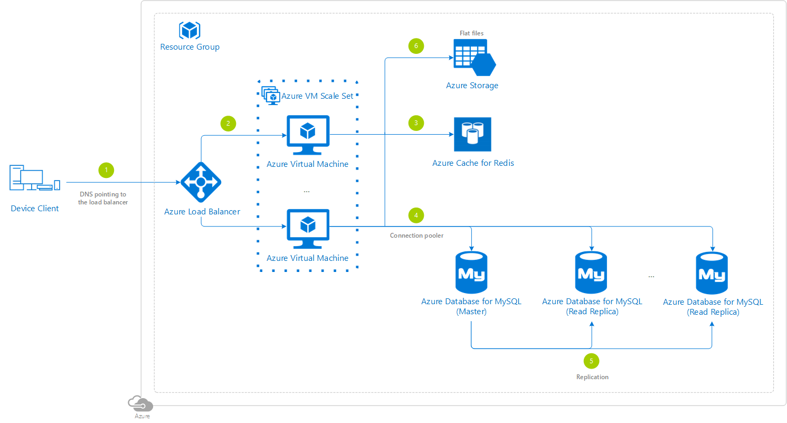

# LAMP Reference Architectures

## Single region

### Architecture diagram

### Abstract

### Azure specific

### Architecture services

- [Azure Linux Virtual Machines](https://docs.microsoft.com/azure/virtual-machines/linux/overview) - The most basic way to get computing power on Azure, in this case hosting the Apache web server and application PHP files LAMP components.
- [Azure Virtual Machine Scale Set](https://docs.microsoft.com/azure/virtual-machine-scale-sets/overview) - Let you create and manage a group of identical, load balanced Virtual Machines.
- [Azure Database for MySQL](https://docs.microsoft.com/azure/mysql/) - The LAMP data-storage component.
- [Azure Cache for Redis](https://docs.microsoft.com/azure/azure-cache-for-redis/cache-overview) - Cache to improve the performance and scalability of the architecture.
- [Azure Load Balancer](https://docs.microsoft.com/azure/load-balancer/load-balancer-overview) - Distributes the traffic across the different Azure Linux Virtual Machine instances from the Azure Virtual Machine Scale Set.
- [Azure Storage](https://docs.microsoft.com/en-us/azure/storage/common/storage-introduction) - Stores the flat files.

### Step by step

1. The device client gets the **Azure Load Balancer** IP address from a domain name system (DNS).
2. The Azure Load Balancer chooses a specific **Azure Linux Virtual Machine** instance from the **Azure Virtual Machine Scale Set**.
3. The Azure Linux Virtual Machines code attempts to read information stored in the **Azure Cache for Redis** first, following the [common cache-aside pattern](https://docs.microsoft.com/azure/architecture/patterns/cache-aside).
4. The Azure Linux Virtual Machines code reads or writes information from/into the **Azure Database for MySQL**, and any available read replicas, using a connection pooler.
5. To ensure high-availability, the Azure Database for MySQL has some kind of replication enabled.
6. Azure Linux Virtual Machine instances from the Azure Virtual Machine Scale Set read and write flat files from/into a high-performance **Azure Storage**.

### Deployment

An application running on a Azure Virtual Machine Scale Set is typically deployed in one of the two ways:

- Copying the application files at deployment time by using **Virtual Machine extensions**.
- Create a **golden image** that includes both the OS and the application files in a single custom image.

The Virtual Machine extension based approach can result in a slower scale out because the extensions will run on a new Virtual Machine each time it is created. If the scale set is based on a golden image, any new Virtual Machine is a copy of the source custom image and the scale out will be faster as the prerequisites and application are already installed.

The golden image approach, also known as immutable deployments has its advantages:

1. It is predictable, as you are promoting the image which you have already tested
2. It is also easy to scale and makes rollback to a well-known previous state easier

You can also do a combination of both, building a golden image that has the most immutable elements, like the OS version, Apache version, PHP version and your custom tools, while leaving out the PHP scripts that require more frequent update.

> [!IMPORTANT]
> Refer to [Deploy a single region LAMP architecture](./general-purpose-lamp-deployment-single-region.md) to find a detailed step by step to deploy this architecture using different methods.

### Distribute read workload to multiple MySQL read replicas in PHP

Consider leveraging [mysqlnd_ms](https://www.php.net/manual/book.mysqlnd-ms.php) (a plugin for PHP’s native driver for MySQL) that can be used as load balancer proxy to distribute read workload to multiple read replicas.

You can specify server name, user name, and password for connecting to a MySQL Server, so it can work to load balance and scale out by distributing read workload to Azure Database for MySQL read replicas.

## Case studies

:::row:::
    :::column:::

    :::column-end:::
    :::column:::

  
[Game developer dynamically scales fun in the cloud](https://customers.microsoft.com/story/gameinsights)

*"Azure had everything we needed to run the LAMP stack."* *"Azure “played well” with Terraform"*

    :::column-end:::
:::row-end:::

## Pricing

If you don't have an Azure subscription, create a [free account](https://aka.ms/azfreegamedev) to get started with 12 months of free services. You're not charged for services included for free with Azure free account, unless you exceed the limits of these services. Learn how to check usage through the [Azure Portal](https://docs.microsoft.com/azure/billing/billing-check-free-service-usage#check-usage-on-the-azure-portal) or through the [usage file](https://docs.microsoft.com/azure/billing/billing-check-free-service-usage#check-usage-through-the-usage-file).

You are responsible for the cost of the Azure services used while running these reference architectures, the total amount depends on the number of events that will run though the analytics pipeline. See the pricing webpages for each of the services that were used in the reference architectures:

- [Azure Linux Virtual Machines](https://azure.microsoft.com/pricing/details/virtual-machines/linux/)
- [Azure Virtual Machine Scale Set](https://azure.microsoft.com/pricing/details/virtual-machine-scale-sets/linux/)
- [Azure Database for MySQL](https://azure.microsoft.com/pricing/details/mysql/)
- [Azure Cache for Redis](https://azure.microsoft.com/pricing/details/cache/)
- [Azure Load Balancer](https://azure.microsoft.com/pricing/details/load-balancer/)
- [Azure Storage](https://azure.microsoft.com/pricing/details/storage/)

You also have available the [Azure pricing calculator](https://azure.microsoft.com/pricing/calculator/), to configure and estimate the costs for the Azure services that you are planning to use.

### Cost estimation

It can be laborious to estimate exactly how much a cloud infrastructure will cost. This guide will hopefully simplify how the settings in the Azure Pricing Calculator correlate with the deployment of a single region LAMP architecture for your game backend.

#### Components

For someone implementing this system, these are the important pieces you will need to consider:

1. Azure Virtual Machine instances

    There are no incremental charges for the Virtual Machine Scale Sets service itself, you are only charged for the compute instances you choose, as well as the other underlying infrastructure resources consumed such as storage and networking.

    Review the [harware](./multiplayer.md#hardware) considerations to determine the most appropriate Virtual Machine type to use and the number of instances you should start with in your architecture, based on your specific needs. Bear in mind that from your proof of concept (PoC) until your backend is used fully in production, you may need to make adjustments.

    To estimate the monthly compute cost, apply this formula, knowing that pricing may vary per region:

    `(# of Virtual Machine instances * # of hours running per month) + (# of Virtual Machine instances * # of GBs per instance)`

2. Azure Cache for Redis

    For selecting the right cache for your situation, review [What Azure Cache for Redis offering and size should I use?](https://docs.microsoft.com/azure/azure-cache-for-redis/cache-faq#what-azure-cache-for-redis-offering-and-size-should-i-use). To estimate the monthly Azure for Redis Cache cost, apply this formula, knowing that pricing varies per instance SKU (Premium > Standard > Basic) and also may vary per region:

    `(# of instances * # of hours running per month) + (# of GBs per instance for persistence if enabled in Premium SKU)`

    If you need a really large memory amount, you will need to use the Premium SKU and create a cluster where each node consists of a primary/replica cache pair for high availability.

3. Azure Database for MySQL

    To estimate the monthly Azure Database for MySQL cost, apply this formula, knowing that pricing varies per database tier (Memory Optimized > General Purpose > Basic) and compute tier, and may also vary per region:

    `(# of servers * # of hours running per month) + (# of GBs provisioned) + (# of GBs in additional backup storage)`

    Note that there is no additional charge for backup storage for up to 100% of your total provisioned storage.

4. Azure Load Balancer

    Basic Azure Load Balancer is free of charge while the Standard Azure Load Balancer has a charge associated with it. To estimate the monthly Standard Load Balanacer cost, apply this formula, knowing that pricing may vary per region:

    `(# or GBs of data processed) + (# of rules processed * # of hours running)`

5. Azure Storage

    To estimate the monthly storage cost, apply this formula, knowing that pricing varies per performance tier (Premium > Standard), redundancy alternative and access tier (Hot > Cool > Archive), and may also vary per region:

    `(# or GBs of capacity) + (# of write operations) + (# of list/create operations) + (# of read operations) + (# of GBs retrieved) + (# of GBs written)`

6. Bandwidth

    On top of that you have to add the bandwidth cost, where:

    - Inbound data transfers (i.e. data going into Azure data centers): Free
    - Outbound data transfers (for West US) (i.e. data going out of Azure data centers) is charged using this formula:

    `(# of GBs transferred outbound)`

#### Open the calculator

To start, open the Azure Calculator using any of the different pre-set estimations:

| | Small T-shirt configuration|Medium T-shirt configuration|Large T-shirt configuration|
|----------|----------|----------|-----------|
|Single region| [Calculator](https://azure.com/e/868f344674504e41a6bb87f3e838b128) | [Calculator](https://azure.com/e/041f3f70c85545d0b50868ae044c680a) | [Calculator](https://azure.com/e/1f57f2008dff494596198d3ffc9780c5) |

Set the **Region** in each section to the region you expect to run this from, Japan West for example, and make any adjustments you consider based on your own scenario.
