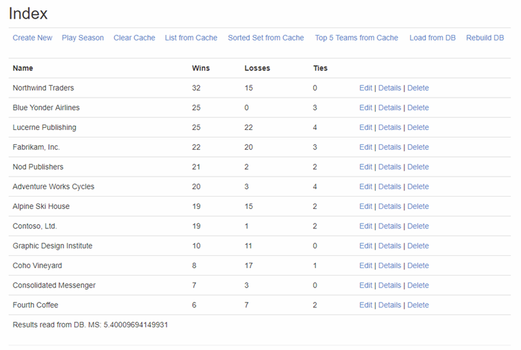
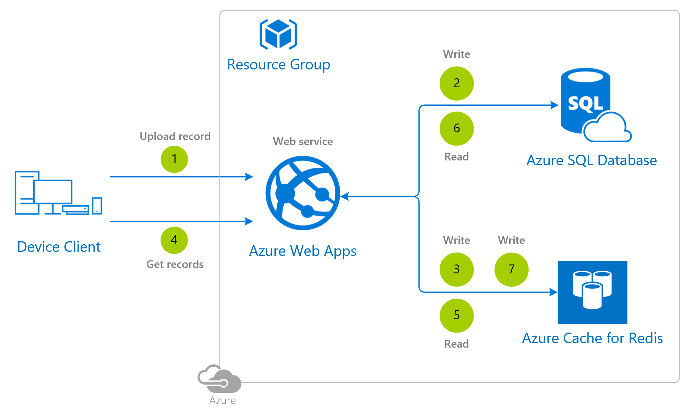
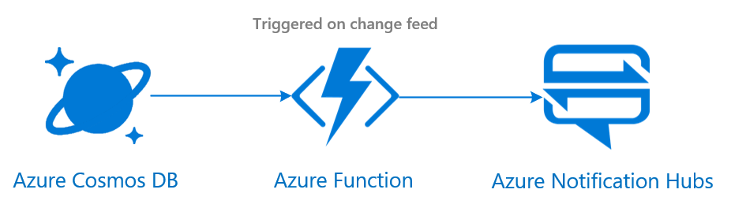

# Non-relational Leaderboard Reference Architecture

## Simple leaderboard for small scale

[](media/leaderboard/leaderboard-simple-redis.png)

### Architecture diagram

[](media/leaderboard/leaderboard-non-relational-redis.png)

### Implementation details

In this complete [tutorial](https://docs.microsoft.com/azure/azure-cache-for-redis/cache-web-app-cache-aside-leaderboard) that includes source code you can learn how to implement a leaderboard that uses Azure Cache for Redis in tandem with another database to improve data throughput and reduce database load.

It leverages the [cache-aside pattern](https://docs.microsoft.com/azure/architecture/patterns/cache-aside) using Azure Cache for Redis as a caching layer for the persistent database backend. Whenever you do a write you write the data to both the persistent database and Azure Cache for Redis. Whenever you read, you read the data from the cache first and if you get a *miss* (the data is no longer in the cache, as it expires after a certain time) then you read the data from the persistent database and right after that you write it into the cache. If you get a cache *hit*, you read the data from the cache.

The sample is using **Entity Framework**, a .NET abstraction layer to model and express relationship between data objects. Using it and in a nutshell, from a programming model standpoint you are getting a bunch of objects and setting properties to those objects, then the Entity Framework will map all the operations into SQL operations.

The step by step is:

1. The device client connects to the **Azure Web App** (web service), like it's shown in the architecture diagram above, to upload a new player's record. Alternatively you could substitute the web service for example with Azure Functions, each of them doing a specific task, or a load balancer with virtual machines.
2. The **Azure Web App** receives the action to upload a new record and, following the cache-aside pattern, writes it first into the persistent database, **Azure SQL Database** in this case.
3. After that, continuing with the cache-aside pattern, the same record is saved into the **Azure Cache for Redis** database.
4. Another player wants to see a specific leaderboard, so it connects to the **Azure Web App** (web service).
5. The **Azure Web App** receives the action to retrieve the records from a specific leaderboard. It attempts first to read it from the **Azure Cache for Redis**. If it finds it there (*hit*), then it just returns the information to the device client.
6. If the attempt to read the records from Azure Cache for Redis gets a *miss* (the data is no longer in the cache, as it expires after a certain time), then the **Azure Web App** reads the records from the persistent database, **Azure SQL Database** in this case.
7. The records retrieved from the persistent database are then saved into the **Azure Cache for Redis** and finally sent to the device client.

### Alternatives

Alternatively to [Azure SQL Database](https://docs.microsoft.com/azure/sql-database/sql-database-technical-overview), you could use other database like [Azure Database for MySQL](https://docs.microsoft.com/azure/mysql/overview) for example.

## Advanced leaderboard for large scale

### Architecture diagram


### Architecture services

- [Azure Functions](https://docs.microsoft.com/azure/azure-functions/)
- [Azure Cosmos DB](https://docs.microsoft.com/azure/cosmos-db/)

In this implementation, an Azure Function is used to write the data, instead of the Azure Cosmos DB SDK. If you are looking for finer control and debugging, you can leverage an app service and the [change processor SDK](https://docs.microsoft.com/azure/cosmos-db/sql-api-sdk-dotnet-changefeed).

### Architecture considerations

There are a variety of design considerations and choices to make when designing a leaderboard for your game.

#### Master collection, partitions and partition keys

Before we go any further, it's worth explaining some of the Azure Cosmos DB foundational aspects.

**Partitioning** is the technique used by Azure Cosmos DB to scale individual containers in a database. The items in a container are divided into distinct subsets, called logical partitions.

The **logical partitions** are created based on the value of a partition key property associated with each item. and they are a distinct subset of items in a container.

The items in a logical partition are identified by the partition key value that is shared by all items in the logical partition. For example, consider a container that holds documents and each document has a UserID property. If UserID serves as the partition key for the items in a container, and there are 1000 unique UserID values, 1000 logical partitions will be created for the container.

Each item in a container has a **partition key** that determines the item’s logical partition, and each item also has an item id (which is unique within a logical partition). The index of an item uniquely identifies it and it is formed by combining the partition key and the item id.

There are three key things that you need to take into consideration when defining a partition key:

1. There is a limit of 10GB per partition key, though each collection can have a large number of partition keys.
2. Partition keys can't be updated. If a partition key like A_B_C is created, it cannot be later updated to A_B_C_D. However, new keys can be created and data [migrated](#partition-key-update).
3. The goal is to spread the workload evenly across all partitions and avoid *hot spots*. 

For all the details on how to choose a partition key for your leaderboard, see [choosing a partition key](https://docs.microsoft.com/azure/cosmos-db/partitioning-overview#choose-partitionkey).

The implementation of this leaderboard reference architecture will leverage a **global leaderboard general collection** - aka the master collection that stores all the entries - and a **partition key for each combination of values**.

In this use case the **player's score will be ranked based on two variables: platform and level**, where the partition key used is `level_system`.

To use a concrete example, if a game leveraging this reference architecture and implementation was launched on both Xbox and PlayStation platforms and it only had two levels (1 and 2), that would end up generating the following collection and partitions in Azure Cosmos DB:

- Master collection
- Partition 1 (all_all))
- Partition 2 (xbox_all)
- Partition 3 (ps4_all)
- Partition 4 (all_level1)
- Partition 5 (all_level2)
- Partition 6 (xbox_level1)
- Partition 7 (ps4_level1)
- Partition 8 (xbox_level2)
- Partition 9 (ps4_level2)

The schema is:

```json
{
    "id": "1",
    "platform": "Xbox Live",
    "level": 3,
    "character": "Damian",
    "name": "Brian",  //platform gamertag
    "xp": 12345, // stat 1
    "quests": 12 //stat 2
}
```

Merely for clarification purposes, to demonstrate what would happen in a more complex scenario with 3 variables from a racing game: **level** (Laguna Seca and Monza), **choice** (fast class and slow class) and **stat** (fastest lap and power ups picked up). The partition key structure used would be `level_choice_stat` generating the following combinations as users upload their records:

- Master collection
- Partition 1 (lagunaseca_fastclass_fastestlap) [000]
- Partition 2 (lagunaseca_fastclass_powerupspicked) [001]
- Partition 3 (lagunaseca_slowclass_fastestlap) [010]
- Partition 4 (lagunaseca_slowclass_powerupspicked) [011]
- Partition 5 (monza_fastclass_fastestlap) [100]
- Partition 6 (monza_fastclass_powerupspicked) [101]
- Partition 7 (monza_slowclass_fastestlap) [110]
- Partition 8 (monza_slowclass_powerupspicked) [111]

In this scenario, if the first player is driving in the track *Monza* (level) using a car belonging to the *fast class* (choice), the information stored in Azure Cosmos DB would look like this:

|   |   |
| - | - |
| Global leaderboard collection (leaderboards_all_data) | { userID: "XYZ", stat: "fastestlap", choice: "fastclass", level: "monza", value: "123" }  { userID: "XYZ", stat: "powerupspicked", choice: "fastclass", level: "monza", value: "1" } |
| Partition 5 (monza_fastclass_fastestlap) | { userID: "XYZ", stat: "fastestlap", choice: "fastclass", level: "monza", value: "123" } |
| Partition 6 (monza_fastclass_powerupspicked) | { userID: "XYZ", stat: "powerupspicked", choice: "fastclass", level: "monza", value: "1" } |

#### Cascade writing pattern

Because it's going to be required to write information into the master collection and at least one or more sub-tables, especially if you have related variables (for example: iOS, Android and mobile. Where mobile is a filter that shows records from both iOS and Android users) the best practice is to not do more than a single writing operation and instead let the [Azure Cosmos DB change feed](https://docs.microsoft.com/azure/cosmos-db/change-feed) do the work by trickling effect to avoid inconsistencies that could happen if only one of the writes actually completed.

#### Partition key update

As previously mentioned, it's not possible to update an existing partition key, you can add new ones though.

Piggybacking on the twp variable example, let's say that you want to add one more so you can split the data depending on what difficulty setting the users are playing with (easy, medium, hard). To enable this you would like to upgrade from the old partition key  `level_system` to `level_system_difficulty`. To work around the limitation of not being able to update an existing partition key there is a [migration tool](https://github.com/Azure/azure-cosmos-dotnet-v2/tree/master/samples/ChangeFeedMigrationTool) available that follows these steps:

1. Drains the whole collection using the change feed.
2. Re-ingests the data using the different partition key.

#### Azure Cosmos DB request units per second

Have a look at the [general guidelines documentation](./general-guidelines.md#azure-cosmos-db) to understand how Azure Cosmos DB collections are billed, how to track the number of request units and the rule of thumb for requesting them.

### Deployment template

Have a look at the [general guidelines documentation](./general-guidelines.md#naming-conventions) that includes an article summarizing the naming rules and restrictions for Azure services.

### Optimization considerations

With respect to optimizing Cosmos DB cost, here are some useful resources:

- [Pricing model](https://docs.microsoft.com/azure/cosmos-db/how-pricing-works)
- [Optimizing for development and testing in Azure Cosmos DB](https://docs.microsoft.com/azure/cosmos-db/optimize-dev-test)
- [Total cost of ownership (TCO)](https://docs.microsoft.com/azure/cosmos-db/total-cost-ownership)
- [Understand your bill](https://docs.microsoft.com/azure/cosmos-db/understand-your-bill)
- [Optimize provisioned throughput cost](https://docs.microsoft.com/azure/cosmos-db/optimize-cost-throughput)
- [Optimize query cost](https://docs.microsoft.com/azure/cosmos-db/optimize-cost-queries)
- [Optimize storage cost](https://docs.microsoft.com/azure/cosmos-db/optimize-cost-storage)
- [Optimize reads and writes cost](https://docs.microsoft.com/azure/cosmos-db/optimize-cost-reads-writes)
- [Optimize multi-regions cost](https://docs.microsoft.com/azure/cosmos-db/optimize-cost-regions)
- [Optimize dev/testing workloads](https://docs.microsoft.com/azure/cosmos-db/optimize-dev-test)
- [Optimize with reserved capacity](https://docs.microsoft.com/azure/cosmos-db/cosmos-db-reserved-capacity)

## Additional potential features

### Adding support for push notifications

Depending on the platform your players are using, you may want to let them know when their score has been beaten by a friend for example, you can leverage the [Azure Cosmos DB change feed](https://docs.microsoft.com/azure/cosmos-db/change-feed) and the [Azure Notification Hubs service](https://docs.microsoft.com/azure/notification-hubs/) for enabling that.



## Additional resources and samples

### Functions and Cosmos DB via MongoDB API

Set up a [game Leaderboards API hosted on Azure Functions and backed by Azure Cosmos DB with Mongo API](https://github.com/dgkanatsios/AzureFunctionsNodeLeaderboards-Cosmos) that stores game leaderboards (scores) and exposes them via HTTP(s) methods/operations. Use this API service in your game and post new scores, get the top scores, find out the latest ones and more.

## Pricing

If you don't have an Azure subscription, create a [free account](https://aka.ms/azfreegamedev) to get started with 12 months of free services. You're not charged for services included for free with Azure free account, unless you exceed the limits of these services. Learn how to check usage through the [Azure Portal](https://docs.microsoft.com/azure/billing/billing-check-free-service-usage#check-usage-on-the-azure-portal) or through the [usage file](https://docs.microsoft.com/azure/billing/billing-check-free-service-usage#check-usage-through-the-usage-file).

You are responsible for the cost of the Azure services used while running these reference architectures, the total amount depends on the number of events that will run though the analytics pipeline. See the pricing webpages for each of the services that were used in the reference architectures:

- [Azure Functions](https://azure.microsoft.com/pricing/details/functions/)
- [Azure Cosmos DB pricing](https://azure.microsoft.com/pricing/details/cosmos-db/)
- [Azure Virtual Machines pricing](https://azure.microsoft.com/pricing/details/virtual-machines)

You also have available the [Azure pricing calculator](https://azure.microsoft.com/pricing/calculator/), to configure and estimate the costs for the Azure services that you are planning to use.