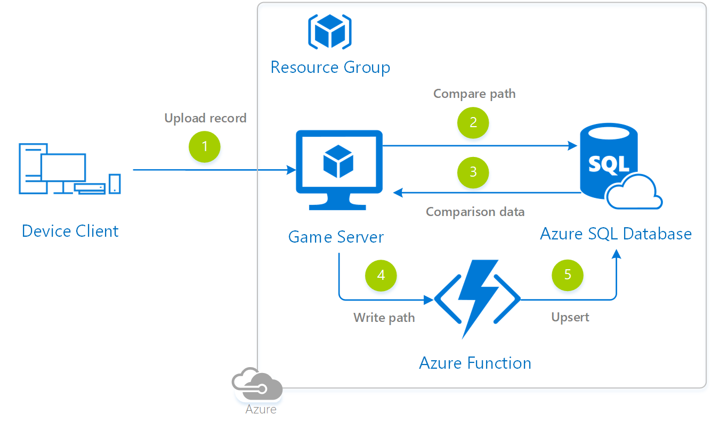

# Relational Leaderboard Reference Architecture

## Architecture Diagram



## Architecture Services

- [Azure Functions](https://docs.microsoft.com/azure/azure-functions/)
- [Azure SQL Database](https://docs.microsoft.com/azure/sql-database/)

## Architecture considerations

In this reference architecture, we define a “leaderboard” as showing the game player name and aggregated rank of top competitors across one or more gaming dimensions and timeframes.

This reference architecture assumes the following **large scale** requirements:

- 1 million players, each playing 4 games daily. This equates to:
    - 4 million games per day (~ 46 games per second)
    - ~ 121 million games per month
    - ~ 1.46 billion games per year
- Final individual game scores should be immediately available to the player upon game completion 
- Players get daily rewards based on their rank and the global leaderboard used to define rank should be easily refreshed every 4 minutes (should run with ample execution-time buffer).
- Gaming history should be periodically archived out of the “hot path.”  Archiving should be fast and not impact concurrent game result activity.
The data tier in this reference architecture also assumes coverage of a single game that is accessible across one or more platforms (Xbox, PlayStation, Desktop, iOS, Android, etc.).

While this reference architecture can be extended to support multiple games, isolating by game can help with individual tenant scale and the avoiding of “noisy” neighbors and concurrency issues.

### Service tiers for gaming leaderboard performance and scalability

To ensure sufficient resources for gaming launches and ongoing large-scale throughput, consider implementing the data tier on [Premium or Business Critical](https://docs.microsoft.com/azure/sql-database/sql-database-service-tier-business-critical) service tier models. These service tiers are designed for games that require low-latency responses from the underlying SSD storage and provide fast recovery if the underlying infrastructure fails. Business Critical enables a free of charge readable secondary replica of the primary database.

> [!NOTE]
> All schema and queries recommended in this architecture were tested on the [Azure SQL Database Business Critical](https://docs.microsoft.com/en-us/azure/sql-database/sql-database-service-tier-business-critical) Gen 5 service tier, with 14 vCores and using 1.6 Billion rows of game score history.

## Database schema

For the purposes of this reference architecture, we will use the following base tables and supporting constraints and indexes. Each table is intended to cover the “minimum viable” schema and can be extended based on gaming requirements. 

[](media/leaderboard/leaderboard-relational-schema.png)

This schema accommodates the following usage scenario:

- We will insert final level and scores upon each individual game completion into the **GameCompletion** table. This table should be accessed specifically for new row inserts and periodic calculation of leaderboard snapshot rank results.
- The GameCompletion table ideally contains all rows for the “hot path” of data (*data you expect to frequently use for ranking calculations*). For infrequently accessed older data, use the **GameCompletionHistory** table.This reference architecture will show how to benefit from fast partition-switching in order to minimize the time it takes to remove old data from GameCompletion. The GameCompletion partition function and scheme are described later and help facilitate efficient data archiving. 
- The **GamePlatform** and **Player** tables contain supplemental game platform and player-related data.  This data can be joined to the GameCompletion and GameCompletionHistory tables.
- The **LeaderboardSnapshot** table contains the calculated leaderboard ranking results.  
    - This is the table that should be used by the application to return ranking results.
    - This table should be populated by a separate process based on the required schedule and frequency (for example, calculating current daily leaderboard ranking every 4 minutes).
    - Data is calculated using the GameCompletion table - and as necessary, the GameCompletionHistory table.
    - or access to results, always use the LeaderboardSnapshot table (avoid repeated re-calculations of the same ranking results from GamePlatform). 
- The **RankResultType** table contains the different types of leaderboard snapshots required for the game. The primary key for this table can then be used in LeaderboardSnapshot to indicate the type of ranking results being retrieved.

The next sections will detail the schema of each of the aforementioned objects.

### Player table

This table contains the generated player surrogate key for optimal join performance and player “natural key” and alias columns.

> [!NOTE]
> **Natural keys** are unique keys based on “real world” attributes (for example, an Xbox Live ID). 
>
> **Surrogate keys** are unique system-generated keys. This type of key has no inherent real-world meaning but can be used to optimize performance (allowing a choice of optimal key data types) and also minimizes the dependency on later natural key changes. For example – if a game player changes their Live ID, if a surrogate key is used, only one change is required to the Player table – instead of multiple natural key changes required for all player game history.

We will assume population based on your core gaming authentication data source and system.

```sql
CREATE TABLE dbo.Player
(
    PlayerSurrogateKey BIGINT IDENTITY(1, 1) PRIMARY KEY CLUSTERED,
    PlayerNaturalKey UNIQUEIDENTIFIER NOT NULL,
    PlayerGamerAlias NVARCHAR(256) NOT NULL
);
GO
```

### GamePlatform table

This table covers the platforms on which the specific game can be played (e.g. Xbox, iOS, Android).

```sql
CREATE TABLE dbo.GamePlatform
(GamePlatformSurrogateKey BIGINT IDENTITY(1,1) PRIMARY KEY CLUSTERED,
 GamePlatformName NVARCHAR(256) NOT NULL
);
GO

INSERT dbo.GamePlatform
(GamePlatformName)
VALUES (N'Xbox'), (N'iOS'), ('PS'), ('Android');
GO
```

### GameCompletion partition function and scheme

Every large-scale table should accommodate partitioning when possible. This allows for archiving over time and also scaling out for “cold path” data.  The following partition function and scheme will be used for consecutive table examples.  In this example, partitioning is performed for each month in 2019 and can be extended (split and merged) over time based on gaming requirements and data retention policies.

```sql
CREATE PARTITION FUNCTION GameCompletionMonthPartitionFunction (DATETIME2)
AS RANGE RIGHT FOR VALUES
(   '20190201',
    '20190301',
    '20190401',
    '20190501',
    '20190601',
    '20190701',
    '20190801',
    '20190901',
    '20191001',
    '20191101',
    '20191201'
);
GO

CREATE PARTITION SCHEME GamePartitionMonthPartitionScheme
AS PARTITION GameCompletionMonthPartitionFunction
ALL TO
    (
        [PRIMARY]
    );
GO
```

### GameCompletion table

The GameCompletion table is populated with the final score by level, game completion date, player and game platform.  Notice that the table is partitioned by game completion date:

```sql
CREATE TABLE dbo.GameCompletion
(
    GameCompletionSurrogateKey BIGINT IDENTITY(1, 1),
    PlayerSurrogateKey BIGINT NOT NULL,
    GamePlatformSurrogateKey BIGINT NOT NULL,
    GameCompletionLevel INT NOT NULL,
    GameCompletionScore BIGINT NOT NULL,
    GameCompletionDate DATETIME2 NOT NULL
) ON GamePartitionMonthPartitionScheme (GameCompletionDate);
GO
```

We will also add a clustered columnstore index to this table in order to enable low-latency analytic ranking queries against a very large result set:

```sql
CREATE CLUSTERED COLUMNSTORE INDEX CCI_GameCompletion
ON dbo.GameCompletion
ON GamePartitionMonthPartitionScheme(GameCompletionDate);
GO
```

To support data quality, we add the following primary key and two foreign key constraints to this table:

```sql
ALTER TABLE dbo.GameCompletion
ADD CONSTRAINT PK_GameCompletionOriginal
    PRIMARY KEY NONCLUSTERED (
                                 GameCompletionSurrogateKey,
                                 GameCompletionDate
                             ) ON GamePartitionMonthPartitionScheme(GameCompletionDate);
GO

ALTER TABLE dbo.GameCompletion
ADD CONSTRAINT FK_GameCompletion_PlayerSurrogateKeyOriginal
    FOREIGN KEY (PlayerSurrogateKey)
    REFERENCES dbo.Player (PlayerSurrogateKey);
GO

ALTER TABLE dbo.GameCompletion
ADD CONSTRAINT FK_GameCompletion_GamePlatformSurrogateKeyOriginal
    FOREIGN KEY (GamePlatformSurrogateKey)
    REFERENCES dbo.GamePlatform (GamePlatformSurrogateKey);
GO
```

*Keep ad hoc activity to a minimum against the GameCompletion table*. This table should be used for fast ingestion of incoming score rows (~ 50 rows/sec). Instead of accessing GameCompletion for ranking results, use the LeaderboardSnapshot table for any customer-facing reporting and application-tier caching.

### GameCompletionHistory table

The GameCompletionHistory table is intended to hold historical rows on the “cold path” of access.  Consider keeping such a history table that matches the underlying partition scheme of the GameCompletion table.  This allows for fast partition switches from GameCompletion to GameCompletionHistory (this is described later).

```sql
CREATE TABLE dbo.GameCompletionHistory
(
    GameCompletionSurrogateKey BIGINT NOT NULL,
    PlayerSurrogateKey BIGINT NOT NULL,
    GamePlatformSurrogateKey BIGINT NOT NULL,
    GameCompletionLevel INT NOT NULL,
    GameCompletionScore BIGINT NOT NULL,
    GameCompletionDate DATETIME2 NOT NULL
) ON GamePartitionMonthPartitionScheme (GameCompletionDate);
GO

CREATE CLUSTERED COLUMNSTORE INDEX CCI_GameCompletionHistory
ON dbo.GameCompletionHistory
ON GamePartitionMonthPartitionScheme(GameCompletionDate);
GO

ALTER TABLE dbo.GameCompletionHistory
ADD CONSTRAINT PK_GameCompletionHistory
    PRIMARY KEY NONCLUSTERED (
        GameCompletionSurrogateKey,
        GameCompletionDate
    ) ON GamePartitionMonthPartitionScheme(GameCompletionDate);
GO
```

### RankResultType table

The RankResultType table contains the ranking categories you wish to generate for your game.  In the example below, we have ranking for all time, day, week, month and year.  Having this referenced in a separate table from the actual leaderboard results allows for scalability of future ranking options:

```sql
CREATE TABLE dbo.RankResultType
(
    RankResultTypeSurrogateKey SMALLINT IDENTITY(1, 1) PRIMARY KEY CLUSTERED,
    RankResultTypeDescription NVARCHAR(256) NOT NULL
);
GO

INSERT dbo.RankResultType
(
    RankResultTypeDescription
)
VALUES
('All Time'),
('Day'),
('Week'),
('Month'),
('Year');
GO
```

### LeaderboardSnapshot table

The LeaderboardSnapshot table will contain the point-in-time leaderboard ranking results against an array of potential ranking types.  This allows repeatable access to the latest or historical results without a repeated re-calculation of rankings against the source score data.  We also add a foreign key constraint to the rank result type.  Also notice that some columns are preserved from the original score tables in order to assist with easier post-calculation debugging (preserving point-in-time level, score, date):

```sql
CREATE TABLE dbo.LeaderboardSnapshot
(
    PlayerSurrogateKey BIGINT NOT NULL,
    GamePlatformSurrogateKey BIGINT NOT NULL,
    LeaderboardSnapshotDate DATETIME2 NOT NULL,
    GameCompletionLevel INT NOT NULL,
    GameCompletionScore BIGINT NOT NULL,
    GameCompletionDate DATETIME2 NOT NULL,
    RankResultTypeSurrogateKey SMALLINT NOT NULL,
    RankResult BIGINT NOT NULL,
    CONSTRAINT PK_LeaderboardSnapshot
        PRIMARY KEY CLUSTERED (
            PlayerSurrogateKey,
            GamePlatformSurrogateKey,
            LeaderboardSnapshotDate,
            GameCompletionDate,
            RankResultTypeSurrogateKey
        )
);
GO

ALTER TABLE dbo.LeaderboardSnapshot
ADD CONSTRAINT FK_LeaderboardSnapshot_PlayerSurrogateKey
    FOREIGN KEY (RankResultTypeSurrogateKey)
    REFERENCES dbo.RankResultType (RankResultTypeSurrogateKey);
GO
```

## Data access patterns

The following section details leaderboard-related access patterns against a populated schema. 

### Ranking operations

The following is an example of generating a single-day, all-player-and-platform rank based on top score and completion level.  Notice that the results are populated into the LeaderboardSnapshot table (*on the aforementioned reference service tier, with 1.6 billion rows in history, this query takes ~ 20 seconds leveraging the Columnstore index and batch mode execution for most operations*):

```sql
;WITH CTE_Leaderboard
AS (SELECT DENSE_RANK() OVER (ORDER BY GameCompletionScore DESC, GameCompletionLevel DESC) AS RankResult,
           PlayerSurrogateKey,
           GamePlatformSurrogateKey,
           GameCompletionLevel,
           GameCompletionScore,
           GameCompletionDate
    FROM dbo.GameCompletion
    WHERE CAST(GameCompletionDate AS DATE) = '2/26/2019')
INSERT dbo.LeaderboardSnapshot
(
    PlayerSurrogateKey,
    GamePlatformSurrogateKey,
    LeaderboardSnapshotDate,
    GameCompletionLevel,
    GameCompletionScore,
    GameCompletionDate,
    RankResultTypeSurrogateKey,
    RankResult
)
SELECT DISTINCT
       CTE_Leaderboard.PlayerSurrogateKey,
       CTE_Leaderboard.GamePlatformSurrogateKey,
       SYSDATETIME() AS LeaderboardSnapshotDate,
       GameCompletionLevel,
       GameCompletionScore,
       GameCompletionDate,
       2 AS RankResultTypeSurrogateKey, -- Day 
       CTE_Leaderboard.RankResult
FROM CTE_Leaderboard
ORDER BY RankResult;
GO
```

The prior operation inserted the ranking rows into the leaderboard table. To retrieve these results for a specific day and ranking type, you can use the following query:

```sql
SELECT PlayerSurrogateKey,
       GamePlatformSurrogateKey,
       LeaderboardSnapshotDate,
       GameCompletionLevel,
       GameCompletionScore,
       GameCompletionDate,
       RankResultTypeSurrogateKey,
       RankResult
FROM dbo.LeaderboardSnapshot
WHERE LeaderboardSnapshotDate = '2019-02-28 18:08:01.0052490' 
	AND RankResultTypeSurrogateKey = 2
ORDER BY RankResult;
GO
```

> [!TIP]
> As a recommendation, create additional nonclustered indexes on the LeaderboardSnapshot table to support common leaderboard result query patterns (*based on common predicates and join conditions*). In the prior query example, the following index helps with performance because it covers both columns that were referenced in WHERE clause predicates.
>
> Consider the tradeoff of read-performance vs. write-overhead. Additional indexes may improve read-performance, but also increase storage and write-overhead.  

```sql
CREATE NONCLUSTERED INDEX [LeaderboardSnapshot_LeaderboardSnapshotDate_RankResultTypeSurrogateKey]
ON [dbo].[LeaderboardSnapshot] ([LeaderboardSnapshotDate],[RankResultTypeSurrogateKey])
INCLUDE ([GameCompletionLevel],[GameCompletionScore],[RankResult])
WITH (DATA_COMPRESSION = PAGE);
GO
```

### Real-time ranking with paging of results

If leaderboard snapshots are required for only a specific range of values (for example, paging results), you can use the OFFSET ROWS FETCH NEXT functionality of T-SQL.  For example, the following are the top 100 rankings for all rows in GameCompletion on March 10th (~ 20 seconds execution time on the aforementioned service tier and table size):

```sql
;WITH CTE_Leaderboard
AS (SELECT DENSE_RANK() OVER (ORDER BY GameCompletionScore DESC, GameCompletionLevel DESC) AS RankResult,
           PlayerSurrogateKey,
           GamePlatformSurrogateKey,
           GameCompletionLevel,
           GameCompletionScore,
           GameCompletionDate
    FROM dbo.GameCompletion
	WHERE CAST(GameCompletionDate AS DATE) = '3/10/2019')
INSERT dbo.LeaderboardSnapshot
(
    PlayerSurrogateKey,
    GamePlatformSurrogateKey,
    LeaderboardSnapshotDate,
    GameCompletionLevel,
    GameCompletionScore,
    GameCompletionDate,
    RankResultTypeSurrogateKey,
    RankResult
)
SELECT DISTINCT
       CTE_Leaderboard.PlayerSurrogateKey,
       CTE_Leaderboard.GamePlatformSurrogateKey,
       SYSDATETIME() AS LeaderboardSnapshotDate,
       GameCompletionLevel,
       GameCompletionScore,
       GameCompletionDate,
       2 AS RankResultTypeSurrogateKey, -- Day
       CTE_Leaderboard.RankResult
FROM CTE_Leaderboard
ORDER BY RankResult OFFSET 0 ROWS FETCH NEXT 100 ROWS ONLY;
GO
```

### Ranking results “around me”

In the following example, assume that we generated daily rank for all players as of May 1st, 2019. Results across all players are populated in the LeaderboardSnapshot table.  
Now consider the following conditions and requirements:

- Player “242695” is ranked 24,421 for this particular ranking snapshot.
- This player wishes to see the 10 players immediately above and below them.

Since the ranking should already have been generated and populated into the LeaderboardSnapshot table, the next step is to run a query like the following to generate player “242695”’s window of nearby competitors.  

In this below example, we define one common table expression for the game completion date and rank type (CTE_NearMe), a second common table expression for defining the upper/lower rank boundaries for player 242695 (CTE_PlayerRank), and then a query to pull the nearest-neighbor ranking rows using these CTEs:

```sql
;WITH CTE_NearMe
AS (SELECT PlayerSurrogateKey,
           GamePlatformSurrogateKey,
           LeaderboardSnapshotDate,
           GameCompletionLevel,
           GameCompletionScore,
           GameCompletionDate,
           RankResultTypeSurrogateKey,
           RankResult
    FROM dbo.LeaderboardSnapshot
    WHERE CAST(GameCompletionDate AS DATE) = '5/1/2019'
          AND RankResultTypeSurrogateKey = 2),
      CTE_PlayerRank
AS (SELECT (CTE_NearMe.RankResult - 10) AS LowerRankBound,
           (CTE_NearMe.RankResult + 10) AS UpperRankBound
    FROM CTE_NearMe
    WHERE CTE_NearMe.PlayerSurrogateKey = 242695)
SELECT CTE_NearMe.PlayerSurrogateKey,
       CTE_NearMe.GamePlatformSurrogateKey,
       CTE_NearMe.GameCompletionLevel,
       CTE_NearMe.GameCompletionScore,
       CTE_NearMe.GameCompletionDate,
       CTE_NearMe.RankResultTypeSurrogateKey,
       CTE_NearMe.RankResult
FROM CTE_NearMe
WHERE RankResult
BETWEEN
(
    SELECT LowerRankBound FROM CTE_PlayerRank
) AND
(
    SELECT UpperRankBound FROM CTE_PlayerRank
)
ORDER BY RankResult;
GO
```

### Handling singleton lookups

Again, keep ad hoc activity to a minimum against the *GameCompletion* table.  If using this table for real-time individual score retrieval (vs. leaderboard generation), consider adding supporting [nonclustered b-tree indexes](https://docs.microsoft.com/sql/relational-databases/indexes/clustered-and-nonclustered-indexes-described?view=sql-server-2017) based on the anticipated lookup values.

For infrequent scenarios, the following is an example of a single game result lookup operation that uses just the underlying Columnstore index of GameCompletion:

```sql
SELECT GameCompletionSurrogateKey,
       PlayerSurrogateKey,
       GamePlatformSurrogateKey,
       GameCompletionLevel,
       GameCompletionScore,
       GameCompletionDate
FROM dbo.GameCompletion
WHERE PlayerSurrogateKey = 944799
	AND GameCompletionDate = '2019-12-30 00:00:02.9428411';
GO
```

Even without a nonclustered index, this example singleton lookup query only takes ~ 200 milliseconds.  Measure any benefit of additional indexes against the overall write-latency overhead and storage footprint.

### Aging out data

This reference architecture lends itself to easy archiving and migration of old data to a history table. The following query shows how to age out data to GameCompletionHistory:

```sql
-- Switching out the oldest data by month
-- Partition “1” in this example is January 2019 data
ALTER TABLE dbo.GameCompletion 
	SWITCH PARTITION 1 
		TO dbo.GameCompletionHistory PARTITION 1;
GO
```

The change and archive process runs immediately (sub-second) assuming all steps were followed as documented in this reference architecture.  Data that was archived is immediately available in GameCompletionHistory.

## Additional resources and samples

- [Partitioned Tables and Indexes](https://docs.microsoft.com/sql/relational-databases/partitions/partitioned-tables-and-indexes?view=sql-server-2017)
- [Columnstore indexes - Design guidance](https://docs.microsoft.com/sql/relational-databases/indexes/columnstore-indexes-design-guidance?view=sql-server-2017#choose-the-best-columnstore-index-for-your-needs)
- [Manual tune query performance in Azure SQL Database](https://docs.microsoft.com/azure/sql-database/sql-database-performance-guidance)
- [Clustered and Nonclustered Indexes DescribedSQL Server Index Architecture and Design Guide](https://docs.microsoft.com/sql/relational-databases/indexes/clustered-and-nonclustered-indexes-described?view=sql-server-2017)
- [Azure SQL Database for Gaming Industry Workloads technical white paper](https://azure.microsoft.com/resources/azure-sql-database-for-gaming-industry-workloads/)

## Pricing

If you don't have an Azure subscription, create a [free account](https://aka.ms/azfreegamedev) to get started with 12 months of free services. You're not charged for services included for free with Azure free account, unless you exceed the limits of these services. Learn how to check usage through the [Azure Portal](https://docs.microsoft.com/azure/billing/billing-check-free-service-usage#check-usage-on-the-azure-portal) or through the [usage file](https://docs.microsoft.com/azure/billing/billing-check-free-service-usage#check-usage-through-the-usage-file).

You are responsible for the cost of the Azure services used while running these reference architectures, the total amount depends on the number of events that will run though the analytics pipeline. See the pricing webpages for each of the services that were used in the reference architectures:

- [Azure Functions](https://docs.microsoft.com/azure/azure-functions/)
- [Azure SQL Database](https://azure.microsoft.com/pricing/details/sql-database/managed/)

You also have available the [Azure pricing calculator](https://azure.microsoft.com/pricing/calculator/), to configure and estimate the costs for the Azure services that you are planning to use.
