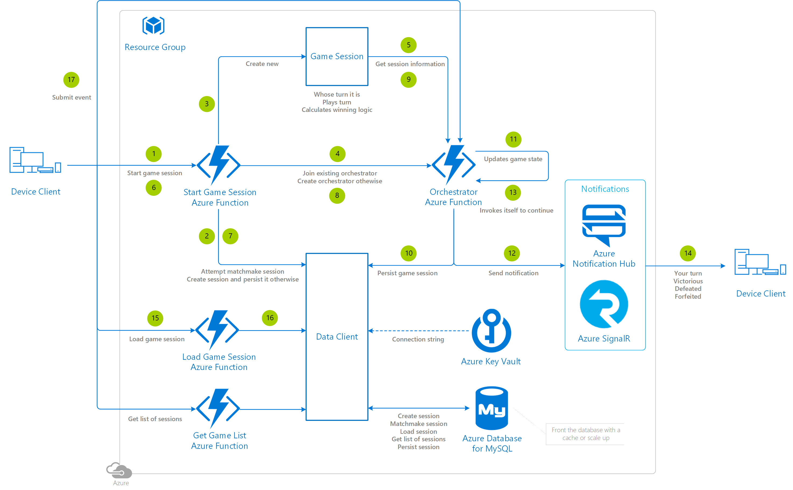
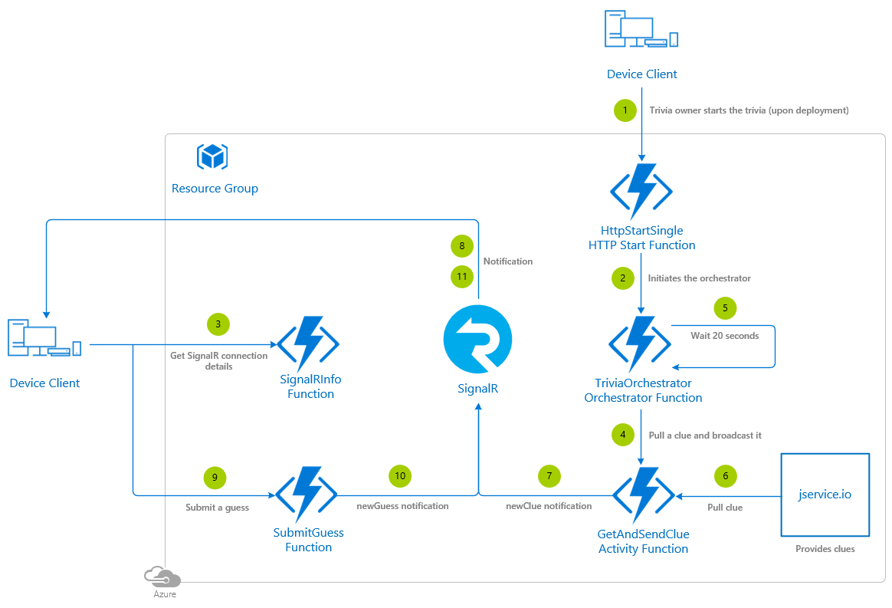

# Serverless Asynchronous Multiplayer Reference Architecture

## Architecture diagram

## Architecture services

- [Azure Function](https://docs.microsoft.com/azure/azure-functions/functions-overview) - Used to run small pieces of matchmaking logic. Note that when using a Consumption plan, Function definitions are stored in File Storage, meaning that you will have to create a Storage account. For optimal performance you should use a Storage account in the same region as the Functions.
- [Azure Database for MySQL](https://docs.microsoft.com/azure/mysql/) - Used to store the information as it is fast, lightweight, reliable and cost effective.
- [Notification Hub](https://docs.microsoft.com/azure/mysql/) - An easy-to-use and scaled-out push engine that allows you to send notifications to many platforms (iOS, Android, Windows, Kindle, Baidu, etc.).
- [SignalR](https://azure.microsoft.com/services/signalr-service/) - Simplifies the process of adding real-time web functionality to applications over HTTP, allowing you to push data to connected device clients.
- [Key Vault](https://docs.microsoft.com/azure/key-vault/key-vault-overview) - The best service for managing secrets, including database connection strings.

## Design considerations

This specific reference architecture showcases a **simple serverless tic-tac-toe** game.

In this reference architecture, a helper class (Data Client) will connect to and interact with the database, and the rest of the Functions will make use of it when needed. The Game Session class is used to run the turn with the information submitted by the player, and for calculating the winner. There will be 3 different action events supported: *forfeit* (to give up on a game), *addPlayer* (to join a player to a game session) and *takeTurn*

## Deployment template

Have a look at the [general guidelines documentation](./general-guidelines.md#naming-conventions) that includes a section summarizing the naming rules and restrictions for Azure services.

>[!NOTE]
> If you're interested in how the ARM template works, review the Azure Resource Manager template documentation from each of the different services leveraged in this reference architecture:
>
> - [Create an Event Hub using Azure Resource Manager template](https://docs.microsoft.com/azure/event-hubs/event-hubs-resource-manager-namespace-event-hub)
> - [Automate resource deployment for your function app in Azure Functions](https://docs.microsoft.com/azure/azure-functions/functions-infrastructure-as-code)
> - [Azure Database for MySQL template](https://docs.microsoft.com/azure/templates/microsoft.dbformysql/servers)
> - [Azure Notification Hub template](https://docs.microsoft.com/azure/templates/microsoft.notificationhubs/allversions)

>[!WARNING]
> The database admin password must contain 8 to 128 characters. Also, it must contain characters from three of the following categories: English uppercase letters, English lowercase letters, numbers (0-9), and non-alphanumeric characters (!, $, #, %, and so on).

>[!TIP]
> To run the Azure Functions locally, update the *local.settings.json* file with these same app settings.

## Step by step

### Create a new game session

1. The device client formats any game settings selected by the player and sends the *start game session* event to the backend, then awaits a response.
1. The backend receives the command to start a new game session. First of all it tries to find an existing game session that matches the player settings.
1. Assuming a suitable game session is **not available** for matchmaking, a new game session object is created.
1. A new durable Orchestrator Function is created.
1. The durable Orchestrator Function reads the game session object and **waits until at least 2 players have joined the game session**.
1. Another player with the same settings as those selected by the first player sends a *start game session* event to the backend.
1. The backend receives the command and tries to find an existing game. In this case it **finds the game session previously created**.
1. The durable Orchestrator Function receives the *addPlayer* event and stops waiting as the 2 players have joined the game session.
1. The durable Orchestrator Function officially starts the match, setting the game state to **in progress** and randomly selecting one of the players to start. In a nutshell, the Orchestrator is responsible for executing the game logic and updating the game state.
1. The durable Orchestrator Function triggers an operation to **persist the data into the database**.
1. Write operations into the database are batched via an **Azure Event Hub** to avoid exhausting the database connections.
1. The **Azure Event Hub** is bound to an **Azure Function** that leverages the data client helper class to connect to the database to persist the data.
1. The durable Orchestrator Function runs the game session logic and returns that it's the turn of the next player.
1. It **queues notifications** to the player or players based on the game conditions (it's some elses turn, someone won, someone forfeited, etc).
1. The durable Orchestrator then **invokes itself** with the new game state, and waits for the next event to be received.
1. The device client receives the notification, including the unique identifier of the Orchestrator Function managing the game session.
1. The device client sends the *load game session* event to the backend, including the unique identifier of the durable Orchestrator received in the notification.
1. The backend receives the command to **load the game session** and returns the details of the game session to be displayed by the device client.
1. The player submits an X or a O directly to the durable Orchestrator Function and ends the turn.

### Request player games list

1. The device client submits the *get list of sessions* command to the backend.
2. The backend handles the request by querying the database, then sends the the data to the device client. Consider limiting the number of results returned by the query and ordering them.
3. The device client receives the backend response and uses the data it contains to populate the pertinent UI.

## Implementation sample

### Exercise for the reader

The sample provided doesn't include logic to scale the *reads* from the database, only the *writes*. Consider [fronting the database with a cache](https://docs.microsoft.com/azure/architecture/best-practices/caching?toc=/azure/redis-cache/toc.json#considerations-for-using-caching) or scale up the database to avoid exhausting the connections to the database.

## Security considerations

Do not hard-code the database connection string into the source of the Function.  Instead, at a minimum, leverage the [Function App Settings](https://docs.microsoft.com/azure/azure-functions/functions-how-to-use-azure-function-app-settings#manage-app-service-settings) or, for even stronger security, use [Key Vault](https://docs.microsoft.com/azure/key-vault/) instead. There is a tutorial explaining how to [create a Key Vault](https://blogs.msdn.microsoft.com/benjaminperkins/2018/06/13/create-an-azure-key-vault-and-secret/), how to [use a managed service identity with a Function](https://blogs.msdn.microsoft.com/benjaminperkins/2018/06/13/using-managed-service-identity-msi-with-and-azure-app-service-or-an-azure-function/) and finally how to [read the secret stored in Key Vault from a Function](https://blogs.msdn.microsoft.com/benjaminperkins/2018/06/13/how-to-connect-to-a-database-from-an-azure-function-using-azure-key-vault/).

## Alternatives

In this reference architecture, Azure Database for MySQL was used, however it could be replaced with [Azure SQL Database](https://docs.microsoft.com/azure/sql-database/sql-database-technical-overview) or [Azure Database for PostgreSQL](https://docs.microsoft.com/azure/postgresql/).

## Additional resources and samples

### Trivia game using durable Functions and Azure SignalR service

Though it's not entirely asynchronous (it runs on a 20 seconds timer), you can find the implementation of a **trivia game** built on durable Functions and Azure SignalR Service [at this link](https://github.com/anthonychu/serverless-trivia). Clues are retrieved from [jservice.io](https://jservice.io/). To see it running, see [this link](https://aka.ms/serverlesstriviatrivia).

Here's how it works:

1. The trivia game hoster starts the game, invoking the **HttpStartSingle** Azure Function, either upon deployment or via a web request.
2. That Azure Function kicks off the **TriviaOrchestrator Durable Azure Function**.
3. Players join the game. The device client from each player running the app retrieves the Azure SignalR Service hub details from the backend. The backend receives the request via the **SignalRInfo Azure Function**.  A token is generated by the function binding by using the key in the connection string, then it is sent to the device client. The device client sets the two events from the Azure SignalR Service that is going to listen to: *newClue* and *newGuess*.
4. On the backend, the **TriviaOrchestrator Durable Azure Function** calls the **GetAndSendClue Durable Activity Azure Function**.
5. The **TriviaOrchestrator Durable Azure Function** sets a timer to call itself every 20 seconds, which is the amount of time the players have to respond to the trivia clue.
6. The **GetAndSendClue Durable Activity Azure Function** pulls a trivia clue from the jservice.io service.
7. Then the trivia clue is **broadcast via Azure SignalR Service** to all connected users with the target *newClue*.
8. Players receives the trivia clue from the **Azure SignalR Service**, and come up with their answer.
9. The backend receives the player responses via the **SubmitGuess Azure Function**.
10. This Azure Function calculates if the answers submitted by the players are correct or not. Then the outcomes are **broadcast via Azure SignalR Service** to all connected users with the target *newGuess*.
11. The device client receives the response from **Azure SignalR Service** and updates the number of correct or incorrect guesses.

## Pricing

If you don't have an Azure subscription, create a [free account](https://aka.ms/azfreegamedev) to get started with 12 months of free services. You're not charged for services included for free with Azure free account, unless you exceed the limits of these services. Learn how to check usage through the [Azure Portal](https://docs.microsoft.com/azure/billing/billing-check-free-service-usage#check-usage-on-the-azure-portal) or through the [usage file](https://docs.microsoft.com/azure/billing/billing-check-free-service-usage#check-usage-through-the-usage-file).

You are responsible for the cost of the Azure services used while running these reference architectures.  The total amount will vary based on usage. See the pricing webpages for each of the services that were used in the reference architecture:

- [Azure Function](https://azure.microsoft.com/pricing/details/functions/)
- [Azure Database for MySQL](https://azure.microsoft.com/pricing/details/mysql/)
- [Azure Notification Hubs](https://azure.microsoft.com/pricing/details/notification-hubs/)
- [Azure SignalR Service](https://azure.microsoft.com/pricing/details/signalr-service/)
- [Azure Key Vault](https://azure.microsoft.com/pricing/details/key-vault/)

You can also use the [Azure pricing calculator](https://azure.microsoft.com/pricing/calculator/) to configure and estimate the costs for the Azure services that you are planning to use.