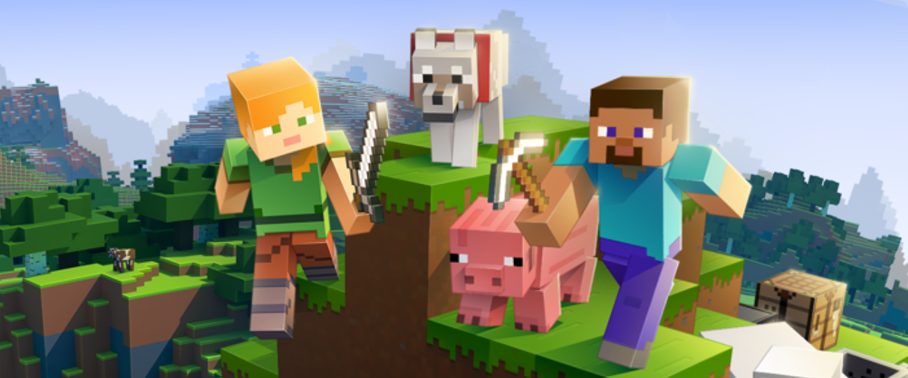
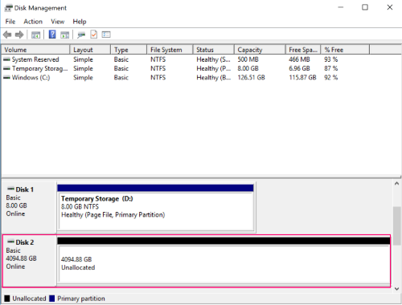

# Basic Game Server Hosting on Azure

This reference architecture details the steps to setup a basic Azure backend that will host a game server on either Windows or Linux, using **Minecraft server** as an example.



## Architecture diagram


## Relevant services

- [Azure Windows Virtual Machines](https://docs.microsoft.com/azure/virtual-machines/windows/overview) and [Azure Linux Virtual Machines](https://docs.microsoft.com/azure/virtual-machines/linux/overview) - The most basic way to get computing power on Azure.
- [Azure Disk Storage](https://docs.microsoft.com/azure/virtual-machines/windows/about-disks-and-vhds) - Basic persistent storage.

## Step by step

The summary of steps to complete is:

1. Set up a resource group.
2. Set up an Azure Virtual Machine, attach a persistent disk and open ports.
3. Access the new Azure Virtual Machine remotely via maintenance port.
4. Set up the operating system firewall.
5. Initialize and format the persistent data disk.
6. Install the game server dependencies.
7. Install the game server itself.
8. Configure the game server.
9. Run the game server and double check that the ports are open.

### Set up a resource group

A resource group is a logical collection of Azure resources. All resources are deployed and managed in a resource group. Do the following to create a resource group:

1. If you don't have an Azure subscription, [create a free account](https://aka.ms/azfreegamedev) before you begin.
2. Sign in to the [Azure portal](https://portal.azure.com/).
3. In the left navigation, click **Resource groups**. Then click **Add**.
4. Type a unique name for the resource group. The system immediately checks to see if the name is available in the currently selected Azure subscription.
5. In **Subscription**, click the name of the Azure subscription in which you want to create the resource group.
6. Select a geographic location for the resource group.
7. Click **Create**.

### Set up an Azure Virtual Machine, attach a persistent disk and open ports

1. Create a resource and choose a virtual machine with the **operating system** that the game server will run on. Search for the following in the Azure Portal, they are usually amongst the most popular:

    |Windows|Linux|
    |----------|-----------|
    |Windows Server 2016 Datacenter or Windows Server 2016 VM|Ubuntu Server 18.04 LTS or Ubuntu Server 18.04 VM|

2. Select the **Azure subscription**, resource group, name of the virtual machine and the region.

3. Choose a machine type, disk type, and disk size that meets your own I/O and resource needs. In the case of Minecraft server, a small Azure Virtual Machine like **Standard B2s**, with 2 virtual CPU (vCPU) and 4GB of RAM, would be fine for less than 10 users.

4. Setup the machine **administrator username and password**, for being able to access it later remotely.

5. Allow the **public inbound ports** for being able to connect to the virtual machine as an administrator later (maintenance ports), the specific ports from your game server will be enabled afterwards:

    |Windows|Linux|
    |----------|-----------|
    |RDP (Remote Desktop Protocol) port: TCP/3389<br>Optionally add the SSH port: TCP/22|SSH port: TCP/22|

6. Switch to the **disks** section and select **create and attach a new data empty disk** to the Azure Virtual Machine, to store the game server executable and the data files it produces. The source type is **none (empty disk)**.

    Azure Virtual Machines have one operating system disk and a temporary disk for short-term storage, but the information stored will be lost as soon as the Azure Virtual Machine is stopped. With a persistent disk, even if the Azure Virtual Machine running the server is stopped, **the data will continue to persist** afterwards.

7. Switch to the **networking** section to enable the **ports that your game server needs** to accept player requests and **create a public IP**.

    For opening the ports, you will need to leverage a virtual network, a subnet and a Network Security Group (NSG).

    Both the virtual network and the subnet are created by default, in the case of Minecraft server you don't have to touch anything. For creating the Network Security Group, select the radio button to enable the **advanced NIC network security group**, configure the new Network Security Group (NSG) by clicking on the "Create new" link right next to it and add the pertinent **inbound rule or rules**.

    In the case of Minecraft only one port is required, that it varies in number and protocol depending on the Minecraft edition ([Java Edition](https://minecraft.gamepedia.com/Java_Edition), [Bedrock Edition](https://minecraft.gamepedia.com/Bedrock_Edition)), the source of the values is the [server.properties](https://minecraft.gamepedia.com/Server.properties) file, the format for which is [explained here](https://minecraft.gamepedia.com/Server.properties#Minecraft_server_properties). After clicking on the "Add an inbound rule" link use these values:

    ||Minecraft Java Edition|Minecraft Bedrock Edition|
    |----------|----------|-----------|
    |**Source**|Any|Any|
    |**Source port ranges**|*|*|
    |**Destination**|Any|Any|
    |**Destination port ranges**|*25565*|*19132*|
    |**Protocol**|*TCP*|*UDP*|
    |**Action**|Allow|Allow|
    |**Priority**|100|100|
    |**Name**|MinecraftJava_Port|MinecraftBedrock_Port|

    For creating the public IP, follow these steps: click on the "Create new" link right next to this setting and configure it with **static assignment**.

8. **Review and create** the Azure Virtual Machine. Bear in mind it will take a few minutes to complete the deployment.

### Access the new Azure Virtual Machine remotely via maintenance port

You will need either the public IP or the DNS name to connect to the Azure Virtual Machine, to find them follow these steps:

1. Access the Resource Group you created.
2. Select then the virtual machine that you created.
3. The **Public IP address** or the **DNS Name** fields are what you are looking for, either will be fine. To setup the DNS, click on the "Configure" link under **DNS Name**, give a name under **DNS name label** and save it.

After that, follow these tutorial to access the Azure Virtual Machine remotely:

|Remote Desktop Protocol (TCP/3389)|SSH (TCP/22)|
|----------|-----------|
|[How to use Remote Desktop](https://support.microsoft.com/help/4028379/windows-10-how-to-use-remote-desktop)|[Secure Shell Protocol](https://www.ssh.com/ssh/)|

Once you have connected to the Azure Virtual Machine, you can proceed with the remaining steps below.

### Set up the operating system firewall

Your virtual machine is already configured to accept requests to both the maintenance and game server specific ports, however the **operating system firewall** needs to be configured too. Follow these tutorials to open the **ports that your game server needs** to accept player requests.

|Windows|Linux|
|----------|-----------|
|[Create an inbound port rule on Windows Server 2016](https://docs.microsoft.com/windows/security/threat-protection/windows-firewall/create-an-inbound-port-rule)|[Ubuntu uncomplicated firewall](https://help.ubuntu.com/lts/serverguide/firewall.html)<br><br>For example in the case of Minecraft the commands would be:<br>- `sudo ufw allow 25565/tcp` for Minecraft Java Edition<br>- `sudo ufw allow 19132/udp` for Minecraft Bedrock Edition|

In the case of Minecraft servers, just a reminder that the default ports vary depending on the version of the game: Minecraft Java Edition uses TCP/25565 while Minecraft Bedrock Edition uses UDP/19132.

### Initialize and format the persistent data disk

|Windows|Linux|
|----------|-----------|
|Use Disk Management (diskmgmt.msc)<br><br>To open Disk Management, right-click the Start button and select Disk Management.<br><br>Notice that the disk 2 is unallocated, that's the persistent disk that needs to be initialized and formatted.<br>[](media/multiplayer/game-server-format-disk.png)|[Connect to the Linux VM to mount the new disk](https://docs.microsoft.com/azure/virtual-machines/linux/add-disk#connect-to-the-linux-vm-to-mount-the-new-disk)<br><br>It involves the following steps:<br> 1. Discovering the disk<br>2. Partitioning it<br>3. Writing a file system on it<br>4. Mounting it to a directory<br>5. Setting up automatic mounting after reboots|

### Install game server dependencies

In the case of Minecraft server, the dependencies are:

|Minecraft server edition|Windows|Linux|
|----------|----------|-----------|
|Minecraft Java Edition|[Java 8 64-bit version](https://java.com/en/download/manual.jsp)|[Installing Java 8 on Ubuntu](https://minecraft.gamepedia.com/Tutorials/Setting_up_a_server#Ubuntu)|
|Minecraft Bedrock Edition|[Microsoft Visual C++ Redistributable for Visual Studio](https://support.microsoft.com/help/2977003/the-latest-supported-visual-c-downloads)|N/A|

### Install the game server itself

1. Create a folder in the persistent disk that you just formatted.

2. Download and install the game server there. In the case of Minecraft server the download links are:

    |Minecraft Java Edition|Minecraft Bedrock Edition|
    |----------|-----------|
    |[Download link](https://www.minecraft.net/download/server/)|[Download link](https://www.minecraft.net/download/server/bedrock/)|

 If you are accessing the Azure Virtual Machine via SSH:
- check out the [Wget command documentation](https://manpages.ubuntu.com/manpages/xenial/man1/wget.1.html) to learn how to use a non-interactive network downloader.
- install unzip by running `sudo apt-get install unzip` and then run `sudo unzip THEZIPFILE` to be able to unzip the Minecraft Bedrock Edition server.

### Configure the game server

In the case of Minecraft Java Edition server, first change the eula.txt file parameter (eula=true) to accept their EULA. If you are accessing the Azure Virtual Machine via SSH, check out the [Nano editor](https://help.ubuntu.com/community/Nano) documentation to edit files via SSH.

Follow this tutorial from the official Minecraft wiki to [configure the Minecraft server](https://minecraft.gamepedia.com/Tutorials/Setting_up_a_server#Configuring_the_Minecraft_server) for both Minecraft server editions.

### Run the game server and double check that the ports are open

To run the Minecraft Java Edition server use this from the command line (Windows) or terminal (Linux):

```shell
java -Xmx2G -XX:+UnlockExperimentalVMOptions -XX:+UseG1GC -XX:G1NewSizePercent=20 -XX:G1ReservePercent=20 -XX:MaxGCPauseMillis=50 -XX:G1HeapRegionSize=32M -jar server.jar nogui
```

Should you want to start the server with its graphical user interface you can leave out the "nogui" part. You can create a batch file (Windows) or script (Linux) for convenience.

To run the Minecraft Bedrock Edition server:
- on Windows, just double click on the `bedrock_server.exe` executable.
- on Linux, use `LD_LIBRARY_PATH=. ./bedrock_server` from the directory where the server was installed. The server doesn't need to be run as root.

If you are using Minecraft Java Edition, once the server is running, you can check that the ports needed for your game server are open and listening.  But, ensure that the game server is running before testing:

|Testing from|Windows|Linux|
|----------|-----------|-----------|
|Within the Azure Virtual Machine|Run `netstat -an | find "LISTENING"` from the command line and validate that the port is shown as *listening*|Run `sudo netstat -ntlp | grep LISTEN` from the terminal|
|Outside the Azure Virtual Machine|1. Enable Telnet by following these steps: Click on Start, Control Panel, Programs, and then Turn Windows Features on or off; then Scroll down and select Telnet Client and click OK<br>2. After that, from the command line, run `telnet <host> <port>` and validate that the connection is shown as *accepted*|Run `telnet <host> <port>` and validate that the connection is shown as *accepted*|

If you are using Minecraft Bedrock Edition:

|Testing from|Windows|Linux|
|----------|-----------|-----------|
|Within the Azure Virtual Machine|Run `netstat -an | find "19132"` from the command line and validate that the port is shown|Run `sudo netstat -ntlp | grep 19132` from the terminal|

## Security considerations

Public inbound ports are exposed to the internet so you should use the Azure Portal advanced controls to limit maintenance inbound traffic to known IP addresses, meaning only you can access the Azure Virtual Machine remotely.

## Pricing

If you don't have an Azure subscription, create a [free account](https://aka.ms/azfreegamedev) to get started with 12 months of free services. You're not charged for services included for free with Azure free account, unless you exceed the limits of these services. Learn how to check usage through the [Azure Portal](https://docs.microsoft.com/azure/billing/billing-check-free-service-usage#check-usage-on-the-azure-portal) or through the [usage file](https://docs.microsoft.com/azure/billing/billing-check-free-service-usage#check-usage-through-the-usage-file).

You are responsible for the cost of the Azure services used while running these reference architectures, the total amount depends on the number of events that will run though the analytics pipeline. See the pricing webpages for each of the services that were used in the reference architectures:

- [Azure Windows Virtual Machines](https://azure.microsoft.com/pricing/details/virtual-machines/windows/)
- [Azure Linux Virtual Machines](https://azure.microsoft.com/pricing/details/virtual-machines/linux/)
- [Azure Disk Storage](https://azure.microsoft.com/pricing/details/managed-disks/)

You also have available the [Azure pricing calculator](https://azure.microsoft.com/pricing/calculator/), to configure and estimate the costs for the Azure services that you are planning to use.
