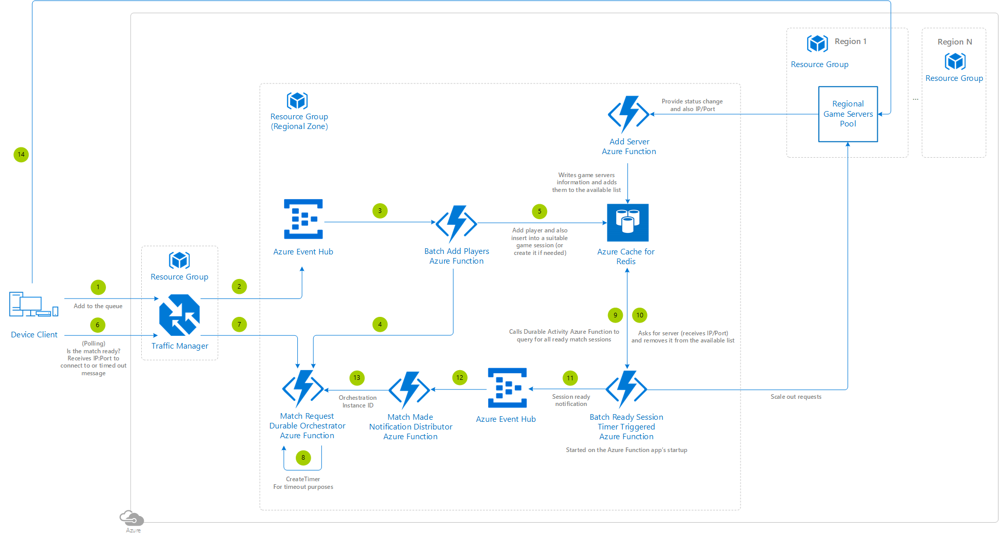

# Multiplayer Serverless Matchmaker

We're going to describe the solution listed here on [GitHub](https://github.com/Azure-Samples/gaming-serverless-matchmaker). Keep in mind that the code from this reference architecture is only an example for guidance and there may be a few places to optimize the code pattern before it's ready for production.

## Architecture diagram

## Relevant services

- [Azure Traffic Manager](https://docs.microsoft.com/azure/traffic-manager/traffic-manager-overview) - Selected as it connects the player to the most appropiate regional zone based on latency.
- [Azure Function](https://docs.microsoft.com/azure/azure-functions/functions-overview) - Selected as it's the simplest way to run the small pieces of matchmaking logic, also you are only charged when you have users attempting to matchmake and play.
- [Azure Event Hub](https://azure.microsoft.com/services/event-hubs/) - Allows batching requests, handy to avoid exhausting the Azure Cache of Redis connection pool.
- [Azure Cache for Redis](https://docs.microsoft.com/azure/azure-cache-for-redis/cache-overview) - Simple key/value pair database for storing the information of the different players trying to join a multiplayer session, and also the connection information (IP/port) from the game servers used. Selected as query flexibility, indexing, replication and move data out are not a strict requirement, also pricing is based on storage capacity exclusively.
- [Resource Groups](https://docs.microsoft.com/azure/azure-resource-manager/resource-group-portal#manage-resource-groups) - Leverage one resource group for the Azure Traffic Manager and one resource group for each matchmaking regional handler (i.e: one for North America, another for Europe, another for LATAM, another for Asia, etc).

## Deployment template

Click the following button to deploy the project to your Azure subscription:

This operation will trigger a template deployment of the [azuredeploy.json](https://github.com/Azure-Samples/gaming-serverless-matchmaker/blob/master/azuredeploy.json) ARM template file to your Azure subscription, which will create the necessary Azure resources.

Have a look at the [general guidelines documentation](./general-guidelines.md#naming-conventions) that 
includes a section summarizing the naming rules and restrictions for Azure services.

>[!NOTE]
> If you're interested in how the ARM template works, review the Azure Resource Manager template documentation from each of the different services leveraged in this reference architecture:
>
> - [Create an Azure Cache for Redis using a template](https://docs.microsoft.com/azure/azure-cache-for-redis/cache-redis-cache-arm-provision)
> - [Create an Event Hub using Azure Resource Manager template](https://docs.microsoft.com/azure/event-hubs/event-hubs-resource-manager-namespace-event-hub)
> - [Automate resource deployment for your function app in Azure Functions](https://docs.microsoft.com/azure/azure-functions/functions-infrastructure-as-code)

Finally add the Function [application settings](https://docs.microsoft.com/azure/azure-functions/functions-how-to-use-azure-function-app-settings) so the sample project can reach out to the Azure services:

- EVENTHUB_CONNECTION_STRING - The [connection string](https://docs.microsoft.com/azure/event-hubs/event-hubs-get-connection-string) to the Azure Event Hub namespace that was created.
- REDIS_CONNECTION_STRING - The [connection string](https://docs.microsoft.com/azure/azure-cache-for-redis/cache-configure#access-keys) to the Azure Cache for Redis that was created.

>[!TIP]
> To run the Azure Functions locally, update the *local.settings.json* file with these same app settings.

## Step by step

1. The player's device client connects to the traffic manager to route a request for the player to be added to the matchmaking queue.
2. The traffic manager connects to the regional zone with the lowest latency and points to an Azure Event Hub that captures requests and allows to process them in batch.
3. The Event Hub passes the details from the new players to be added to the matchmaking pool into an **add players Azure Function**.
4. This Azure Function first creates a **match request Durable Azure Function Orchestrator** that will an end point to provide the player the game server connection details via polling mechanism. There will be one per matchmaking request and the orchestration instance ID of the orchestrator should be the player GUID for being able to send events to it later.
5. Then the same Azure Function adds the players into the database and also includes them into a suitable existing game session, if none was available it creates one.
6. After that, in a polling mechanism, the player's device client connects to the traffic manager to route a request for the player to be provided a game session connection details.
7. The traffic manager points to the Azure Function mentioned previously (step 4).
8. That Azure Function creates a timer for timeout purposes and then awaits for either an event containing a game session server connection details (IP:Port) or a timeout event, whichever happens first.
9. The **ready session timer triggered Azure Function** scans in the database to get any sessions that have enough players to start a match.
10. It also looks for an available server in the database fetching the server connection details (IP:Port) and removes it from the list of available servers.
11. For each game session that is ready to be started, the **ready session timer triggered Azure function** fetches the list of players and it passes the information together with the server connection details to an Azure Event Hub.
12. This Azure Event Hub feeds the ***match made notification distributor Azure Function**.
13. This Azure Function consumes the Azure Event Hub messages, and reaches out to each player's **match request Durable Azure Function Orchestrator** (step 6), using the player GUID as the orchestrator instance ID.
14. The device client receives the server connection details (IP:Port) to connect to, and it directly connects to the game server. If the matchmaking attempt timeouts, the device client handles that graciously.

### Implementation details

**Match Request Monitors (one per match request)**

When a player wants to connect to a game, start a *Match Request Durable Azure Function Orchestrator* that:

1. Calls **CreateTimer** for the timeout period of the request.
2. Calls ***WaitForExternalEvent** to wait for a *server ready* event, which contains the server information (see Match Made Notification Distributor Azure Function).
3. Uses Task.WhenAny to await the first task to return, 1 or 2.
4. If the timeout occurs before a *server ready* event arrives, return some sort of failure message the device client will understand.
5. If the *server ready* event arrives before the timeout:
    - Cancel the timeout timer.
    - Return the server information.

Note: The orchestration instance ID of the game should be the player ID, or some other unique identifier for the request that a) the device client has and b) is stored in the Azure Cache for Redis.

**Batched Ready Session Monitor (timer triggered Azure Function)**

It is started on the Azure Function App’s startup:

1. Queries Azure Cache for Redis for all ready sessions.
2. For each ready session, sends a *server ready* notification.

**Match Made Notification Distributor Azure Function**

In a notification system-triggered Azure Function (not Durable) that consumes the 'server ready' notification:

1. Send a request to the Match Made Notification Distributor Azure Function.
2. Use the **Match Request Durable Azure Function Orchestrator** to send a *server ready* event to each player in the session:
    - Send to the orchestrator instance ID that matches the player ID – using specific orchestration instance IDs is how this function knows where to send the events.
    - Send the server information.

The device client [polls the match request monitor’s status](https://docs.microsoft.com/azure/azure-functions/durable/durable-functions-http-api#get-instance-status), seeing either that the orchestration is in progress, or has completed with a) a timeout message or b) server information. If b, it connects to the server. Specifically for this scenario, the GET URL that needs to be invoked by the device client is: `GET /runtime/webhooks/durabletask/instances/{playerGUID}?code={systemKey}`

#### Exercise for the reader

The sample provided doesn't include logic to handle if a player **decided to cancel an ongoing matchmaking request**. In that scenario, the player should be removed from the database to enable future matchmaking attempts.

It doesn't make use of the PlayersTimeStartedMatchmaking and SessionsCreationTime sorted sets either, they could be leveraged to optimize the time the matchmaking time.

Also the sample doesn't include the code to do **scale out requests** when there are no servers available to make it as generic as possible. There is a cue within the batched ready session monitor timer triggered Azure Function.

## Database setup

|Name|Redis type|Details|Redis command sample|
|------|------|------|------|
|**Servers**|Redis Hash|Stores servers information|hmset Servers GUID "IP:Port" GUID "IP:Port"|
|**ServersAvailable**|Redis Set|Stores the server GUIDs that are available and can host a game session|sadd ServersAvailable "GUID"|
|**Player**|Redis Hash|Stores players information|hmset Player:GUID Name "value1" MatchmakingSettings "value2"|
|**PlayersTimeStartedMatchmaking**|Redis Sorted Set|Stores the dates where the players started to look for a match. The key is the Player GUID, the value the UNIX timestamp of the date|zadd PlayersTimeStartedMatchmaking GUID TIMESTAMP|
|**Session**|Redis Hash|Stores game sessions information, including capacity and matchmaking bucket|hmset Session:GUID Capacity value1 MatchmakingSettings value2|
|**SessionsPerMatchmaking**|Redis Set|Stores sessions per matchmaking bucket|sadd SessionsPerMatchmaking:MatchmakingBucket "GUID"|
|**SessionPlayers**|Redis Set|Stores the player identifiers from a game session|sadd SessionPlayers:SESSIONGUID "PLAYERGUID"|
|**SessionsReady**|Redis Set|Stores all the sessions that have zero capacity, meaning then can be started as soon as a game server is available|sadd SessionsReady "GUID"|
|**SessionsCreationTime**|Redis Sorted Set|Stores the dates where each of the games sessions were initialized|zadd SessionsCreationTime GUID TIMESTAMP|

## Scaling

In terms of Azure Cache for Redis capacity, see [how to scale Azure Cache for Redis](https://docs.microsoft.com/azure/azure-cache-for-redis/cache-how-to-scale) to learn how to scale appropriately the database storing the matchmaking information.

Have a look at the [general guidelines documentation](./general-guidelines.md#azure-event-hub-partitions) to understand the Azure Event Hub peculiarities and the rule of thumb to model the partition count.

## Additional resources and samples

[Azure Event Hubs SDK for Unity](https://docs.microsoft.com/sandbox/gamedev/unity/azure-event-hubs-unity): This is a sandbox project. The content in this article is unsupported, and therefore may be out of date or not in a working state.

## Pricing

If you don't have an Azure subscription, create a [free account](https://aka.ms/azfreegamedev) to get started with 12 months of free services. You're not charged for services included for free with Azure free account, unless you exceed the limits of these services. Learn how to check usage through the [Azure Portal](https://docs.microsoft.com/azure/billing/billing-check-free-service-usage#check-usage-on-the-azure-portal) or through the [usage file](https://docs.microsoft.com/azure/billing/billing-check-free-service-usage#check-usage-through-the-usage-file).

You are responsible for the cost of the Azure services used while running these reference architectures, the total amount depends on the number of events that will run though the analytics pipeline. See the pricing webpages for each of the services that were used in the reference architectures:

- [Azure Traffic Manager](https://azure.microsoft.com/pricing/details/traffic-manager/)
- [Azure Event Hubs](https://azure.microsoft.com/pricing/details/event-hubs/)
- [Azure Function](https://azure.microsoft.com/pricing/details/functions/)
- [Azure Cache for Redis](https://azure.microsoft.com/pricing/details/cache/)

You also have available the [Azure pricing calculator](https://azure.microsoft.com/pricing/calculator/), to configure and estimate the costs for the Azure services that you are planning to use.