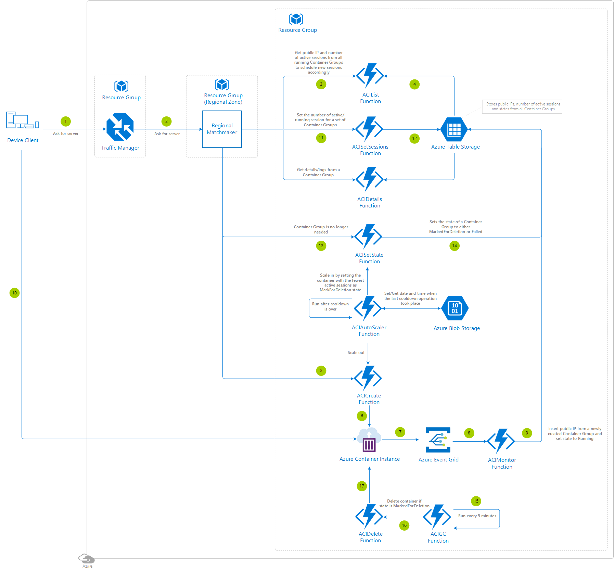

# Synchronous Multiplayer Using Azure Container Instances (ACI)

Explore this alternative solution using Azure Container Instances, Event Grid, and Azure Functions that automatically scales on demand and is **billed per second of usage**, if you would prefer to have a simpler architecture and maintenance leveraging hosted virtual machines at the expense of paying a premium.

The server state needs to be persistent outside of Azure Container Instances.

This article will describe the architecture used in [this sample on GitHub](https://github.com/dgkanatsios/AzureContainerInstancesManagement). Keep in mind that the code from this reference architecture is only an example for guidance and there may be places to optimize the code before using in a production environment.

## Architecture diagram

## Relevant services

- [Azure Traffic Manager](https://docs.microsoft.com/azure/traffic-manager/traffic-manager-overview) - Selected as it connects the player to the most appropiate regional zone based on latency.
- [Azure Container Instances](https://docs.microsoft.com/azure/container-instances/container-instances-overview) -Fastest and simplest way to run a container in Azure, without having to manage any virtual machines and without having to adopt a higher-level service.
- [Azure Function](https://docs.microsoft.com/azure/azure-functions/functions-overview) - Chosen as they are the simplest way to run the small pieces of logic.
- [Azure Table Storage](https://docs.microsoft.com/azure/storage/tables/table-storage-overview) - Simple key/attribute storage for keeping track of the Container Groups state.
- [Azure Event Grid](https://docs.microsoft.com/azure/event-grid/overview) - Selected as it has built-in support for events coming from Azure services.
- [Azure Blob Storage](https://docs.microsoft.com/azure/storage/blobs/storage-blobs-overview) - We just need a place to store the configuration of the auto-scaling helper.
- [Resource Groups](https://docs.microsoft.com/azure/azure-resource-manager/resource-group-portal#manage-resource-groups) - Leverage one resource group for the Azure Traffic Manager and one resource group for each regional game server pool (i.e: one for North America, another for Europe, another for LATAM, another for Asia, etc).

## Deployment template

Click the following button to deploy the project to your Azure subscription:

This operation will trigger a template deployment of the [azuredeploy.json](https://github.com/dgkanatsios/AzureContainerInstancesManagement/blob/master/deploy.json) ARM template file to your Azure subscription, which will create the necessary Azure resources as well as pull the source code from this repository. This may induce charges in your Azure account.

Have a look at the [general guidelines documentation](./general-guidelines.md#naming-conventions) that includes an article summarizing the naming rules and restrictions for Azure services.

You need to specify the following information in order to deploy the project:
- **Location**: select the Azure region where your resources will be deployed. [Make sure to select a location where Azure Container Instances are available](https://docs.microsoft.com/azure/container-instances/container-instances-quotas#region-availability).
- **Function Name**: select a unique name for your Function App. This will determine your Function's DNS, so choose wisely.
- **Repo URL**: this determines the repo that contains the files which will be pulled to create the Azure Functions. You can leave the default or switch it with your own fork.
- **Branch**: this corresponds to your project's GitHub branch.

The Azure Functions are deployed on a Free [App Service Plan](https://docs.microsoft.com/azure/azure-functions/functions-scale#app-service-plan), you may need to scale it up for increased performance.

The project uses [Managed Service Identity](https://docs.microsoft.com/azure/active-directory/managed-service-identity/overview) and its relationship with [Azure Functions](https://docs.microsoft.com/azure/app-service/app-service-managed-service-identity) to authenticate to the Azure ARM API Management Service in order to create/delete/modify the Azure Container Instances needed. The deployment script automatically creates an app identity for the Function App, however you need to give this identity permissions to the Resource Group that will host your Container Instances. To do that:

- Visit the [Azure Portal](https://portal.azure.com).
- Find the **Resource Group(s)** that you will create your Azure Container Instances in (this may be the same Resource Group that your Function App is hosted).
- Select **Access Control (IAM)**.
- Select **Add**, **Contributor** as Role, assign access to **Function App** and then select your Azure Function by modifying the subscription/resource group drop down boxes.
- Click **Save**, you're done!

Moreover, as soon as the deployment completes, you need to manually add the Event Subscription webhook for the `ACIMonitor` Function using the instructions [here](https://docs.microsoft.com/azure/azure-functions/functions-bindings-event-grid#create-a-subscription). Just make sure that you select the correct Resource Group to monitor for events (i.e. the Azure Resource Group where your containers will be created). This will make the Event Grid send a message to the `ACIMonitor` Function as soon as there is a resource modification in the specified Resource Group. As soon as this completes, your deployment is ready. Optionally, as soon as you get the URL of the `ACIMonitor` Function, you can use [this](https://github.com/dgkanatsios/AzureContainerInstancesManagement/blob/master/deploy.eventgridsubscription.json) ARM template to deploy the Event Grid subscription. 

When you deploy the Event Grid subscription using the Portal, these are the values you need to fill in:

- **Name** - Select a distinctive name for the Event Grid subscription.
- **Topic Type** - Select 'Resource Groups' (or 'Azure subscription' if your Azure Container Instances will be deployed in various Resource Groups).
- **Subscription** - The subscription which you want to monitor for Azure Container Instances' creation.
- **Resource Group** - Select the Resource Group that will contain the Azure Container Instance you create. Make sure that the **Subscribe to all event types** checkbox is checked.
- **Subscriber type** - Webhook.
- **Subscription Endpoint** - This will contain the trigger URL for your `ACIMonitor` Azure Function.
- **Prefix filter** - Leave it blank.
- **Suffix filter** - Also leave it blank.

Last but not least, with the new v2 runtime of Azure Functions, the EventGrid binding extension *may* need manual registration. Under normal circumstances, the extension will be installed automatically (as it's registered in the *extensions.csproj* file), but if this does not happen, you can check the following articles on how to do it manually:

- [Azure Function register binding extensions](https://docs.microsoft.com/azure/azure-functions/functions-triggers-bindings#register-binding-extensions).
- [Manually install or update Azure Functions binding extensions from the portal](https://docs.microsoft.com/azure/azure-functions/install-update-binding-extensions-manual).

## Step by step

1. The player's device client connects to the traffic manager to route a request for the player to find a game server.
2. The traffic manager connects to the regional zone with the lowest latency and points to the matchmaker to get a game server available.
3. The matchmaker invokes the `ACIList` Azure Function to get the list of public IPs and active sessions from all Container Groups.
4. That Azure Function gets the table from an Azure Table Storage that stores the public IPs, number of active sessions and states from all the Container Groups.
5. Assuming there are none available, the `ACICreate` Azure Function is invoked. The container state is *Creating*.
6. The `ACICreate` Azure Function creates the container.
7. Event Grid is hooked up to listen to when a container has been created or deleted. At some point (a few minutes) Event Grid receives the pertinent event from a container being created.
8. Event Grid is also setup to invoke the `ACIMonitor` Azure Function after the event is received, passing the public IP along.
9. The `ACIMonitor` Azure Function inserts the public IP from the newly created container and also sets the state of the container to *Running*.
10. The matchmaker has now an available server for the player, it sends the details back to the device client so it can connect directly to it.
11. The matchmaker invokes the `ACISetSession` Azure Function to update the number of active sessions running on the container that the player was appointed to.
12. The `ACISetSession` Function updates the Azure Table Storage.
13. At some point the server is no longer needed. The containers are not manually deleted, as there may be players still using the container instance, so instead of killing it the `ACISetState` Azure Function is invoked to set the state of the container to *MarkedForDeletion*, which makes that new players are not scheduled in that container instance.
14. The `ACISetState` Azure Function updates the Azure Table Storage.
15. The time triggered `ACIGC` Azure Function runs every now and then and deletes any container instances that has the *MarkedForDeletion* state.
16. The `ACIGC` Azure Function invokes the `ACIDelete` Azure Function that actually deletes the container instance.
17. The `ACIDelete` Azure Function deletes the container.

Using a more specific example:

1. At the beginning, there are no server instances.
2. Suddenly a server is needed for players to connect. `ACICreate` is called.
3. When the create command is executed, the server is not yet up and running. The state is *Creating*.
4. When the deployment is complete (a few minutes), the Event Grid via `ACIMonitor` will notify that the server instance (Container Group 1) is running in a specific IP address (i.e: 1.2.3.4). State for the instance is updated to *Running*.
5. Players can now connect to the server instance.
6. Assume now another another server instance is required. You can either use `ACICreate` again or let the `ACIAutoScaler` create it using ACICreate on your behalf if the scale-out threshold has been crossed.
7. Same pattern again, the new server is not ready yet, when the deployment is completed Event Grid will notify via `ACIMonitor` that the server is running in another specific IP address (i.e: 2.3.4.5). State for this second instance (Container Group 2) is updated to *Running*.
8. Players can now connect to the second instance.
9. Eventually, the second instance is not required, either because we decide it or the threshold for scale-in is crossed. As there may be players still using the second instance, instead of killing it, `ACISetScale` is called to mark the server for deletion, which makes that new players are not scheduled in the second instance. The state of the second instance is now *MarkedForDeletion*.
10. When the players have finished playing in the second instance, the garbage collector `ACIGB` runs and triggers an `ACIDelete` to remove the second instance completely.

## Scaling

The `ACIAutoScaler` Azure Function setup is configurable via environment variables: threshold for scaling in/out, MIN/MAX instances and cooldown. The logic of the autoscaler is:

- Timed triggered, runs every 1 minute, disabled by default.
- Load is *number of connected players* / *total player capacity*.
- If ("load" > 80% and the instances < MAX), then call the `ACICreate` Azure Function to spin up a new instance. This takes care of scaling-out.
- Else If ("load" < 60% and the instances > MIN), then call the `ACISetState` Azure Function to set the state *MarkedForDeletion* for instance with the smallest load. This takes care of scaling-in.
- There is a cooldown period of 10 minutes for scaling in/out.

Azure Container Instances are fast to scale up, in a matter of a few minutes you will have your new containers ready to go. For example, requesting to scale up 30 new Azure Container Instances running OpenArena took less than 3 minutes since the request was sent until players were able to connect.

## Creating a set of containers manually for testing

If you want to create a bunch of container instances for testing, you can use a [sample available here](https://github.com/dgkanatsios/AzureContainerInstancesManagement/blob/master/DEMOS.md). Substitute *openarenaserver1* for a unique name in for each of the instances that you are creating (openarenaserver1, openarenaserver2, openarenaserver3, etc). Also replace the resource group, location and the storage name/key.

## Additional resources and samples

See the [Multiplayer Server Scaling with Azure Container Instances](https://channel9.msdn.com/Events/Build/2018/THR3512) session recorded from [Build](https://www.buildwindows.com/) to go through the details.

## Pricing

If you don't have an Azure subscription, create a [free account](https://aka.ms/azfreegamedev) to get started with 12 months of free services. You're not charged for services included for free with Azure free account, unless you exceed the limits of these services. Learn how to check usage through the [Azure Portal](https://docs.microsoft.com/azure/billing/billing-check-free-service-usage#check-usage-on-the-azure-portal) or through the [usage file](https://docs.microsoft.com/azure/billing/billing-check-free-service-usage#check-usage-through-the-usage-file).

You are responsible for the cost of the Azure services used while running these reference architectures, the total amount depends on the number of events that will run though the analytics pipeline. See the pricing webpages for each of the services that were used in the reference architectures:

- [Azure Traffic Manager](https://azure.microsoft.com/pricing/details/traffic-manager/)
- [Azure Container Instances](https://azure.microsoft.com/pricing/details/container-instances/)
- [Azure Function](https://azure.microsoft.com/pricing/details/functions/)
- [Azure Event Grid](https://azure.microsoft.com/pricing/details/event-grid/)
- [Azure Table Storage and Azure Blob Storage](https://azure.microsoft.com/pricing/details/storage/)

You also have available the [Azure pricing calculator](https://azure.microsoft.com/pricing/calculator/), to configure and estimate the costs for the Azure services that you are planning to use.