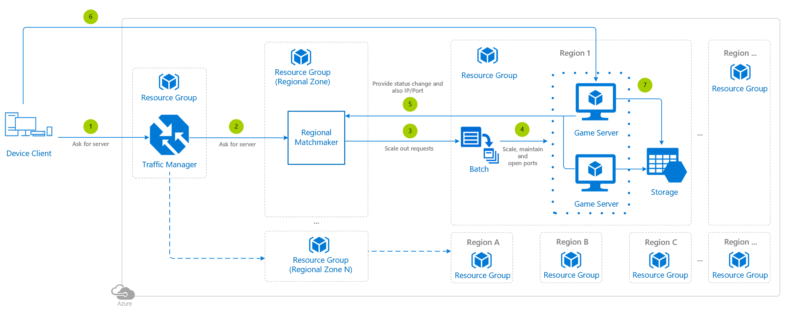

# Synchronous Multiplayer Using Azure Batch

The game server pools are managed by Azure Batch, responsible for **creating virtual machines and open ports**. Each region will have it's own pool of game servers.

## Architecture diagram

## Relevant services

- [Azure Traffic Manager](https://docs.microsoft.com/azure/traffic-manager/traffic-manager-overview) - Selected as it connects the player to the most appropiate regional zone based on latency.
- [Azure Batch](https://docs.microsoft.com/azure/batch/batch-technical-overview) - It is used for creating VMs and opening ports. Selected as it can automatically scale pools based on parameters that you define.

Leverage one resource group for the Azure Traffic Manager and one resource group for each regional virtual machine cluster.

## Architecture considerations

There are some differences depending on what operating system the virtual machines are running and also whether platform images or custom images are used.

### Operating system

- **Windows**
    - Windows Server virtual machines take roughly twice the time than Linux virtual machines to be up and running, and ready for scheduling.
    - At the present time, Windows Server 2012 performs better than Windows Server 2016.
    - It is worth mentioning that if you already possess a valid on-premise license for Windows, you may not have to pay the full cost for the SKU.

- **Linux**
    - It's roughly twice as fast to be up and running, and ready for scheduling, than using Windows.

### Platform images

- **Platform/Marketplace images**
    - They are updated with security patches. Support is available for these images.
    - The downside of using platform images on long living pools is that the image might be deprecated and removed from repository and the pool can never be scaled up.

- **Custom images**
    - Custom image boot time can vary dramatically depending on the custom softwares and data that are already present the source.
    - The advantage is you can have their image ready with all pre-installed software/data in the OSDisk.
    - Custom image source disk can be one of the three types: 1. Snapshot, 2. Manageddisk, 3. VHD.
        - Currently we recommend the source to be Snapshot. Storage has scale limits which stops Azure Batch from scaling beyond 2500 VMs at once.

### Containers

In case you have containerized you game in Linux containers, there are pre-baked images to run the containers. See [Run container applications on Azure Batch](https://docs.microsoft.com/azure/batch/batch-Docker-container-workloads) to learn how to create a pool of compute nodes that support running container tasks, and then run container tasks on the pool.

Refer to the **microsoft-azure-batch** publisher documented in [this link](https://docs.microsoft.com/azure/batch/batch-linux-nodes#list-of-virtual-machine-images) for the available Linux images.

## Deployment template

Click the following button to deploy the project to your Azure subscription:

This operation will trigger a template deployment of the [BatchWithPoolDeploy.json](https://gist.github.com/BrianPeek/1d02048356779f91d0a510be12cd0b4e) ARM template file to your Azure subscription, which will create the necessary Azure resources. To be more precise:

- Creates an Azure Storage account.
- Creates an Azure Batch account associated with the Azure Storage account.
- Creates a pool with (by default) 5 nodes on D2s_v3 Windows Server 2016.
- The pool has an empty start task that could be used to launch your game server.

This may induce charges in your Azure account.

Have a look at the [general guidelines documentation](./general-guidelines.md#naming-conventions) that includes an article summarizing the naming rules and restrictions for Azure services.

>[!NOTE]
> If you're interested in how the ARM template works, review the Azure Resource Manager template documentation from each of the different services leveraged in this reference architecture:
>
> - [Azure Batch pools template reference](https://docs.microsoft.com/azure/templates/microsoft.batch/2018-12-01/batchaccounts/pools)

## Step by step

1. The player's device client connects to the **Azure Traffic Manager** to route a request for the player to find a game server.
2. The Azure Traffic Manager connects to the regional zone with the lowest latency and points to the **matchmaker** to get a game server available.
3. The matchmaker has all the information required to select a game server, if more capacity is required it proactively pings the Azure Batch service to start scaling out.
4. The **Azure Batch** service receives the request and begins scaling out. If automated scaling was set up, it may have proactively kicked off the process depending on the rules established.
5. The game servers regularly sends the matchmaker an status update once a game session is over and they are *available*, also their most updated IP and port.
6. Each of the player devices connects directly to the game server using the connection information provided by the matchmaker.
7. After the game session is over, relevant information is stored.

## Scaling

With [Azure Batch automatic scaling](https://docs.microsoft.com/azure/batch/batch-automatic-scaling), the service dynamically adds nodes to a pool as task demands increase, and removes compute nodes as they decrease.

You enable automatic scaling on a pool of compute nodes by associating with it an autoscale formula that you define. The Azure Batch service uses the autoscale formula to determine the number of compute nodes that are needed to execute your workload.

You can enable automatic scaling either when a pool is created, or on an existing pool. You can also change an existing formula on a pool that is configured for autoscaling. Azure Batch enables you to evaluate your formulas before assigning them to pools and to monitor the status of automatic scaling runs.

Alternatively like in this example, you can task the matchmaker to proactively let Azure Batch know when to scale out.

## Security considerations

There are some [requirements](https://docs.microsoft.com/azure/batch/batch-virtual-network#vnet-requirements) when you are including an **Azure Batch service pool of virtual machines in a virtual network**.

## Additional resources and samples

[Azure Batch Explorer](https://github.com/Azure-Samples/azure-batch-samples/tree/master/CSharp/BatchExplorer): tool that allows you to interact with the Azure Batch Service to view, manage, monitor, and debug entities within an Azure Batch account. A **heat map** is provided to check out all of the running virtual machines and their current state, the way to read it is as follows:

- White blocks mean that the virtual machines are idle and ready to be assigned some work.
- Yellow blocks mean that the virtual machines cannot be used as they are either  starting up or shutting down.
- Green blocks mean that the virtual machines are currently running a workload.
- Red blocks mean that the virtual machines are in a faulty state.

## Pricing

If you don't have an Azure subscription, create a [free account](https://aka.ms/azfreegamedev) to get started with 12 months of free services. You're not charged for services included for free with Azure free account, unless you exceed the limits of these services. Learn how to check usage through the [Azure Portal](https://docs.microsoft.com/azure/billing/billing-check-free-service-usage#check-usage-on-the-azure-portal) or through the [usage file](https://docs.microsoft.com/azure/billing/billing-check-free-service-usage#check-usage-through-the-usage-file).

You are responsible for the cost of the Azure services used while running these reference architectures, the total amount depends on the number of events that will run though the analytics pipeline. See the pricing webpages for each of the services that were used in the reference architectures:

- [Azure Batch](https://azure.microsoft.com/pricing/details/batch/)
- [Azure Traffic Manager](https://azure.microsoft.com/pricing/details/traffic-manager/)

You also have available the [Azure pricing calculator](https://azure.microsoft.com/pricing/calculator/), to configure and estimate the costs for the Azure services that you are planning to use.