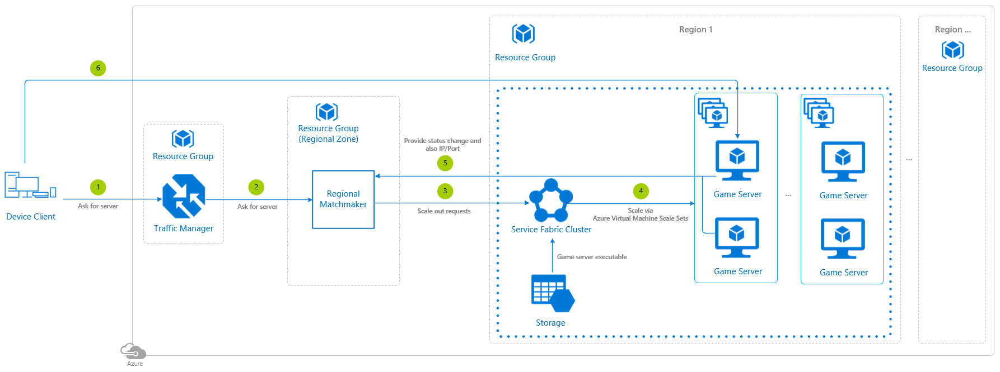

# Synchronous Multiplayer Using Azure Service Fabric

In this example, game server pools are managed by Azure Service Fabric, responsible for **creating and orchestrating Azure Virtual Machine Scale Sets**. Each region will have it's own pool of game servers.

## Architecture diagram

## Relevant services

- [Azure Traffic Manager](https://docs.microsoft.com/azure/traffic-manager/traffic-manager-overview) - Connects the player to the most appropriate regional zone based on latency.
- [Azure Service Fabric](https://docs.microsoft.com/azure/service-fabric/service-fabric-overview) - Makes it easy to package, deploy, and manage scalable and reliable game servers within containers.

## Deployment template

Refer to [this repository](https://github.com/Azure-Samples/service-fabric-cluster-templates) containing sample Service Fabric cluster templates that you can customize for use in setting up your clusters. The intent is to provide a wide variety of templates, based on the input and the types of clusters we have seen other developers create. The templates cover both Windows and Linux clusters.

The most basic template to start with is [this one](https://github.com/Azure-Samples/service-fabric-cluster-templates/tree/master/5-VM-Windows-1-NodeTypes-Secure-NSG). It allows you  to deploy a secure 5 node, Single Node Type Service Fabric Cluster running Windows Server 2016 Datacenter with containers on a Standard_D2_v2 Size Virtual Machine Scale set with Azure Diagnostics turned on and network security groups enabled.

Click the following button to deploy the project to your Azure subscription:

This operation will trigger a template deployment of the [azuredeploy.json](https://github.com/Azure-Samples/service-fabric-cluster-templates/blob/master/5-VM-Windows-1-NodeTypes-Secure-NSG/azuredeploy.json) ARM template file to your Azure subscription, which will create the necessary Azure resources. This may induce charges in your Azure account.

Have a look at the [general guidelines documentation](./general-guidelines.md#naming-conventions) that includes an article summarizing the naming rules and restrictions for Azure services.

The game server binaries can be stored in Azure Storage, or alternatively, Azure Container Registry, as Service Fabric can use either.

## Step by step

1. The player's device client connects to the **Azure Traffic Manager** to route a request for the player to find a game server.
1. The Azure Traffic Manager connects to the regional zone with the lowest latency and points to the matchmaker to get an available game server.
1. The matchmaker has all the information required to select a game server, and if more capacity is required, it proactively pings the **Azure Service Fabric** service to start scaling out in a particular Service Fabric cluster.
1. The Azure Service Fabric service receives the request and begins scaling out. If automated scaling was set up, it may have proactively kicked off the process depending on the rules established.
1. The game servers regularly send the matchmaker a status update once a game session is over and the server is once again *available*, along with its current IP address and port.
1. Each of the player devices connect directly to the game server using the connection information provided by the matchmaker.

Optionally, after the game session is over, relevant information could be stored in an Azure Storage account.

## Scaling

There are two main approaches:

1. The matchmaker doesn't control scaling.  Instead, **Azure Service Fabric owns the scaling requirements**, using [Azure Service Fabric auto scaling](https://docs.microsoft.com/azure/service-fabric/service-fabric-cluster-resource-manager-autoscaling). In this case, the service dynamically scales your game servers based on the load that they are reporting, or based on their usage of resources. Auto scaling gives great elasticity and enables provisioning of additional instances or partitions of your game server on demand. The entire auto scaling process is automated and transparent, and once you set up your policies, there is no need for manual scaling operations at the game server level. Auto scaling can be turned on either at the creation time, or at any time via updating.

    A common scenario where auto-scaling is useful is when the load varies over time, like in multiplayer games.

1. Alternatively, like in this example, you can task the matchmaker to proactively let Azure Service Fabric know when to scale out. The best practice is to use a **pool management pattern**.

    This pattern is providing a solution for situations where an application requires the ability to dynamically create Service Fabric Service Instances at run-time, most notably through calling [CreateServiceAsync](https://docs.microsoft.com/dotnet/api/system.fabric.fabricclient.servicemanagementclient.createserviceasync?view=azure-dotnet). It allows you to register a Service which should be managed and it will ensure the configured number of available instances of your Service are available in the Pool.

    Once deployed and initialized, the game simply calls into the manager "asking" for an instance of the Service and it returns a pointer to the Instance that can be used either by returning one previously used by the game, determined by a unique ID, or returning an available Instance not yet allocated. If there are instances of the service which remain idle for a period of time, the manager will deactivate them to open up additional capacity in the cluster.

    The main benefit of using this pattern is to significantly reduce the amount of time the game may be delayed when manually instantiating new Instances.

See [Scaling in Server Fabric](https://docs.microsoft.com/azure/service-fabric/service-fabric-concepts-scalability) to read about how you can build scalable games.

## Additional resources and samples

To manage Azure Service Fabric games and clusters successfully, there are recommended operations to perform to optimize reliability.  Please see [this document](https://docs.microsoft.com/azure/service-fabric/service-fabric-best-practices-overview) that covers security, networking, infrastructure as a core, and monitoring, amongst other things.

## Pricing

If you don't have an Azure subscription, create a [free account](https://aka.ms/azfreegamedev) to get started with 12 months of free services. You're not charged for services included for free with Azure free account, unless you exceed the limits of these services. Learn how to check usage through the [Azure Portal](https://docs.microsoft.com/azure/billing/billing-check-free-service-usage#check-usage-on-the-azure-portal) or through the [usage file](https://docs.microsoft.com/azure/billing/billing-check-free-service-usage#check-usage-through-the-usage-file).

You are responsible for the cost of the Azure services used while running these reference architectures.  The total amount will vary based on usage. See the pricing webpages for each of the services that were used in the reference architecture:

- [Azure Service Fabric](https://azure.microsoft.com/pricing/details/service-fabric/)
- [Azure Traffic Manager](https://azure.microsoft.com/pricing/details/traffic-manager/)

You can also use the [Azure pricing calculator](https://azure.microsoft.com/pricing/calculator/) to configure and estimate the costs for the Azure services that you are planning to use.