# Deploying Unreal Pixel Streaming in Azure

# Overview

This guide will walk through the process of taking the exported Unreal Pixel Streaming package and deploying it on an Azure GPU Virtual Machine, or multiple VMs if using the Matchmaker service to load balance across many streams on multiple GPU VMs. For a detailed overview of Pixel Streaming and architectures in Azure, see our documentation [here](unreal-pixel-streaming-in-azure.md). For deploying Unreal Pixel Streaming at scale (i.e., 2 to 1000&#39;s of streams) see our documentation [here](http://needdocumentationlinkhere.com/), which uses Terraform to deploy your Pixel Streaming solution in Azure with auto-scaling.

# Architecture

Below are a couple simple architectures this guide will cover to start with when deploying Pixel Streaming to Azure, which is a **Single VM** and **Multiple VMs with the Matchmaker** service. By first deploying these approaches you can better understand the components and how each interact with one another, which is key to being able to further develop a scaled-out architecture in Azure. Essentially, the **Single VM** approach will have the Unreal Engine 3D App and the Signaling Web Server (SS) on the same VM, allowing users to stream to a single stream which will be shared. For providing each user their own 3D stream, we will then walk through adding the Matchmaker (MM) service on a separate VM to load balance incoming users across multiple GPU VMs (i.e., Signaling Servers). Please refer to our overview documentation [here](unreal-pixel-streaming-in-azure.md) for a deeper dive into these architectures and services.

###
[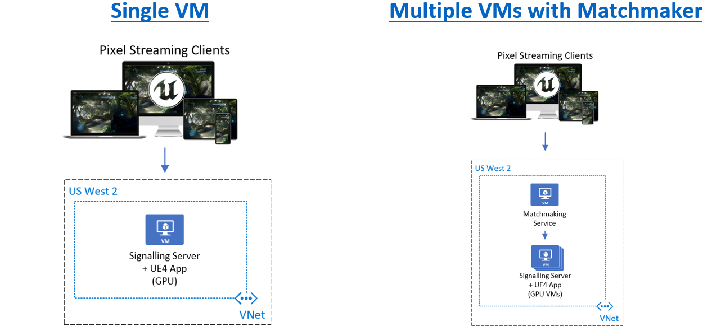](media/pixel-streaming/pixel-streaming-architectures-simple.png)

# Quick Start Deployment for a Single VM in Azure

To deploy Unreal Pixel Streaming in Azure using a single VM we can use the below steps. Luckily, Microsoft and Epic have worked together and made a [Terraform template](unreal-pixel-streaming-at-scale.md) for deploying Pixel Streaming in Azure at scale which only requires a few commands of Terraform to deploy; however, the below steps go through the table stakes to get Pixel Streaming deployed for reference.

1. Sign into the Azure portal at [https://portal.azure.com](https://portal.azure.com/).
2. Type **virtual machines** in the search.
3. Under **Services** , select **Virtual machines**.
4. In the **Virtual machines** page, select **Add-&gt;Virtual machine** at the top left.
5. Follow the [Quickstart documentation](https://docs.microsoft.com/en-us/azure/virtual-machines/windows/quick-create-portal) to fill in the appropriate settings for creating a Windows VM, but use the following options below in the Basics tab:

[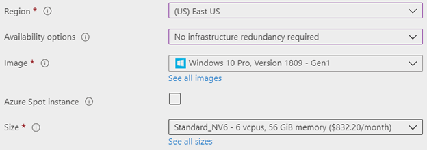](media/pixel-streaming/pixel-streaming-create-windows-vm.png)

Depending on your **Region** needs, choose a **Region** that is the closest to the users that will be running the Pixel Streaming application (due to latency), **No infrastructure redundancy required** so most GPU SKUs are available, use **Windows 10 Pro Version 1809** or later (or Windows Server 2016 or 2019 if desired) as the **Image** , **Azure Spot instance** checked if desired for testing (or a cheaper option) and the **Size** as a **Standard\_NV6**. NV12v3&#39;s are a new/faster option that is similar in price to NV6, though might require a [support ticket](https://docs.microsoft.com/en-us/azure/azure-portal/supportability/per-vm-quota-requests) to increase your quota before it shows up as an option. **Note:** Most NC\* series GPU VMs are setup for ML (TCC) workloads and require an [NVIDIA GRID license](https://www.nvidia.com/en-us/data-center/buy-grid/) to use for WDDM, with an exception of [NCas T4 v3](https://docs.microsoft.com/en-us/azure/virtual-machines/nct4-v3-series) which supports Ray Tracing. See Azure GPU VM pricing [here](https://azure.microsoft.com/en-us/pricing/details/virtual-machines/windows/) for comparisons of price/capabilities.

6. Set the **inbound ports** to allow **Http (80), RDP (3389)**. This could be fine for testing; however, please consider your security requirements (or custom desired ports), and be sure to realize that opening 3389 with a public IP address will allow people on the internet to be able to find your RDP login prompt (e.g., hackers pinging random IP addresses). Consider using [Azure Bastion](https://azure.microsoft.com/en-us/services/azure-bastion/#:~:text=Azure%20Bastion%20is%20a%20new,need%20a%20public%20IP%20address.) or a jump box setup with [NSGs](https://docs.microsoft.com/en-us/azure/virtual-network/network-security-groups-overview) for your network if requiring more security for RDP logins.

[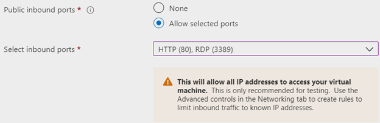](media/pixel-streaming/pixel-streaming-create-vm-ports.png)

7. On the **Disks** tab choose your desired disks per your requirements (defaults could be fine for testing).
8. On the **Networking** tab, create a new **Virtual network** and **Public IP** (if your security requirements allow), or select any existing network resources.

[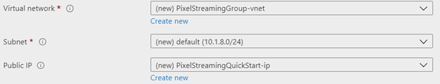](media/pixel-streaming/pixel-streaming-create-vm-vnet.png)

9. On the Advanced tab, choose the Select an extension to install link under the Extensions section, and choose the NVIDIA GPU Driver Extension. This is required to install the correct NVIDIA GRID drivers for WDDM support to run 3D applications (make sure you are using NV\* series VMs, not NC\* series).

[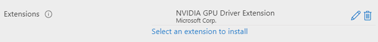](media/pixel-streaming/pixel-streaming-create-vm-nvidia-ext.png)

10. Finish creating the VM from the **Review + create** page.
11. This will start the deployment process and the portal will display status updates until finished.
12. After deployment is complete and you can see &quot;Deployment Complete&quot;, you can choose &#39;Go To Resource&#39; to get access to the VM. From there you can access the Networking tab.
13. In the Networking page on the left, click the [Add inbound port rule](https://docs.microsoft.com/en-us/azure/virtual-machines/windows/nsg-quickstart-portal#create-an-inbound-security-rule) button to open up any additional ports such as 8888 (PixelStreamingPort between UE4 + SS), 9999 (if using MM), 443 (if needing Https) and any STUN/TURN server ports being used (e.g., 19302). STUN/TURN servers not _required_ for most users, though some mobile or restricted networks might require these—learn more [here](#_heading=h.3j2qqm3). As always, please follow your security requirements to ensure desired network safety.

[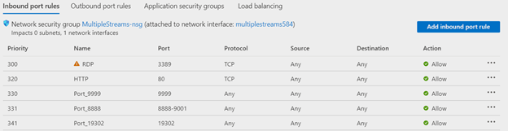](media/pixel-streaming/pixel-streaming-add-ports.png)

14. Now you are ready to Remote Desktop into the VM in Azure. In the left **Overview** tab in the Azure Portal click the **Connect** button and choose **RDP** , and then click the **Download RDP File** button to save the connection file to your local computer. Follow the quick-start documentation [here](https://docs.microsoft.com/en-us/azure/virtual-machines/windows/quick-create-portal#connect-to-virtual-machine) for more on connecting to the VM via RDP, and remember to use the same login/password set when creating the VM. **Note:** When opening the RDP file, choose **More choices** and **Use a different account** to type in the login and password (in case login defaults to your local account). Ensure the name / password previously chosen are correctly entered to login to the VM.

[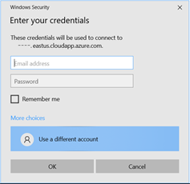](media/pixel-streaming/pixel-streaming-rdp-login.png)

15. Once connected to the VM, accept the Windows Privacy options and copy (right click -&gt; copy) and paste (right click -&gt; paste) the exported Pixel Streaming package ([Unreal docs](https://docs.unrealengine.com/en-US/SharingAndReleasing/PixelStreaming/PixelStreamingIntro/index.html)) to the Windows desktop of the VM (i.e., WindowsNoEditor folder contents). **Note:** To speed up the copy it&#39;s recommended to zip up the files before copying over.
16. The VM should now have the `<AppName>.exe`, `<AppName>\` and `Engine\` folder on the VM.
17. Install the following pre-reqs to run a 3D application on the Windows GPU VM:
    1.   Run the installer under `\Engine\Extras\Redist\en-us\UE4PrereqSetup\_x64.exe` to install required .NET, Visual C++ and DirectX runtimes. This also will be run if starting the UE4 app before manually installing the pre-reqs, as the app checks for dependencies.
    2.   Once installed, ensure that if you launch the Pixel Streaming `<AppName.exe>` it runs successfully. If running into any errors:
         1.   Ensure the NVIDIA extension was setup correctly (make sure `C:\Program Files\Nvidia\...\Nvidia-smi.exe` shows `WDDM` (not `TCC`) and check dxdiag (via the run command) to inspect directx libraries and NVIDIA drivers are installed.
         2.   After the pre-req install try to restart and then run the app again.
18. Close the UE4 app after testing it runs (Alt+F4 if no quit/esc option was added)
19. Install Node.js for the Signaling Server and Matchmaker to run, which can be downloaded [here](https://nodejs.org/en/download/) from any installed Browser on the VM, or copy and paste the installer from your local computer.
20. Download the following files to the `SignallingWebServer\` folder: `…\Engine\Source\Programs\PixelStreaming\WebServers\SignallingWebServer\`
    1.  [runAzure.bat](https://unrealbackendfiles.blob.core.windows.net/ourpublicblobs/runAzure.bat) (Required)
    2.  [runAzure\_WithTURN.bat](https://unrealbackendfiles.blob.core.windows.net/ourpublicblobs/runAzure_WithTURN.bat) (Optional if using TURN servers)
    3.  [Start\_Azure\_SignallingServer.ps1](https://unrealbackendfiles.blob.core.windows.net/ourpublicblobs/Start_Azure_SignallingServer.ps1) (Required)
    4.  [Start\_Azure\_WithTURN\_SignallingServer.ps1](https://unrealbackendfiles.blob.core.windows.net/ourpublicblobs/Start_Azure_WithTURN_SignallingServer.ps1) (Optional if using TURN servers)

Be sure to do a **Save As** in your browser for each file and make sure to remove any .txt added to the file name. These are also in a [GitHub PR request #7698](https://github.com/EpicGames/UnrealEngine/pull/7698) for users who [linked](https://www.epicgames.com/help/en-US/epic-accounts-c74/connect-accounts-c110/how-do-i-link-my-unreal-engine-account-with-my-github-account-a3618) their Epic and GitHub accounts)

21. Ensure that the Windows Firewall allows incoming and outgoing traffic from 80 (TCP/UDP), 8888 (UDP, if not using localhost for PixelStreamingIP below), 19302 (If using Google&#39;s STUN server via above \*.ps1&#39;s, UDP), and any TURN server (none by default) ports (see [opening ports with Windows firewall](https://docs.microsoft.com/en-us/sql/database-engine/configure-windows/configure-a-windows-firewall-for-database-engine-access?view=sql-server-ver15#SSMSProcedure)).
22. Right click on the UE4 `<AppName>.exe` and **Create shortcut**. Right click on the shortcut and choose **Properties**. Paste in the following [parameters](https://docs.unrealengine.com/en-US/SharingAndReleasing/PixelStreaming/PixelStreamingReference/#unrealenginecommand-lineparameters) in the **Target** after the .exe with a space:
    1.  `-AudioMixer -PixelStreamingIP=localhost -PixelStreamingPort=8888 -WinX=0 -WinY=0 -ResX=1920 -ResY=1080 -Windowed -RenderOffScreen -ForceRes`
23. Run the shortcut to kick off the 3D app in the background (you can check Task Manager to verify it&#39;s running under the **Processes** tab—sort by Name or CPU/GPU to spot it easily). Windows may popup a dialog requiring you to confirm you wish to run the App and Node.js services when first started on the VM.
24. Run the `runAzure.bat` under the `SignallingWebServer\` folder and ensure the SS is connected to the 3D app by looking for the `"Streamer Connected::1"` log in the SS console output.
25. The solution is ready to be run by a user now. Navigate to a browser on your local computer or mobile device and type in the IP address of the Virtual Machine to start streaming. The IP can be found by going to the Overview page of the VM in the Azure Portal, noted under the Public IP address section.
26. If using the default template exported from Unreal Engine, click the **Click to start** and the play icon button to begin streaming Unreal Pixel Streaming successfully in Azure.
    
     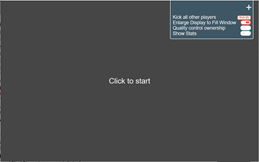
     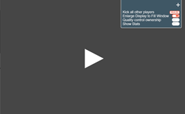
     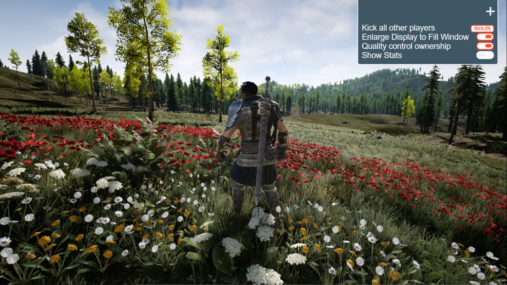

27.  To improve the customer experience, it&#39;s recommended to use a DNS domain/subdomain instead of exposing an IP address which can change or isn&#39;t as polished. A simple custom subdomain can be created for the VM by clicking on the **Public IP address** in the **Overview** page of the VM in the Azure Portal, which will allow for setting a **DNS name label**. Depending on the Azure region used, the dns would be: _&lt;subdomain&gt;_._&lt;azure\_region&gt;_.cloudapp.azure.com. It&#39;s of course recommended to use a proper registered domain for production solutions.
28.  Though out of scope for this quick-start, refer to using something like [Task Scheduler](https://docs.microsoft.com/en-us/windows/win32/taskschd/task-scheduler-start-page) to schedule tasks on restart to ensure the Signaling Service and 3D app are running if the VM is restarted.

# Quick Start Deployment for Multiple VMs with Matchmaker in Azure

To deploy Unreal Pixel Streaming in Azure using a separate Matchmaker VM we can use the following steps:

1. Follow the [Quick Start Deployment for a Single VM](#_heading=h.2s8eyo1) as described above to get a VM with the Signaling Server and UE4 app running in Azure.
2. In the Azure portal, we need to create a new Windows 10 VM for the Matchmaker.
3. Following similar steps as when creating the Signaling Server VM, sign into the Azure portal at [https://portal.azure.com](https://portal.azure.com/).
4. Type **virtual machines** in the search.
5. Under **Services** , select **Virtual machines**.
6. In the **Virtual machines** page, select **Add-&gt;Virtual machine** at the top left.
7. Follow the [Quickstart documentation](https://docs.microsoft.com/en-us/azure/virtual-machines/windows/quick-create-portal) to fill in the appropriate settings for creating a Windows VM, but use the following options below in the Basics tab:

[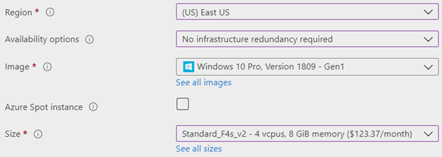](media/pixel-streaming/pixel-streaming-create-mm-vm.png)

Choose the same **Region** as the Signaling Server VM **Region** (though not needed other than being on the same network), use **Windows 10 Pro Version 1809** or later (or Windows Server 2016 or 2019 if desired) as the **Image** , and Standard\_F4s\_v2 SKU or similar (2-4 VCPUs should be fine). Since the Matchmaker is a small console app and mostly does a browser redirect to the SS, smaller general or compute-optimized SKUs should be fine.

8. Set the **inbound ports** to allow **Http (80), RDP (3389)**. This could be fine for testing; however, please consider your security requirements (or custom desired ports) and be sure to realize that opening 3389 with a public IP address will allow people on the internet to be able to find your RDP login prompt (e.g., hackers pinging random IP addresses). Consider using [Azure Bastion](https://azure.microsoft.com/en-us/services/azure-bastion/#:~:text=Azure%20Bastion%20is%20a%20new,need%20a%20public%20IP%20address.) or a jump box setup with [NSGs](https://docs.microsoft.com/en-us/azure/virtual-network/network-security-groups-overview) for your network if requiring more security for RDP logins.

[](media/pixel-streaming/pixel-streaming-create-vm-ports.png)

9. On the **Disks** tab leave the defaults.
10. On the **Networking** tab, use the **Virtual network** used by the SS and a new **Public IP** (if your security requirements allow).
11. Finish creating the VM from the **Review + create** page.
12. Once the VM is successfully deployed, navigate to the VM in the Azure Portal and in the Networking page on the left, click the [Add inbound port rule](https://docs.microsoft.com/en-us/azure/virtual-machines/windows/nsg-quickstart-portal#create-an-inbound-security-rule) button to open up any additional ports such as 9999 (MM web socket). As always, please follow your security requirements to ensure desired network safety.
13. Follow the quick-start documentation [here](https://docs.microsoft.com/en-us/azure/virtual-machines/windows/quick-create-portal#connect-to-virtual-machine) for connecting to the VM via RDP.
14. Once connected to the VM, copy ( **right click -&gt; copy** ) and paste ( **right click -&gt; paste** ) the Matchmaker\ folder (`Engine\Source\Programs\PixelStreaming\WebServers\Matchmaker\`) from the exported Pixel Streaming package ([Unreal docs](https://docs.unrealengine.com/en-US/SharingAndReleasing/PixelStreaming/PixelStreamingIntro/index.html)) to the Windows desktop of the VM.
15. Install Node.js for the Matchmaker to run, which can be downloaded [here](https://nodejs.org/en/download/).
16. Open the `matchmaker.js` file with something like Notepad and change the httpPort variable to 80 (default is 90)—don&#39;t forget to save the changes.
17. Run the `run.bat` under the `Matchmaker\` folder. Windows may popup a dialog requiring you to confirm you wish to run the Matchmaking service when first started on the VM.
18. RDP back into the SS VM and in the `SignallingWebServer\config.json` and add the following configs (some will not be in the config by default so you&#39;ll need to add them):

```json
{
    ...
    "UseMatchmaker": true,
    "matchmakerAddress": "<Put IP or DNS address of Matchmaker VM>",
    "matchmakerPort": "9999",
    "publicIp": "localhost",
    "streamerPort": 8888,
    "httpPort": 80
}
```

Ensure there is a comma after each line (except the last line) otherwise the MM service will fail.

19. Ensure that the Windows Firewall allows incoming and outgoing traffic from 80 and 9999 ports (see [opening ports with Windows firewall](https://docs.microsoft.com/en-us/sql/database-engine/configure-windows/configure-a-windows-firewall-for-database-engine-access?view=sql-server-ver15#SSMSProcedure)).
20. Close any existing SS process and run the **runAzure.bat** file on the SS VM and ensure the MM is connected to the SS by looking for the &quot;Cirrus connected to Matchmaker :9999&quot; log in the SS console output.
21. The solution is ready to be run by a user now. Navigate to a browser on your local computer or mobile device and type in the IP address of the Matchmaker Virtual Machine to be redirected to an available Signaling Server to start streaming. The IP can be found by going to the Overview page of the VM in the Azure Portal, noted under the Public IP address section.
22. If using the default template exported from Unreal Engine, click the **Click to start** and the play icon button to begin streaming Unreal Pixel Streaming successfully in Azure.


23. To improve the customer experience, it&#39;s recommended to use a DNS domain/subdomain instead of exposing an IP address which can change or isn&#39;t as polished. A simple custom subdomain can be created for the VM by clicking on the **Public IP address** in the **Overview** page of the VM in the Azure Portal, which will allow for setting a **DNS name label**. Depending on the Azure region used, the dns would be: `<subdomain>.<azure_region>.cloudapp.azure.com`. It&#39;s of course recommended to use a proper registered domain for production solutions.
24. If more available streams are desired, do the same steps for creating and starting a SS VM, with the same configurations used above to point the SS to the MM.

# Optimizing Pixel Streaming in Azure

Be sure to check out the Pixel Streaming in Azure Overview [documentation](unreal-pixel-streaming-in-azure.md) to learn more about optimizing for Azure VM SKUs, performance and pricing optimizations.

# Configurations

Below are notable configurations to consider when deploying the Pixel Streaming solution in Azure.

## Matchmaker Configuration

Below are the [configurations](https://docs.unrealengine.com/en-US/SharingAndReleasing/PixelStreaming/Hosting/#multiplefullstackswithmatchmaking) available to the `Matchmaker.js` file:

```json
{
    ...
    // The port clients connect to the Matchmaking service over HTTP (default 90, recommend 80)
    "httpPort": 90,
    // The Matchmaking port the Signaling Service connects to the matchmaker over sockets
    "matchmakerPort": 9999,
}
```

## Signaling Server Configuration

Below are [configurations](https://docs.unrealengine.com/en-US/SharingAndReleasing/PixelStreaming/Hosting/#multiplefullstackswithmatchmaking) available to the Signaling Server in their config:

```json
{
    "UseFrontend": false,
    "UseMatchmaker": true, // Set to true if using Matchmaker
    "UseHTTPS": false,
    "UseAuthentication": false,
    "LogToFile": true,
    "HomepageFile": "player.htm",
    "AdditionalRoutes": {},
    "EnableWebserver": true,
    "matchmakerAddress": "", // The DNS / IP address to the matchmaker (if enabled)
    "matchmakerPort": "9999", // The web socket port used to talk to the MM
    "publicIp": "localhost", // The Public IP of the VM, localhost usually is fine
}
```

### TURN / STUN Servers

In some cases you might need a STUN / TURN server in between the UE4 app and the browser to help identify public IPs (STUN) or get around certain NAT&#39;ing/Mobile carrier settings (TURN) that might not support WebRTC. Please refer to Unreal Engine&#39;s [documentation](https://docs.unrealengine.com/en-US/SharingAndReleasing/PixelStreaming/Hosting/index.html) for details about these options; however, for most users a STUN server should be sufficient. Inside of the SignallingWebServer\ folder there are PowerShell scripts used to spin up the Cirrus.js service which communicates between the user and the UE4 app over WebRTC, and `Start_Azure_SignallingServer.ps1` or `Start_Azure_WithTURN_SignallingServer.ps1` are used to launch with STUN / TURN options. There are public stun servers like a Google one (_stun.l.google.com:19302)_, but it&#39;s highly recommended to **deploy your own for production**. You can find many other public options online as well (e.g., [1](https://gist.github.com/mondain/b0ec1cf5f60ae726202e), [2](https://stackoverflow.com/questions/20068944/how-to-self-host-to-not-rely-on-webrtc-stun-server-stun-l-google-com19302/20134888#20134888)). Unreal Engine exports out stunserver.exe and turnserver.exe when packaging up the Pixel Streaming 3D app to setup on your own servers:
 `…\Engine\Source\ThirdParty\WebRTC\rev.23789\programs\Win64\VS2017\release\`

##

## Unreal 3D App

The Unreal application has some key parameters that can be passed in upon startup.

```dos
<PixelStreamingApp>.exe-AudioMixer -PixelStreamingIP=localhost -PixelStreamingPort=8888 -WinX=0 -WinY=0 -ResX=1920 -ResY=1080 -Windowed -RenderOffScreen -ForceRes
```

Notable app arguments to elaborate on (see Unreal [docs](https://docs.unrealengine.com/en-US/SharingAndReleasing/PixelStreaming/PixelStreamingReference/#unrealenginecommand-lineparameters) for others):

- `-ForceRes`: It is important to make sure this argument is used to force the Azure VM&#39;s display adapter to use the specified resolution (i.e., ResX/ResY).
- `-RenderOffScreen`: This renders the app in the background of the VM so it won&#39;t be seen if RDP&#39;ing into the box, which ensures that a window won&#39;t be minimized and not stream back to the user.
- `-Windowed`: If this flag isn&#39;t used the resolution parameters will be ignored (i.e., ResX/ResY).
- `-PixelStreamingPort`: This needs to be the same port specified in the Signaling Server, which is the port on the VM that the communicates with the 3D Unreal app over web sockets.

## Deploying at Scale and Autoscaling Configuration

Setting up Unreal Pixel Streaming for autoscale won&#39;t be focused on in this documentation, so please refer to our documentation on the [Terraform deployment template](unreal-pixel-streaming-at-scale.md) for details on deploying Pixel Streaming at scale in Azure.

## Player HTML &amp; Custom Event Configuration

When Unreal Pixel Streaming is packaged from Unreal Engine the solution contains a \Engine\Source\Programs\PixelStreaming\WebServers\SignallingWebServer\player.htm file to customize the experience, along with the ability to customize JavaScript functions to send custom events between the browser and the 3D Unreal application. Please see Epic&#39;s [documentation](https://docs.unrealengine.com/en-US/SharingAndReleasing/PixelStreaming/CustomPlayer/index.html) on how to make these extra customizations.

## Next Steps

Consider deploying Unreal Pixel Streaming in Azure at scale with a robust Terraform template:

- [Deploying Pixel Streaming at Scale in Azure](unreal-pixel-streaming-at-scale.md)