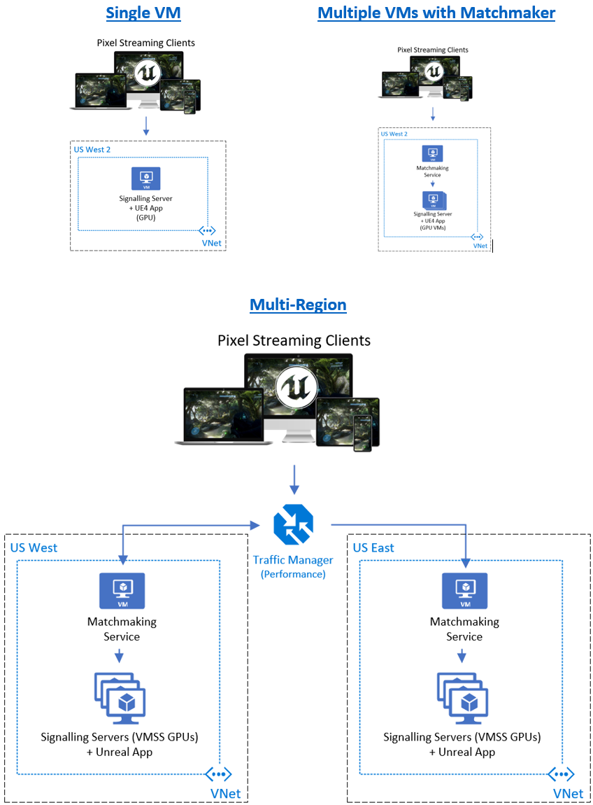

# Unreal Pixel Streaming in Azure

# Overview

This documentation goes through an overview on how to deploy Unreal Engine&#39;s Pixel Streaming technology in Azure, which is a technology that Epic Games provides in their Unreal Engine to stream remotely deployed interactive 3D applications through a browser (i.e., computer/mobile) without the need for the connecting client to have GPU hardware. For those who are new to Pixel Streaming, it&#39;s recommended to first follow Epic&#39;s [Getting Started](https://docs.unrealengine.com/en-US/Platforms/PixelStreaming/PixelStreamingIntro/index.html) documentation to ensure you can deploy Pixel Streaming on your local computer, and then read the documentation below to get a greater understanding of Pixel Streaming architectures in Azure. Once you have a good understanding of how Pixel Streaming works, you can follow our [quick-start guide](#_Quick-Start_Guide) below for the basics of deploying Pixel Streaming in Azure. For a more robust solution in Azure, refer to the [autoscaling solution](#_Autoscaling_Solution) which deploys from Git using Terraform and Application Insights for custom metrics.

## Quick-Start Guide

Follow this guide to learn the basics of deploying Pixel Streaming on an Azure GPU Virtual Machine or multiple VMs if using the Matchmaker service to load balance across many streams on multiple GPU VMs: [Quick-Start Guide](unreal-pixel-streaming-deploying.md).

## Autoscaling Solution

For deploying Unreal Pixel Streaming at scale (i.e., 2 to 1000&#39;s of streams) with autoscaling, multiple streams per GPU and Azure metrics, refer to the Azure documentation here: [Unreal Pixel at Scale](pixel-unreal-pixel-streaming-at-scale.md).

## Overview of Unreal Engine&#39;s Pixel Streaming

Unreal Pixel Streaming allows developers to stream rendered frames and audio from a remote GPU enabled computer (e.g., cloud) to their users through a desktop or mobile web browser, without the need for the users to have special GPU hardware. More than just a stream, Pixel Streaming allows users to interact with the 3D application, as mouse and keyboard inputs are communicated back to the remote server and processed with low latency. This gives the user the experience as if they were using the application right on their own computer or mobile device. Some common use cases for this are for games, simulations, or immersive experiences such as configuring a new car or walking through a virtual showroom. Applications are developed in Unreal Engine and then exported out as a Windows executable to be placed on a GPU capable server, which then communicates with a local WebRTC NodeJS server to broker the stream and interactions to and from the client&#39;s browser connection.

Refer to Epic&#39;s Documentation for more details: [Getting Started](https://docs.unrealengine.com/en-US/Platforms/PixelStreaming/PixelStreamingIntro/index.html), [Architecture/Networking](https://docs.unrealengine.com/en-US/Platforms/PixelStreaming/Hosting/index.html), [Configs](https://docs.unrealengine.com/en-US/Platforms/PixelStreaming/PixelStreamingReference/index.html)

# Architecture

Below are a few recommended architectures to consider when deploying Pixel Streaming to Azure, from a **Single VM** , **Multiple VMs with the Matchmaker** service, and a **Multi-Region** approach.

[](media/pixel-streaming/pixel-streaming-architectures.png)

### Single VM

The simplest setup to get Pixel Streaming deployed in Azure is to deploy a single [GPU VM](https://docs.microsoft.com/en-us/azure/virtual-machines/nv-series) in a [Virtual Network](https://docs.microsoft.com/en-us/azure/virtual-network/virtual-networks-overview) running a Windows OS as required by the Unreal Engine (e.g., Windows 10). This is sufficient for scenarios where no scale out is needed, and all the users hitting the Pixel Streaming solution will share the same session (i.e., everyone shares the same view and controls). The Signaling Server and the UE4 3D App will be the key resources running on this GPU VM, and requires copying the [exported content](https://docs.unrealengine.com/en-US/SharingAndReleasing/PixelStreaming/PixelStreamingIntro/index.html) from the Unreal Engine to the Windows VM (i.e., desktop). Users can use their browser to navigate to the VM&#39;s IP address using the desired port (default 80) to start streaming and interacting with the 3D app. Jump to the quick-start steps [here](unreal-pixel-streaming-deploying.md).

### Multiple VMs with Matchmaker

For Pixel Streaming deployments that need to scale out and have each user control and view their own individual session, the [Matchmaker service](https://docs.unrealengine.com/en-US/SharingAndReleasing/PixelStreaming/Hosting/#multiplefullstackswithmatchmaking) provided in the Pixel Streaming exported package should be used. This architecture in Azure consists of 1 VM for the Matchmaker service (Windows OS, but could configured to run Linux) and 1 or more GPU VMs for the Signaling Service / UE4 app (Windows OS) in a Virtual Network. In addition to the Single VM architecture, deploying the Matchmaker requires copying the Matchmaker folder from the [exported content](https://docs.unrealengine.com/en-US/SharingAndReleasing/PixelStreaming/PixelStreamingIntro/index.html) from the Unreal Engine to the Matchmaker VM (i.e., desktop). Once the Signaling Service and UE4 App are started on the GPU VM, users can now use their browser to navigate to the Matchmaker VM&#39;s IP address using the desired port (default 90) to start streaming and interacting with the 3D app in their own session.

As expected, the more GPU VMs that are needed to be spun up, the more the necessity to build out a proper deployment/DevOps pipeline to configure each Matchmaker and Signaling Server/App VM that is spun up. Instead of individual VMs, look at the [Multi-Region](#_Multi-Region) architecture to learn about using [Virtual Machine Scale Sets](https://docs.microsoft.com/en-us/azure/virtual-machine-scale-sets/overview#:~:text=Azure%20virtual%20machine%20scale%20sets%20let%20you%20create%20and,group%20of%20load%20balanced%20VMs.&amp;text=Scale%20sets%20provide%20high%20availability,a%20large%20number%20of%20VMs.) (VMSS) instead for scaling out compute. Jump to the quick-start steps [here](unreal-pixel-streaming-deploying.md#quick-start-deployment-for-multiple-vms-with-matchmaker-in-azure).

### Multi-Region

The Multi-Region Pixel Streaming architecture customized for Azure is setup to deploy the Pixel Streaming solution to multiple specified regions with a [Traffic Manager](https://docs.microsoft.com/en-us/azure/traffic-manager/traffic-manager-overview) as the entry point, allowing the user to be directed to the closest deployed region for the lowest latency possible. Though a user in Texas (US) could connect to an Azure region in Washington (US) and still have a good experience, the closer the user is to the deployed region the more snappy the interactivity feels due to expected latency. Each regional deployment of a Pixel Streaming solution is made up of a Matchmaker VM and Signaling Server + UE4 app GPU VMs using [Virtual Machine Scale Sets](https://docs.microsoft.com/en-us/azure/virtual-machine-scale-sets/overview#:~:text=Azure%20virtual%20machine%20scale%20sets%20let%20you%20create%20and,group%20of%20load%20balanced%20VMs.&amp;text=Scale%20sets%20provide%20high%20availability,a%20large%20number%20of%20VMs.) (VMSS) to scale out the compute. Please refer to our [autoscaling solution documentation](pixel-unreal-pixel-streaming-at-scale.md) which has a deep dive on this architecture.

# Key Components of Pixel Streaming

Below we will review the key components of Unreal Pixel Streaming to better understand what does what in the full solution.

## Matchmaker (Redirects to available servers)

The Matchmaker (MM) is the first core service hit that determines which streaming servers are available to redirect a user to, and can be thought of as a special load balancer or orchestrator to ensure users can get to an available Pixel Streaming app. Without this service users accessing a Pixel Streaming server directly would collide with other user sessions, and people would be sharing sessions and fighting for control of the app. For use cases where sharing a single session is required among users, do not use a Matchmaker.

The Matchmaker is a simple Node.js webapp deployed on a Windows Server (could be any OS that can run Node.js by removing explicit PowerShell.exe calls), and it listens for connections from an incoming user, and does a browser redirect to the address of an available GPU VM running the Signaling Server and 3D app. Web socket connections are used to communicate with the Signaling Web Servers to track which server instances are available or not. The MM service is generated from the Unreal Engine when exporting a Pixel Streaming application. It&#39;s important for the Matchmaker and the WebRTC Signaling Web Server which is on a separate GPU node to stay in constant communication, which is done via web sockets. As users connect/disconnect from a Signaling Server the communication is sent back to the Matchmaker to let it know that the server is available/unavailable. The Matchmaker will not redirect a user to a Signaling Server if it has not communicated back to the Matchmaker that it is not only connected, but `"message.ready == true"` to let the Matchmaker know the 3D app on the GPU VM is streaming and ready to be used. The main code for the Matchmaker found under the folder path:

`…\Engine\Source\Programs\PixelStreaming\WebServers\Matchmaker\matchmaker.js`

It will run as a console app, and can be manually ran by launching run.bat in the `Matchmaker\` path. You can test that it is up by hitting the root on port 90 to be directed to a streaming server, or a message with be displayed saying that there are no servers available. Once the Matchmaker sees that all the available slots for streaming are used, it will show a webpage to the user telling them to wait for an available server, and will do a force refresh every 10 seconds to reevaluate any open servers to send them to. Note that there is no queuing of users so if the available Signaling Servers become full, the next user to get the spot is the first user whose browser refreshed after one becomes available.

## Signaling Web Server (WebRTC streaming server)

The Signaling Server (SS) is a Node.js webapp that handles the WebRTC streaming from the Unreal 3D Pixel Streaming application back to the user. Like the Matchmaker, this is generated from the Unreal Engine when exporting a Pixel Streaming application. It is in constant communication with the Matchmaker through sockets, letting the MM know when the server is available/unavailable. The SS is deployed on VMSS GPU VMs (e.g. NV12s\_v3, NVIDIA Tesla M60, Windows 10) alongside the Unreal 3D application, and is running a Node.js web server on Http port 80, communicating back to the Matchmaking via port 9999 over web sockets. The SS takes input from the user via a web browser that the user is viewing the app from, and redirects the mouse and keyboard inputs to the 3D application via a JavaScript interface. The SS uses [NVENC](https://en.wikipedia.org/wiki/Nvidia_NVENC) to turn the 3D streaming into something efficient to beam back to the user rendered frames up to 60fps, like watching a video that&#39;s interactive as if you were running the 3D app locally.

The core code for the Signaling Server is located here in the folder structure:
 `…\Engine\Source\Programs\PixelStreaming\WebServers\ SignallingWebServer\cirrus.js`

To run the service manually, you can execute the \run\*.bat file in the SS code&#39;s root folder. This can be started before or after the 3D app has started. When the Matchmaker and the 3D app are running, the SS logs should show a connection to the matchmaker on port 9999, and a &quot;Streamer Connected::1&quot; to show the 3D app is connected on the box. You can always bypass the MM and hit a SS node directly via the node&#39;s specific DNS or IP via port 80 (default). The SS communicates with the 3D app over web socket port 8888.

## Unreal 3D Pixel Streaming App

The 3D app that the user will be interacting with is built from Unreal Engine, exported as a special Pixel Streaming executable and through [command lines arguments](https://docs.unrealengine.com/en-US/SharingAndReleasing/PixelStreaming/PixelStreamingReference/#unrealenginecommand-lineparameters) it connects over a specified port (default 8888) to the Node.js Signaling Server. To run this 3D app on a VM it must have DirectX runtime, vcredist2017 and Node.js installed. Please note that the &lt;PixelStreamingName&gt;.exe isn&#39;t the only executable run on start, but there is a separate executable that is also run and lives in the &lt;`PixelStreamingName`&gt; folder which contains the larger exe size.

See the [Configurations section](#_Unreal_3D_App) for the Unreal App below to learn more about notable configs.

# Azure SKU Recommendations

Below are the recommended compute SKUs for general usage of Pixel Streaming in Azure:

- **Matchmaker** : Standard\_F4s\_v2 or similar should be sufficient. 4 cores with a smaller memory footprint should be fine for most deployments as there is very little CPU/Memory usage due to the instant redirecting users to Signaling Servers.
- **Signaling Server** : Standard\_NV12s\_v3 or Standard\_NV6 might be the best price per performance GPU VMs in Azure for Pixel Streaming, with the newer [NV12s\_v3](https://docs.microsoft.com/en-us/azure/virtual-machines/nvv3-series)&#39;s providing better CPU performance at a similar price-point to the older [NV6s](https://docs.microsoft.com/en-us/azure/virtual-machines/nv-series). Both have a NVIDIA Tesla M60 GPU. If Ray Tracing is required in your app you&#39;ll need to look at the [NCas T4 v3](https://docs.microsoft.com/en-us/azure/virtual-machines/nct4-v3-series) series VMs in limited regions (preview). As GPU SKUs are in high demand, it&#39;s important to work with the capacity team early on to request the needed quota for any event or deployment that will be spinning up a great number of GPU VMs.

**Important:** It is recommended to first deploy your Pixel Streaming executable and run it on your desired GPU SKU to see the performance characteristics around CPU/Memory/GPU usage to ensure no resources are being pegged and frame rates are acceptable. Consider changing resolution and frames per second of the UE4 app to achieve acceptable quality per your requirements. Additionally, consider the IOPS / latency requirements for the 3D app when choosing a disk, as [SSDs](https://azure.microsoft.com/en-us/pricing/details/managed-disks/) and/or striping disks will be key to gaining the best disk speed (some GPU SKUs might not support Premium SSDs so also consider disk striping for adding IOPS).

# Optimizing Pixel Streaming in Azure

There are some performance and pricing optimizations to consider when running Pixel Streaming in Azure, and your deployments will need to weigh the risks/rewards for each of options.

## Performance Optimizations

Consider the following performance optimizations for your Pixel Streaming solution:

- **FPS:** Consider reducing the frames per second (FPS) of the Unreal application to reduce the load on the GPU especially, which can be set in the _Engine.ini_ file by adding the following section (e.g., 30 fps):

`<PixelStreamingProject>\Saved\Config\WindowsNoEditor\Engine.ini`

```ini
[/Script/Engine.Engine]
 bUseFixedFrameRate=True
 FixedFrameRate=30.000000
```

- **Resolution:** If you don&#39;t set the resolution for the Unreal app in the command line or shortcut property arguments it will use the currently set resolution, so it&#39;s recommended to pick a resolution that is the max acceptable resolution for the application such as 720p or 1080p to reduce the load on the GPU/CPU. Use the following arguments when calling the Unreal executable to set the resolution that the Unreal app should run (from the command line/script or from a shortcut of the .exe): `-WinX=0 -WinY=0 -ResX=1920 -ResY=1080 -Windowed -ForceRes`

The `ForceRes` argument is very important to **ensure** the Azure VM uses the specified resolution.

- **3D Complexity:** Like any 3D app dev, the more you can reduce triangle counts, texture sizes and lighting complexity the less load you will be putting on the GPU. Consider that many users may be viewing your Pixel Streaming app from their cell phone and there could be ways to reduce the complexity without sacrificing too much noticeable quality. This is assuming you need reduce the GPU load, so first test on your target GPU SKU to see if anything is even being pegged.

## Price Optimizations

One of the challenges with Pixel Streaming when streaming to hundreds or even thousands of users is the cost, especially if each user is taking up a whole VM themselves, or if requirements dictate the need to keep an available pool of servers hot so users don&#39;t have to wait to experience the app. Below are some considerations to explore in order to wrangle costs when using more costly compute like GPU SKUs.

- **More streams per VM** : One of the best ways to optimize costs is to fit more than one 3D app on each GPU VM. Depending on requirements and your apps complexity, using the performance optimizations listed above you could potentially fit 2 - 4 apps per VM (e.g., 30fps, 720p). Nearly all documentation on Pixel Streaming assumes 1 stream per GPU VM, but this functionality could be implemented and would require a separately running Signaling Server with a different communication port (i.e., 8888, 8889, etc.), and running the 3D app separately with the respective `-PixelStreamingPort` for each desired instance. Refer to our documentation on the [Terraform deployment template](unreal-unreal-pixel-streaming-at-scale.md) which provides this functionality.
- **Spot VMs:** Another way to reduce costs greatly is to consider looking at [Azure Spot VMs](https://azure.microsoft.com/en-us/pricing/spot/) for the GPU SKUs which can provide a 60%+ discount for VMs that are sitting idle in Azure and provides deep incentives to customers. There is a chance that Spot VMs can be evicted and given to another customer willing to pay full price for a guaranteed VM, but If the project&#39;s requirements allow for that risk this option in conjunction with fitting more stream instances per VM has the lowest cost of running Pixel Streaming in Azure. There could be a hybrid approach where some VMs are Spot and others are regular VMs, and depending on the importance of a customer (i.e., paying or VIP) the Matchmaker could be tailored to redirect specific users to different tiers (i.e., Spot/Regular).
- **Promo VMs:** SomeGPU VMs can be found in certain regions as Promo where large discounts are given, which could also be incorporated as a hybrid approach to regular and spot VMs.

## Next Steps

See these quickstarts to get started:

- [Deploying Pixel Streaming in Azure](unreal-pixel-streaming-deploying.md)
- [Deploying Pixel Streaming at Scale in Azure](unreal-pixel-streaming-at-scale.md)