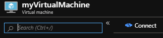

# Deploy a single region LAMP architecture

This document covers different methods to deploy a single region LAMP architecture, either using command line tools on either Linux bash or Windows batch for a more hands on programmatic setup, or an Azure Resource Manager template for a one-click deployment. In most cases there will be pointers to how to setup a certain portion of the architecture using the Azure Portal.

In general, when deploying a single region LAMP architecture there are certain steps that are mostly one-offs while others need to be executed in more regular basis as your backend gets updated to match your game requirements. Here below is the full step list:

**Mostly one-offs operations**

1. Deploy a Virtual Machine on a Managed Disk with your preferred Linux OS distribution.
2. Install Apache, your preferred PHP version and other stuff you consider.
3. Deallocate and generalize the Virtual Machine.
4. Capture the Virtual Machine Disk Image to generate the custom golden image.
5. Deploy the networking resources (load balancer, etc).
6. Deploy the Azure Cache for Redis.
7. Deploy the Azure Database for MySQL.
8. Create the Azure Storage account and container.
9. Create your Virtual Machine Scale Set ensuring it references the captured Disk Image as the OS Disk
1. Setup the autoscale settings.

> [!NOTE]
> You may want in the future to change to another Linux OS version or PHP version, so that would require to recreate the custom golden image (steps 1-4). Or you may want to make changes into the autoscaler (step 8).

**Regular basis operations**

1. Update the Virtual Machine instances from the Virtual Machine Scale Set with any PHP file modifications.

**General configuration variables and tools**

Regardless of what step you are working on, it's best practice to keep a set of general variables handy as they are foundational:

- **YOURSUBSCRIPTIONID**: Your Azure subscription ID (format: XXXXXXXX-XXXX-XXXX-XXXX-XXXXXXXXXXXX).
- **REGIONNAME**: The Azure region where the architecture will be deployed.
- **RESOURCEGROUPNAME**: The name of the resource group that will contain all the different Azure services from the architecture. Consider appending the region name as a suffix.
- **PREFIX**: The string that will precede all the Azure services for future identification purposes. i.e: the codename of your game.

To initialize the variables:

```bash
SET YOURSUBSCRIPTIONID=XXXXXXXX-XXXX-XXXX-XXXX-XXXXXXXXXXXX
SET RESOURCEGROUPNAME=myResourceGroup
SET REGIONNAME=westus
SET LOGINUSERNAME=azureuser
```

If you haven't already done so, install [Azure CLI](https://docs.microsoft.com/cli/azure/install-az-cli2), a command-line tool providing a great experience for managing Azure resources. The CLI is designed to make scripting easy, query data, support long-running operations, and more.

## Deploy a Virtual Machine on a Managed Disk

This Virtual Machine only has one specific use, serve as a foundation for the custom golden image. In most cases, it gets deleted afterwards.

### Command line approach using Azure CLI

On top of the general configuration variables, the following variables are also being used:

|Variable|Default value|Small T-shirt value|Medium T-shirt value|Large T-shirt value|Description|
|----------|----------|-----------|----------|----------|-----------|
| **LOGINUSERNAME** | azureuser | | | | The admin username to connect to the Virtual Machine after being deployed.
| **VMNAME** | myVirtualMachine | | | | The name of the Virtual Machine.
| **VMNAME** | Canonical:UbuntuServer:16.04-LTS:latest | | | | The Linux OS that will be installed in the Virtual Machine.
| **VMSIZE** | Standard_B1s | Standard_B1s | Standard_F4s_v2 | Standard_F32s_v2 | Virtual Machine option. Be aware that Premium SSD is not supported in every Virtual Machine option. [Learn more](https://azure.microsoft.com/pricing/details/virtual-machines/linux/#Linux).
| **VMDATADISKSIZEINGB** | 5 | 5 | 10 | 30 | How much persistent disk storage you are going to allocate per Virtual Machine. [Benefits of using managed disks](https://docs.microsoft.com/azure/virtual-machines/windows/managed-disks-overview#benefits-of-managed-disks).

#### Initialize the variables

```bash
SET VMNAME=myVirtualMachine
SET IMAGE=Canonical:UbuntuServer:16.04-LTS:latest
SET VMSIZE=Standard_B1s
SET VMDATADISKSIZEINGB=5
```

> [!NOTE]
> Aside from the core steps documented below, for more details about the process of deploying a Virtual Machine on a Managed Disk, refer to the [Create and Manage Linux VMs with the Azure CLI](https://docs.microsoft.com/azure/virtual-machines/linux/tutorial-manage-vm) tutorial that covers basic Azure virtual machine deployment items such as selecting a VM size, selecting a VM image, and deploying a VM.

#### Login

```batch
CALL az login
```

#### Set the Azure subscription

If you only have one, this step is optional.

```batch
CALL az account set ^
 --subscription %YOURSUBSCRIPTIONID%
```

#### Create a resource group

```batch
CALL az group create ^
 --name %RESOURCEGROUPNAME% ^
 --location %REGIONNAME%
```

#### Create a Virtual Machine

This operation will take several minutes.

```batch
CALL az vm create ^
 --resource-group %RESOURCEGROUPNAME% ^
 --name %VMNAME% ^
 --image %IMAGE% ^
 --size %VMSIZE% ^
 --admin-username %LOGINUSERNAME% ^
 --data-disk-sizes-gb %VMDATADISKSIZEINGB% ^
 --generate-ssh-keys
```

> [!TIP]
> It's recommended to use SSH keys rather than password to protect the access to the Virtual Machines.

#### Open the port 80

```batch
CALL az vm open-port ^
 --port 80 ^
 --priority 900 ^
 --resource-group %RESOURCEGROUPNAME% ^
 --name %VMNAME%
```

#### Open the port 443

```batch
CALL az vm open-port ^
 --port 443 ^
 --priority 901 ^
 --resource-group %RESOURCEGROUPNAME% ^
 --name %VMNAME%
```

### Azure Resource Manager template

TBD

### Azure Portal

Refer to [Create a Linux virtual machine in the Azure portal](https://docs.microsoft.com/azure/virtual-machines/linux/quick-create-portal) and [Attach a managed data disk to a VM by using the Azure portal](https://docs.microsoft.com/azure/virtual-machines/windows/attach-managed-disk-portal#add-a-data-disk) if you prefer to create the Virtual Machine manually using the Azure Portal.

## Install Apache and PHP

### Get the public IP of the Virtual Machine that was just created

#### Command line approach using Azure CLI

```batch
CALL az network public-ip list ^
 --resource-group %RESOURCEGROUPNAME% ^
 --query [].ipAddress
```

#### Azure Portal

Select the **Connect** button on the overview page for your Virtual Machine.

[](media/webstack/webstack-connect-to-vm-portal.png)

On the right side of the screen a new blade will be open, in Login using VM local account a connection command is shown.

### Connect to the Virtual Machine

Using your preferred local bash shell, paste the SSH connection command into the shell to create an SSH session. The following example shows what the SSH connection command looks like:

`ssh azureuser@[PUBLICIP]`

### Run the installation commands one by one

The following commands will install Apache and the PHP 7.3 version. You can change to any other PHP version, like 5.6, replacing all the 7.3 references below.

```bash
sudo add-apt-repository -y ppa:ondrej/php

sudo apt-get -y update

export DEBIAN_FRONTEND=noninteractive

sudo apt-get -y install apache2 php7.3 libapache2-mod-php7.3 php7.3-mysql

sudo apt-get -y install php7.3-cli php7.3-fpm php7.3-json php7.3-pdo php7.3-zip php7.3-gd php7.3-mbstring php7.3-curl php7.3-xml php7.3-bcmath php7.3-json

sudo service apache2 start

echo "<?php phpinfo(); ?>" | sudo tee /var/www/html/phpinfo.php > /dev/null

exit
```

> [!TIP]
> You can create a shell script and execute all the commands in a more automated fashion.

### Validate that the web server and PHP are running properly

Replace the PUBLICIP below with the real IP address of your Virtual Machine. Then open your preferred web browser and try to access the default page or any of your specific PHPs for example and check that everything is working as intended.

`http://[PUBLICIP]`

## Deallocate and generalize the Virtual Machine

### Clean up the virtual machine

To create an image for deployment, you'll need to clean the system and make it ready for re-provisioning.

Use your preferred local bash shell, the account name, and the public IP address of the Virtual Machine to connect to it remotely and deprovision it.

```bash	
ssh azureuser@[PUBLICIP]
sudo waagent -deprovision+user -force
exit 
```

The command above performs the following tasks:

- Removes SSH host keys
- Clears nameserver configuration in /etc/resolvconf
- Removes the root user's password from /etc/shadow
- Removes cached DHCP client leases
- Resets host name to localhost.localdomain
- Deletes the last provisioned user account and it’s data

### Stopping, deallocating and generalizing the virtual machine

Before creating an image it's needed to stop and prepare the Linux guest OS on the Virtual Machine. If you create an image from a Virtual Machine that hasn't been generalized, any Virtual Machines created from that image won't start. These operations should be really quick to complete.

#### Command line approach using Azure CLI

On top of the previously defined variables, the following variables are also being used:

|Variable|Default value|Description|
|----------|----------|-----------|
| **GOLDENIMAGENAME** | myGoldenImage | The name of the custom golden image..

```batch
CALL az vm deallocate ^
 --resource-group %RESOURCEGROUPNAME% ^
 --name %VMNAME%

CALL az vm generalize ^
 --resource-group %RESOURCEGROUPNAME% ^
 --name %VMNAME%
```

## Capture the Virtual Machine Disk Image to generate the custom golden image

#### Command line approach using Azure CLI

To initialize the variables:

```batch
SET GOLDENIMAGENAME=myGoldenImage
```

Then:

```batch
CALL az image create ^
 --resource-group %RESOURCEGROUPNAME% ^
 --source %VMNAME% ^
 --name %GOLDENIMAGENAME% ^
 --os-type Linux
```

### Azure Resource Manager template

TBD

### Azure Portal

TBD

## Deploy the networking resources

> [!CAUTION]
> This is the portion of the configuration that requires a more careful look as there are multiple networking elements involved, some interconnected.

### Command line approach using Azure CLI

On top of the previously defined variables, the following variables are also being used:

|Variable|Default value|Small T-shirt value|Medium T-shirt value|Large T-shirt value|Description|
|----------|----------|-----------|----------|----------|-----------|
| **LBSKU** | Basic | Basic | Standard | Standard | The Azure Load Balancer SKU. [Learn more](https://azure.microsoft.com/pricing/details/virtual-machines/linux/#Linux).
| **PUBLICIPNAME** | PREFIX + PublicIP | | | | The name to identify the public IP address of the Azure Load Balancer.
| **PUBLICIPALLOCATION** | Static | | | | Dynamic or Static.
| **PUBLICIPVERSION** | Ipv4 | | | | Ipv4 or Ipv6.
| **LBNAME** | PREFIX + LB | | | | The name to identify the Azure Load Balancer.
| **VNETNAME** | PREFIX + VNET | | | | The name to identify the Azure Virtual Network.
| **VNETADDRESSPREFIX** | 10.0.0.0/16 | | | | The Azure Virtual Network address space.
| **SUBNETNAME** | PREFIX + Subnet | | | | The name to identify the subnet.
| **SUBNETADDRESSPREFIX** | 10.0.0.0/24 | | | | The subnet's address range in CIDR notation (e.g. 192.168.1.0/24). It must be contained by the address space of the Azure Virtual Network.
| **LBBEPOOLNAME** | LBNAME + BEPool | | | | The name of the Azure Load Balancer backend pool.
| **LBFENAME** | LBNAME + FE | | | | The name of the Azure Load Balancer frontend IP configuration.
| **LBFEPORTRANGESTART** | 50000 | | | | Frontend IP configuration range start port.
| **LBFEPORTRANGEEND** | 50119 | | | | Frontend IP configuration range end port.
| **LBNATPOOLNAME** | LBNAME + NATPool | | | | The Azure Load Balancer NAT pool name.
| **LBRULEHTTPNAME** | LBNAME + HTTPRule | | | | The Azure Load Balancer inbound NAT rule name for the HTTP connections.
| **LBRULEHTTPSNAME** | | Note: Only Standard SKU | LBNAME + HTTPSRule | LBNAME + HTTPSRule | The Azure Load Balancer inbound NAT rule name for the HTTPs connections.

#### Initialize the variables

```batch
SET LBSKU=Basic
SET PUBLICIPNAME=%PREFIX%PublicIP
SET PUBLICIPALLOCATION=Static
SET PUBLICIPVERSION=IPv4
SET LBNAME=%PREFIX%LB
SET VNETNAME=%PREFIX%VNET
SET VNETADDRESSPREFIX=10.0.0.0/16
SET SUBNETNAME=%PREFIX%Subnet
SET SUBNETADDRESSPREFIX=10.0.0.0/24
SET LBBEPOOLNAME=%LBNAME%BEPool
SET LBFENAME=%LBNAME%FE
SET LBFEPORTRANGESTART=50000
SET LBFEPORTRANGEEND=50119
SET LBNATPOOLNAME=%LBNAME%NATPool
SET LBRULEHTTPNAME=%LBNAME%HTTPRule
SET LBRULEHTTPSNAME=%LBNAME%HTTPSRule
```

#### Create the Azure Virtual Network

```batch
CALL az network vnet create ^
 --resource-group %RESOURCEGROUPNAME% ^
 --name %VNETNAME% ^
 --address-prefix %VNETADDRESSPREFIX% ^
 --subnet-name %SUBNETNAME% ^
 --subnet-prefix %SUBNETADDRESSPREFIX%
```

#### Create an inbound public IP address for the load balancer

```batch
CALL az network public-ip create ^
 --resource-group %RESOURCEGROUPNAME% ^
 --name %PUBLICIPNAME% ^
 --allocation-method %PUBLICIPALLOCATION% ^
 --sku %LBSKU% ^
 --version %PUBLICIPVERSION%
```

#### Create an Azure Load Balancer

```batch
CALL az network lb create ^
 --resource-group %RESOURCEGROUPNAME% ^
 --name %LBNAME% ^
 --sku %LBSKU% ^
 --backend-pool-name %LBBEPOOLNAME% ^
 --frontend-ip-name %LBFENAME% ^
 --public-ip-address %PUBLICIPNAME%
```

#### Create an Azure Load Balancer health probe for HTTP

```batch
CALL az network lb probe create ^
 --resource-group %RESOURCEGROUPNAME% ^
 --lb-name %LBNAME% ^
 --name http ^
 --protocol http ^
 --port 80 ^
 --path /
```

#### Create an Azure Load Balancer health probe for HTTPs

> [!CAUTION]
> This is only supported in the Standard Load Balancer SKU.

```batch
if %LBSKU%==Standard ECHO Creating the load balancer health probe for HTTPs (Standard Load Balancer SKU only) & CALL az network lb probe create ^
 --resource-group %RESOURCEGROUPNAME% ^
 --lb-name %LBNAME% ^
 --name https ^
 --protocol https ^
 --port 443 ^
 --path /
```

#### Create an inbound NAT pool with backend port 22

```batch
CALL az network lb inbound-nat-pool create ^
 --resource-group %RESOURCEGROUPNAME% ^
 --name %LBNATPOOLNAME% ^
 --backend-port 22 ^
 --frontend-port-range-start %LBFEPORTRANGESTART% ^
 --frontend-port-range-end %LBFEPORTRANGEEND% ^
 --lb-name %LBNAME% ^
 --frontend-ip-name %LBFENAME% ^
 --protocol Tcp
```

#### Create a load balancing inbound rule for the port 80

```batch
CALL az network lb rule create ^
 --resource-group %RESOURCEGROUPNAME% ^
 --name %LBRULEHTTPNAME% ^
 --lb-name %LBNAME% ^
 --protocol tcp ^
 --frontend-port 80 ^
 --backend-port 80 ^
 --probe http ^
 --frontend-ip-name %LBFENAME% ^
 --backend-pool-name %LBBEPOOLNAME%
```

#### Create a load balancing inbound rule for the port 443

> [!CAUTION]
> This is only supported in the Standard Load Balancer SKU.

```batch
if %LBSKU%==Standard ECHO Creating a load balancing inbound rule for the port 443 (Standard Load Balancer SKU only) & CALL az network lb rule create ^
 --resource-group %RESOURCEGROUPNAME% ^
 --name %LBRULEHTTPSNAME% ^
 --lb-name %LBNAME% ^
 --protocol tcp ^
 --frontend-port 443 ^
 --backend-port 443 ^
 --probe https ^
 --frontend-ip-name %LBFENAME% ^
 --backend-pool-name %LBBEPOOLNAME%
```

### Azure Resource Manager template

TBD

### Azure Portal

TBD

## Deploy the Azure Cache for Redis

### Command line approach using Azure CLI 

On top of the previously defined variables, the following variables are also being used:

|Variable|Default value|Small T-shirt value|Medium T-shirt value|Large T-shirt value|Description|
|----------|----------|-----------|----------|----------|-----------|
| **REDISNAME** | PREFIX + Redis | |  | | The Azure Cache for Redis name.
| **REDISNAMEUNIQUE** | REDISNAME + [Random number] | | | | **Important**: The name of the Azure Cache for Redis has to be entirely unique across all Azure customers. Hence the scripts use a random generator.
| **REDISVMSIZE** | C1 | C3 | C4 | P4 | c0, c1, c2, c3, c4, c5, c6, p1, p2, p3, p4, p5
| **REDISSKU** | Standard | Basic | Standard | Premium | Basic – Single node, multiple sizes, ideal for development/test and non-critical workloads. The basic tier has no SLA.<br>Standard – A replicated cache in a two node Primary/Secondary configuration managed by Microsoft, with a high availability SLA.<br>Premium – The new Premium tier includes all the Standard-tier features and more, such as better performance compared to Basic or Standard-tier caches, bigger workloads, data persistence, and enhanced network security.
| **REDISSHARDSTOCREATE** | | Note: Only Premium SKU | Note: Only Premium SKU | 10 | Number of shards per cluster.
| **REDISSUBNETNAME** | | Note: Only Premium SKU | Note: Only Premium SKU | REDISNAME + Subnet | When an Azure Cache for Redis instance is configured with an Azure Virtual Network, it is not publicly addressable and can only be accessed from virtual machines and applications within the Azure Virtual Network. [Learn More](https://docs.microsoft.com/azure/azure-cache-for-redis/cache-how-to-premium-vnet).
| **SUBNETADDRESSPREFIX** | | Note: Only Premium SKU | Note: Only Premium SKU | 10.0.1.0/24 | **Important**: When deploying an Azure Cache for Redis to an Azure Virtual Network, the cache must be in a dedicated subnet that contains no other resources except for Azure Cache for Redis instances.
| **SUBNETID** | | Note: Only Premium SKU | Note: Only Premium SKU | SUBNETID=/subscriptions/YOURSUBSCRIPTIONID/resourceGroups/RESOURCEGROUPNAME/providers/Microsoft.Network/virtualNetworks/VNETNAME/subnets/REDISSUBNETNAME | Note: The full string is required.

#### Initialize the variables

```batch
SET REDISNAME=%PREFIX%Redis
SET REDISNAMEUNIQUE=%REDISNAME%%RANDOM%
SET REDISVMSIZE=P1
SET REDISSKU=Premium
SET REDISSHARDSTOCREATE=2
SET VNETNAME=%PREFIX%VNET
SET REDISSUBNETNAME=%REDISNAME%Subnet
SET SUBNETADDRESSPREFIX=10.0.1.0/24
SET SUBNETID=/subscriptions/%YOURSUBSCRIPTIONID%/resourceGroups/%RESOURCEGROUPNAME%/providers/Microsoft.Network/virtualNetworks/%VNETNAME%/subnets/%REDISSUBNETNAME%
```

#### Create a specific subnet named cache

> [!CAUTION]
> This is only supported in the Premium Azure Cache for Redis SKU.

```batch
CALL az network vnet subnet create ^
 --resource-group %RESOURCEGROUPNAME% ^
 --vnet-name %VNETNAME% ^
 --name %REDISSUBNETNAME% ^
 --address-prefixes %SUBNETADDRESSPREFIX%
```

#### Create an Azure Cache for Redis

```batch
CALL az redis create ^
 --resource-group %RESOURCEGROUPNAME% ^
 --name %REDISNAMEUNIQUE% ^
 --location %REGIONNAME% ^
 --sku %REDISSKU% ^
 --vm-size %REDISVMSIZE% ^
 --shard-count %REDISSHARDSTOCREATE% ^
 --subnet-id %SUBNETID%
```

> [!NOTE]
> Just remove the `--shard-count` and `--subnet-id` if you are using a non-premium SKU or you don't want to setup a cluster and secure the cache behind an Azure Virtual Network.

#### Get details of the cache (hostName, enableNonSslPort, port, sslPort, primaryKey and secondaryKey)

```batch
CALL az redis show ^
 --resource-group %RESOURCEGROUPNAME% ^
 --name %REDISNAMEUNIQUE% ^
 --query [hostName,enableNonSslPort,port,sslPort] ^
 --output tsv

CALL az redis list-keys ^
 --resource-group %RESOURCEGROUPNAME% ^
 --name %REDISNAMEUNIQUE% ^
 --query [primaryKey,secondaryKey] ^
 --output tsv
```

### Azure Resource Manager template

TBD

### Azure Portal

Refer to [Create a cache](https://docs.microsoft.com/azure/azure-cache-for-redis/cache-dotnet-how-to-use-azure-redis-cache#create-a-cache) to create an Azure Cache for Redis using the Azure Portal. Then refer to [How to configure Azure Cache for Redis](https://docs.microsoft.com/azure/azure-cache-for-redis/cache-configure) that describes the configurations available for the Azure Cache for Redis instances.

Refer to [How to configure Redis clustering for a Premium Azure Cache for Redis](https://docs.microsoft.com/azure/azure-cache-for-redis/cache-how-to-premium-clustering) that describes how to configure clustering in a premium Azure Cache for Redis instance using the Azure Portal.

Refer to [How to configure Virtual Network Support for a Premium Azure Cache for Redis](https://docs.microsoft.com/azure/azure-cache-for-redis/cache-how-to-premium-vnet) that describes how to configure virtual network support for a premium Azure Cache for Redis instance using the Azure Portal.

## Deploy the Azure Database for MySQL

### Command line approach using Azure CLI

On top of the previously defined variables, the following variables are also being used:

|Variable|Default value|Small T-shirt value|Medium T-shirt value|Large T-shirt value|Description|
|----------|----------|-----------|----------|----------|-----------|
| **MYSQLNAME** | PREFIX + MySQL | |  | | The name of the MySQL server.
| **MYSQLUSERNAME** | azuremysqluser | | | | The admin username to connect to the MySQL server.
| **MYSQLPASSWORD** | CHang3thisP4Ssw0rD | | | | The admin password to connect to the MySQL server. Change it for whichever you consider, as robust as possible.
| **MYSQLDBNAME** | gamedb | | | | The name of the game database.
| **MYSQLBACKUPRETAINEDDAYS** | 7 | 7 | 15 | 30 | The backup retention period. [Learn more](https://docs.microsoft.com/azure/mysql/concepts-backup).
| **MYSQLGEOREDUNDANTBACKUP** | Disabled | Disabled | Disabled | Enabled | [Learn more](https://docs.microsoft.com/azure/mysql/concepts-backup#backup-redundancy-options). Important: Configuring locally redundant or geo-redundant storage for backup is only allowed during server create. Once the server is provisioned, you cannot change the backup storage redundancy option.
| **MYSQLSKU** | GP_Gen5_2 | GP_Gen5_2 | GP_Gen5_8 | MO_Gen5_16 | **Important**: There is a connection limit depending on the SKU type and number of cores. [Learn more](https://docs.microsoft.com/azure/mysql/concepts-pricing-tiers#storage).
| **MYSQLSTORAGEMBSIZE** | 51200 | 51200 | 256000 | 1024000 | Space and IOPS vary depending on the SKU and allocated storage size. [Learn more](https://docs.microsoft.com/azure/mysql/concepts-pricing-tiers#storage).
| **MYSQLVERSION** | 5.7 | 5.7 | 5.7 | 5.7 | MySQL version.
| **MYSQLREADREPLICANAME** | | | MYSQLNAME + Replica | MYSQLNAME + Replica1 ... | Read replica MySQL name.
| **MYSQLREADREPLICAREGION** | | | REGIONNAME | REGIONNAME | Azure region where the read replica will be deployed.

#### Initialize the variables

```batch
SET MYSQLNAME=%PREFIX%MySQL
SET MYSQLUSERNAME=azuremysqluser
SET MYSQLPASSWORD=CHang3thisP4Ssw0rD
SET MYSQLDBNAME=gamedb
SET MYSQLBACKUPRETAINEDDAYS=7
SET MYSQLGEOREDUNDANTBACKUP=Disabled
SET MYSQLSKU=GP_Gen5_2
SET MYSQLSTORAGEMBSIZE=51200
SET MYSQLVERSION=5.7
SET MYSQLREADREPLICANAME=%MYSQLNAME%Replica
SET MYSQLREADREPLICAREGION=westus
```

#### Enable Azure CLI db-up extension (in preview)

```batch
CALL az extension add --name db-up
```

#### Create the server, database and other routinely tasks

> [!NOTE]
> In addition to creating the server, the az mysql up command creates a sample database, a root user in the database, opens the firewall for Azure services, and creates default firewall rules for the client computer

```batch
CALL az mysql up ^
 --resource-group %RESOURCEGROUPNAME% ^
 --server-name %MYSQLNAME% ^
 --admin-user %MYSQLUSERNAME% ^
 --admin-password %MYSQLPASSWORD% ^
 --backup-retention %MYSQLBACKUPRETAINEDDAYS% ^
 --database-name %MYSQLDBNAME% ^
 --geo-redundant-backup %MYSQLGEOREDUNDANTBACKUP% ^
 --location %REGIONNAME% ^
 --sku-name %MYSQLSKU% ^
 --storage-size %MYSQLSTORAGEMBSIZE% ^
 --version=%MYSQLVERSION%
```

#### Create a read replica using the MySQL server as a source (master)

```batch
CALL az mysql server replica create ^
 --resource-group %RESOURCEGROUPNAME% ^
 --name %MYSQLREADREPLICANAME% ^
 --source-server %MYSQLNAME% ^
 --location %MYSQLREADREPLICAREGION%
```

### Azure Resource Manager template

TBD

### Azure Portal

Refer to [Design an Azure Database for MySQL database using the Azure portal](https://docs.microsoft.com/azure/mysql/tutorial-design-database-using-portal), to learn how to create and manage your server, configure the firewall and setup the database.

Refer to [How to create and manage read replicas in Azure Database for MySQL using the Azure portal](https://docs.microsoft.com/azure/mysql/howto-read-replicas-portal), to learn how to create and manage read replicas in the Azure Database for MySQL service using the Azure Portal.

## Create the Azure Storage account and container

### Command line approach using Azure CLI

On top of the previously defined variables, the following variables are also being used:

|Variable|Default value|Small T-shirt value|Medium T-shirt value|Large T-shirt value|Description|
|----------|----------|-----------|----------|----------|-----------|
| **STORAGENAME** | mygamebackendstrg%RANDOM% | | | | The name of the storage account. **Important**: The name of the Azure Storage has to be entirely unique across all Azure customers. Hence the scripts use a random generator. And it has to be all lowercase.
| **STORAGESKU** | Standard_LRS | Standard_LRS | Premium_LRS | Premium_LRS | The SKU to setup, either standard, premium or ultra.
| **STORAGECONTAINERNAME** | %STORAGENAME%cntnr | | | | The blobs need to be stored within a container.

#### Initialize variables

```batch
SET STORAGENAME=mygamebackendstrg%RANDOM%
SET STORAGESKU=Standard_LRS
SET STORAGECONTAINERNAME=%STORAGENAME%cntnr
```

#### Create a storage account

```batch
CALL az storage account create ^
 --resource-group %RESOURCEGROUPNAME% ^
 --name %STORAGENAME% ^
 --sku %STORAGESKU% ^
 --location %REGIONNAME%
```

#### Get the connection string from the storage account

```batch
CALL az storage account show-connection-string -n %STORAGENAME% -g %RESOURCEGROUPNAME% --query connectionString -o tsv > connectionstring.tmp
SET /p STORAGECONNECTIONSTRING=<connectionstring.tmp
CALL DEL connectionstring.tmp
```

#### Create a storage container into the storage account

```batch
CALL az storage container create ^
 --name %STORAGECONTAINERNAME% ^
 --connection-string %STORAGECONNECTIONSTRING%
```

### Azure Resource Manager template

TBD

### Azure Portal

Refer to [Create a storage account](https://docs.microsoft.com/azure/storage/common/storage-quickstart-create-account?tabs=azure-portal#create-a-storage-account-1), showing you how to create an Azure Storage account using the Azure Portal.

Refer to [Create a container](https://docs.microsoft.com/azure/storage/blobs/storage-quickstart-blobs-portal#create-a-container), showing you how to create an storage containe in the Azure portal.

## Create a Virtual Machine Scale Set

A virtual machine scale set allows you to deploy and manage a set of identical, auto-scaling virtual machines.

### Command line approach using Azure CLI

#### Initialize variables

```batch
SET VMSSNAME=%PREFIX%VMSS
SET GOLDENIMAGENAME=myGoldenImage
SET VMSSSKUSIZE=Standard_DS1_v2
SET VMSSVMTOCREATE=2
SET VMSSSTORAGETYPE=Premium_LRS
SET VMSSACELERATEDNETWORKING=false
SET VMSSUPGRADEPOLICY=Rolling
SET VMSSOVERPROVISIONING=--disable-overprovision
```

#### Create a scale set

```batch
CALL az vmss create ^
 --resource-group %RESOURCEGROUPNAME% ^
 --name %VMSSNAME% ^
 --image %GOLDENIMAGENAME% ^
 --upgrade-policy-mode %VMSSUPGRADEPOLICY% ^
 --load-balancer %LBNAME% ^
 --vnet-name %VNETNAME% ^
 --subnet %SUBNETNAME% ^
 --admin-username %LOGINUSERNAME% ^
 --instance-count %VMSSVMTOCREATE% ^
 --backend-pool-name %LBBEPOOLNAME% ^
 --storage-sku %VMSSSTORAGETYPE% ^
 --vm-sku %VMSSSKUSIZE% ^
 --lb-nat-pool-name %LBNATPOOLNAME% ^
 --accelerated-networking %VMSSACELERATEDNETWORKING% ^
 --generate-ssh-keys %VMSSOVERPROVISIONING%
```

### Azure Resource Manager template

TBD

### Azure Portal

Refer to [Create a virtual machine scale set in the Azure portal](https://docs.microsoft.com/azure/virtual-machine-scale-sets/quick-create-portal) to learn how to deploy a VM scale set using the Azure Portal.

## Create the autoscaler

It monitors the performance of the Virtual Machine instances in your scale set. These autoscale rules increase or decrease the number of Virtual Machine instances in response to these performance metrics.

### Command line approach using Azure CLI

#### Initialize variables

```batch
SET VMSSAUTOSCALERNAME=%PREFIX%Autoscaler
SET VMSSAUTOSCALERCRITERIA=Percentage CPU
SET VMSSAUTOSCALERMAXCOUNT=10
SET VMSSAUTOSCALERMINCOUNT=%VMSSVMTOCREATE%
SET VMSSAUTOSCALERUPTRIGGER=50 avg 5m
SET VMSSAUTOSCALERDOWNTRIGGER=30 avg 5m
SET VMSSAUTOSCALEROUTINCREASE=1
SET VMSSAUTOSCALERINDECREASE=1
```

#### Define the autoscaling profile

```batch
CALL az monitor autoscale create ^
 --resource-group %RESOURCEGROUPNAME% ^
 --resource %VMSSNAME% ^
 --resource-type Microsoft.Compute/virtualMachineScaleSets ^
 --name %VMSSAUTOSCALERNAME% ^
 --min-count %VMSSAUTOSCALERMINCOUNT% ^
 --max-count %VMSSAUTOSCALERMAXCOUNT% ^
 --count %VMSSVMTOCREATE%
```

#### Enable virtual machine autoscaler for scaling out

```batch
CALL az monitor autoscale rule create ^
 --resource-group %RESOURCEGROUPNAME% ^
 --autoscale-name %VMSSAUTOSCALERNAME% ^
 --condition "%VMSSAUTOSCALERCRITERIA% > %VMSSAUTOSCALERUPTRIGGER%" ^
 --scale out %VMSSAUTOSCALEROUTINCREASE%
```

#### Enable virtual machine autoscaler for scaling in

```batch
CALL az monitor autoscale rule create ^
 --resource-group %RESOURCEGROUPNAME% ^
 --autoscale-name %VMSSAUTOSCALERNAME% ^
 --condition "%VMSSAUTOSCALERCRITERIA% < %VMSSAUTOSCALERDOWNTRIGGER%" ^
 --scale in %VMSSAUTOSCALERINDECREASE%
```

### Azure Resource Manager template

TBD

### Azure Portal

Refer to [Automatically scale a virtual machine scale set in the Azure portal](https://docs.microsoft.com/azure/virtual-machine-scale-sets/virtual-machine-scale-sets-autoscale-portal), showing you how to create autoscale rules in the Azure Portal.
