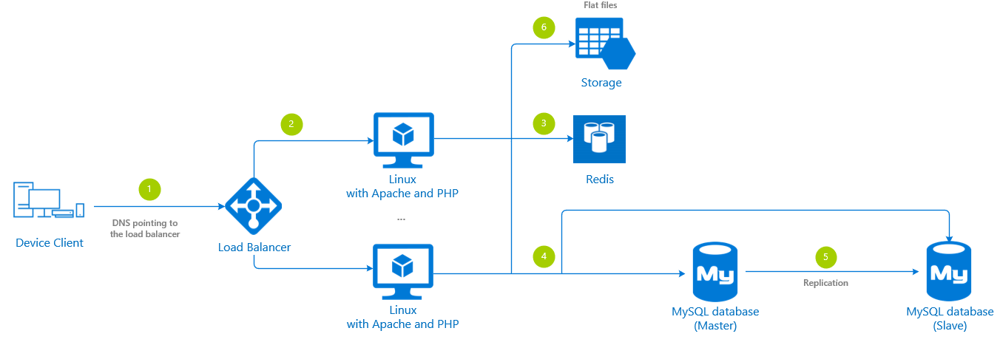
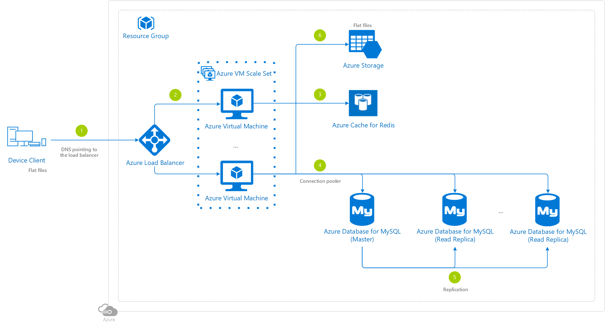

# LAMP Reference Architectures

## Single region

### Architecture diagram

### Abstract

### Azure specific

### Architecture services

- [Azure Linux Virtual Machines](https://docs.microsoft.com/azure/virtual-machines/linux/overview) - The most basic way to get computing power on Azure, in this case hosting the Apache web server and application PHP files LAMP components.
- [Azure Virtual Machine Scale Set](https://docs.microsoft.com/azure/virtual-machine-scale-sets/overview) - Let you create and manage a group of identical, load balanced Virtual Machines.
- [Azure Database for MySQL](https://docs.microsoft.com/azure/mysql/) - The LAMP data-storage component.
- [Azure Cache for Redis](https://docs.microsoft.com/azure/azure-cache-for-redis/cache-overview) - Cache to improve the performance and scalability of the architecture.
- [Azure Load Balancer](https://docs.microsoft.com/azure/load-balancer/load-balancer-overview) - Distributes the traffic across the different Azure Linux Virtual Machine instances from the Azure Virtual Machine Scale Set.
- [Azure Storage](https://docs.microsoft.com/en-us/azure/storage/common/storage-introduction) - Stores the flat files.

### Step by step

1. The device client gets the Azure Load Balancer IP address from a domain name system (DNS).
2. The Azure Load Balancer chooses a specific Azure Linux Virtual Machine instance from the Azure Virtual Machine Scale Set.
3. The Azure Linux Virtual Machines code attempts to read information stored in the Azure Cache for Redis first, following the [common cache-aside pattern](https://docs.microsoft.com/azure/architecture/patterns/cache-aside).
4. The Azure Linux Virtual Machines code reads or writes information from/into the Azure Database for MySQL, and any available read replicas, using a connection pooler.
5. To ensure high-availability, the Azure Database for MySQL has some kind of replication enabled.
6. Azure Linux Virtual Machine instances from the Azure Virtual Machine Scale Set read and write flat files from/into a high-performance Azure Storage.

### Deployment

An application running on a Azure Virtual Machine Scale Set is typically deployed in one of the two ways:

- Copying the application files at deployment time by using Virtual Machine extensions.
- Create a golden image that includes both the OS and the application files in a single custom image.

The Virtual Machine extension based approach can result in a slower scale out because the extensions will run on a new Virtual Machine each time it is created. If the scale set is based on a golden image, any new Virtual Machine is a copy of the source custom image and the scale out will be faster as the prerequisites and application are already installed.

The golden image approach, also known as immutable deployments has its advantages:

1. It is predictable, as you are promoting the image which you have already tested
2. It is also easy to scale and makes rollback to a well-known previous state easier

You can also do a combination of both, building a golden image that has the most immutable elements, like the OS version, Apache version, PHP version and your custom tools, while leaving out the PHP scripts that require more frequent update.

Refer to [Deploy a single region LAMP architecture](./webstack-lamp-deployment-single-region.md) to find a detailed step by step to deploy this architecture using different methods.

### Distribute read workload to multiple MySQL read replicas in PHP

Consider leveraging [mysqlnd_ms](https://www.php.net/manual/book.mysqlnd-ms.php) (a plugin for PHP’s native driver for MySQL) that can be used as load balancer proxy to distribute read workload to multiple read replicas.

You can specify server name, user name, and password for connecting to a MySQL Server, so it can work to load balance and scale out by distributing read workload to Azure Database for MySQL read replicas.
